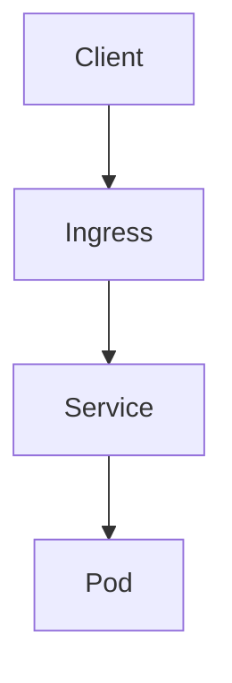

# Mermaid Quality

## Mermaid contract

Every Mermaid block must include a concise accessible title and description:

- Use syntax supported by both GitHub and the repository's pinned Material for MkDocs version.
- Prefer flowchart, sequence, state, class, and entity-relationship diagrams for predictable site styling.
- Treat architecture, mind map, timeline, and experimental diagram types as requiring explicit mobile and theme verification.
- Do not embed secrets, private infrastructure identifiers, confidential names, or unsafe HTML.
- Do not use custom styling merely for decoration. Ensure meaning does not depend on colour alone.
- Keep a text interpretation next to each diagram so the essential meaning survives renderer or accessibility failure.

## Validation

For any article containing Mermaid:

1. Confirm every block has `accTitle` and `accDescr`.
2. Run the knowledge-base validation and `mkdocs build --strict`.
3. Inspect the rendered article, not only the Markdown source.
4. Check a desktop and narrow mobile viewport for clipping, tiny labels, excessive height, and horizontal overflow.
5. Check light and dark themes when diagram or site styling changes.
6. Run `git diff --check` and verify local links.
