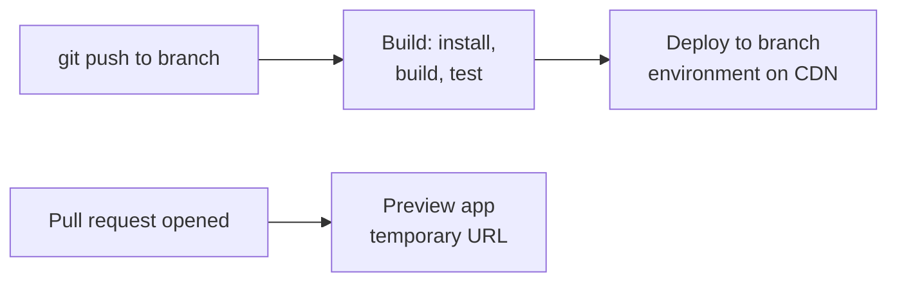

# AWS Amplify - Runbook & Reference

English | [简体中文](README_ZH.md)

> Facts verified against official AWS documentation: 2026-08-19

## Mental model

> Amplify splits into two mostly independent halves: Hosting, a Git-triggered CI/CD pipeline to the AWS CDN, and a backend generation (Gen 1 CLI vs. Gen 2 `ampx`), which turns TypeScript resource definitions into cloud infrastructure.

This article answers three practical questions:

1. What happens between a `git push` and a live deployment?
2. How do Gen 1 and Gen 2 backends differ, and which should a new project use?
3. Where do environments and PR previews fit into the branch model?

## Big picture



Each connected branch is its own environment with its own backend; a pull request gets an ephemeral preview instead of touching an existing environment.

## Overview

AWS Amplify helps you build and host full-stack web and mobile applications on AWS. **Amplify Hosting** provides a Git-based workflow with continuous deployment to the AWS global CDN. **Amplify Gen 2** is the current code-first backend experience: you define data, auth, and functions in TypeScript and manage them with `ampx`. Gen 1 apps use the legacy Amplify CLI and Studio.

## Key concepts

- **Amplify Hosting**: connects a Git repo (GitHub, Bitbucket, GitLab, or CodeCommit) and deploys the frontend with CI/CD.
- **Feature branches**: each connected branch becomes an environment (production/staging) with its own backend.
- **PR previews**: preview apps for pull requests; atomic deployments and custom domains included.
- **Amplify Gen 2 backend**: TypeScript-defined `data`, `auth`, `storage`, and `functions` resources with automatic cloud infrastructure.
- **Amplify Libraries**: client SDKs (JS, React, Swift, Android, Flutter) that connect to the backend.
- **Pricing**: pay-as-you-go for build minutes, hosting, and backend usage.

## Common operations

```bash
# Gen 2 backend (from a project directory)
npx ampx sandbox            # local development backend
npx ampx generate outputs   # generate client config
npx ampx deploy             # deploy the backend

# Gen 1 CLI (legacy)
amplify init
amplify add auth
amplify push

# Hosting via AWS CLI
aws amplify create-app --name my-app --repository https://github.com/example/my-app \
  --platform WEB
aws amplify list-apps
aws amplify start-deployment --app-id <app-id> --branch-name main --source-url s3://artifact-bucket/app.zip
aws amplify create-branch --app-id <app-id> --branch-name staging
```

## Best practices

- Use Amplify Gen 2 for new projects; Gen 1 is legacy and only for existing apps.
- Connect branches per environment and protect production branches; use PR previews for review.
- Define auth rules in the backend schema and test access patterns with the sandbox.
- Keep build output deterministic (lock dependencies, pin Node.js) and cache artifacts.
- Set custom domains with HTTPS and monitor deploy logs and build metrics.
- Secure build environment variables; never commit secrets to the repo.

## Troubleshooting

| Symptom | Checks and fixes |
|---|---|
| Build fails | Check build logs, dependency versions, and environment variables. |
| Backend not updated | Run `ampx deploy` (or `amplify push` for Gen 1) and redeploy the frontend. |
| Auth issues | Verify auth rules, user pool/client config, and client library versions. |
| Custom domain not resolving | Check DNS records and the certificate status in Amplify Hosting. |
| Preview not appearing | Confirm PR branch naming and preview settings for the app. |

## Limits

Build minutes, hosting storage/transfer, and backend resource usage have account limits; see AWS Amplify pricing for current tiers and quotas.

## Official references

- [Welcome to AWS Amplify Hosting](https://docs.aws.amazon.com/amplify/latest/userguide/welcome.html)
- [Amplify Gen 2 documentation](https://docs.amplify.aws/)
- [AWS Amplify pricing](https://aws.amazon.com/amplify/pricing/)
