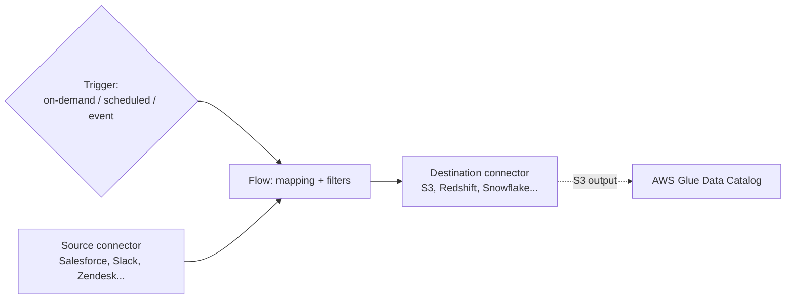

# Amazon AppFlow - Runbook & Reference

> Facts verified against official AWS documentation: 2026-08-19

> AppFlow is a no-code data-mover between named connectors: a flow declares a source, a destination, field mapping/filters, and one of three trigger types, and AppFlow runs it without any custom integration code.

This article answers two practical questions:

1. What are the parts of a flow, and how does a trigger decide when it runs?
2. Where does data go after AppFlow moves it, and how is it made discoverable?

## Big picture



The trigger type is a standing configuration choice, not a per-run decision — it determines whether a flow fires manually, on a cron schedule, or in response to source-side change events.

## Overview

Amazon AppFlow is a fully managed integration service for securely exchanging data between SaaS applications (for example, Salesforce, Slack, Zendesk, Marketo) and AWS services (S3, Redshift, Snowflake). You create flows to move records on demand, on a schedule, or in response to events, without writing code.

## Key concepts

- **Flow**: the configuration that moves data from a source to a destination, including field mapping, filters, and triggers.
- **Connectors**: built-in connectors for SaaS sources/destinations and AWS services; custom connectors built with the Custom Connector SDK for private APIs and other systems.
- **Trigger types**: on-demand (manual), scheduled (cron), or event-driven (SaaS platform events/change data capture).
- **Data transformation**: map fields, filter records, and aggregate/partition data for downstream analytics.
- **PrivateLink**: transfer data privately over the AWS network instead of the public internet.
- **Data catalog**: catalog data transferred to S3 in the AWS Glue Data Catalog for discovery by analytics/ML services.
- **Monitoring**: CloudTrail logs API calls; flow runs can be monitored in the console/API.

## Common operations (AWS CLI)

```bash
# Create a connector profile and a flow
aws appflow create-connector-profile --connector-profile-name salesforce \
  --connector-type Salesforce --connection-mode Public \
  --connector-profile-config file://profile.json
aws appflow create-flow --flow-name salesforce-to-s3 \
  --source-flow-config file://source.json \
  --destination-flow-config file://destination.json \
  --trigger-config '{"triggerType":"OnDemand"}'

# Run and monitor flows
aws appflow start-flow --flow-name salesforce-to-s3
aws appflow describe-flow-execution-records --flow-name salesforce-to-s3
aws appflow list-flows
aws appflow delete-flow --flow-name salesforce-to-s3
```

## Best practices

- Keep connector profiles in a dedicated account/Region and rotate OAuth credentials securely (Secrets Manager).
- Use scheduled flows for periodic sync and event-triggered flows for near-real-time needs; avoid overlapping runs.
- Map only the fields you need and use filters to reduce transfer volume and cost.
- Enable PrivateLink for sensitive data and verify IAM roles for source/destination access.
- Partition and aggregate output so downstream queries stay fast; catalog data in the Glue Data Catalog.
- Monitor flow execution records and set alarms on failed runs.

## Troubleshooting

| Symptom | Checks and fixes |
|---|---|
| Connection to SaaS fails | Check OAuth token/refresh, connector profile configuration, and network (VPC/PrivateLink). |
| Flow run failed | Review execution records/error messages and source/destination permissions. |
| Records missing | Verify filters, field mapping, and the source cursor/change data capture configuration. |
| Slow or throttled transfers | Reduce field count, use incremental transfers, and check API rate limits on the source. |
| Data not cataloged | Confirm the Glue Data Catalog integration and output format settings. |

## Limits

Flows and connector profiles per account, transfer sizes, and API request rates have quotas. See the Amazon AppFlow endpoints and quotas page and Service Quotas console for current values.

## Official references

- [What is Amazon AppFlow?](https://docs.aws.amazon.com/appflow/latest/userguide/what-is-appflow.html)
- [Amazon AppFlow endpoints and quotas](https://docs.aws.amazon.com/general/latest/gr/appflow.html)
- [Amazon AppFlow pricing](https://aws.amazon.com/appflow/pricing/)
- [AWS CLI: appflow commands](https://docs.aws.amazon.com/cli/latest/reference/appflow/)
