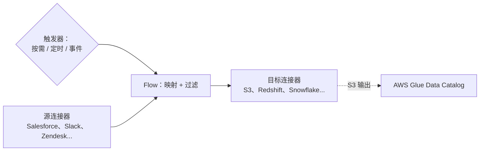

# Amazon AppFlow - Runbook 与参考

[English](README.md) | 简体中文

> 事实核对时间（对照 AWS 官方文档）：2026-08-19

## 心智模型

> AppFlow 是连接器之间的免代码数据搬运工：一个 flow 声明源、目标、字段映射/过滤器，以及三种触发类型之一，AppFlow 无需任何自定义集成代码就能运行它。

本文主要回答两个问题：

1. Flow 由哪些部分组成？触发器如何决定它何时运行？
2. AppFlow 搬运数据之后去了哪里？如何让它可被发现？

## 全景图



触发类型是一次性配置好的固定选择，而不是每次运行时的决定——它决定 flow 是手动触发、按 cron 计划运行，还是响应源端的变更事件。

## 概述

Amazon AppFlow 是全托管集成服务，用于在 SaaS 应用（例如 Salesforce、Slack、Zendesk、Marketo）与 AWS 服务（S3、Redshift、Snowflake）之间安全交换数据。你可以按需、按计划或响应事件创建 flow 移动数据，无需编写代码。

## 核心概念

- **Flow**：将数据从源移动到目标的配置，包括字段映射、过滤器和触发器。
- **连接器（Connectors）**：SaaS 源/目标和 AWS 服务的内置连接器；用 Custom Connector SDK 为私有 API 和其他系统构建自定义连接器。
- **触发类型**：按需（手动）、定时（cron）或事件驱动（SaaS 平台事件/变更数据捕获）。
- **数据转换**：映射字段、过滤记录，并为下游分析做聚合/分区。
- **PrivateLink**：通过 AWS 网络私密传输数据，而不是公共互联网。
- **数据目录**：将传输到 S3 的数据在 AWS Glue Data Catalog 中编目，便于分析和机器学习服务发现。
- **监控**：CloudTrail 记录 API 调用；可在控制台/API 监控 flow 运行。

## 常用操作（AWS CLI）

```bash
# 创建连接器配置和 flow
aws appflow create-connector-profile --connector-profile-name salesforce \
  --connector-type Salesforce --connection-mode Public \
  --connector-profile-config file://profile.json
aws appflow create-flow --flow-name salesforce-to-s3 \
  --source-flow-config file://source.json \
  --destination-flow-config file://destination.json \
  --trigger-config '{"triggerType":"OnDemand"}'

# 运行和监控 flow
aws appflow start-flow --flow-name salesforce-to-s3
aws appflow describe-flow-execution-records --flow-name salesforce-to-s3
aws appflow list-flows
aws appflow delete-flow --flow-name salesforce-to-s3
```

## 最佳实践

- 连接器配置放在专用账户/区域，OAuth 凭证用 Secrets Manager 安全轮换。
- 周期性同步用定时 flow，近实时需求用事件触发 flow；避免运行重叠。
- 只映射所需字段，用过滤器减少传输量和成本。
- 敏感数据启用 PrivateLink；核对源/目标访问的 IAM 角色。
- 输出做分区和聚合，保持下游查询高效；在 Glue Data Catalog 编目数据。
- 监控 flow 执行记录，为失败运行设置告警。

## 故障排查

| 症状 | 检查与处理 |
|---|---|
| SaaS 连接失败 | 检查 OAuth token/刷新、连接器配置和网络（VPC/PrivateLink）。 |
| Flow 运行失败 | 查看执行记录/错误信息，以及源/目标权限。 |
| 记录缺失 | 核对过滤器、字段映射以及源的游标/变更数据捕获配置。 |
| 传输慢或被限流 | 减少字段数、使用增量传输，检查源的 API 速率限制。 |
| 数据未编目 | 确认 Glue Data Catalog 集成和输出格式设置。 |

## 配额

每账户 flow 和连接器配置数、传输大小和 API 请求速率有限制。以 Amazon AppFlow 端点和配额页面及 Service Quotas 控制台为准。

## 官方参考

- [什么是 Amazon AppFlow？- 用户指南](https://docs.aws.amazon.com/appflow/latest/userguide/what-is-appflow.html)
- [Amazon AppFlow 端点和配额](https://docs.aws.amazon.com/general/latest/gr/appflow.html)
- [Amazon AppFlow 定价](https://aws.amazon.com/appflow/pricing/)
- [AWS CLI：appflow 命令](https://docs.aws.amazon.com/cli/latest/reference/appflow/)
