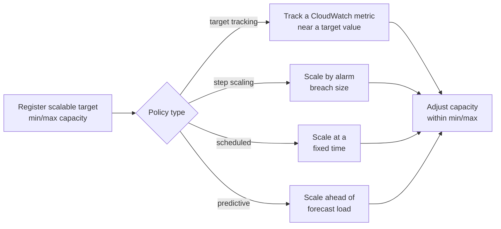

# Application Auto Scaling - Runbook & Reference

> Facts verified against official AWS documentation: 2026-08-19

> Application Auto Scaling is one control loop applied uniformly to many non-EC2 resource types: register a resource as a scalable target with min/max bounds, attach a policy that watches a metric or a clock, and let the loop add or remove capacity within those bounds.

This article answers two practical questions:

1. How does a metric or a schedule turn into a capacity change?
2. Which of the four policy types fits a given scaling need?

## Big picture



All four policy types converge on the same bounded capacity change — they differ only in what triggers the adjustment.

## Overview

Application Auto Scaling automatically scales scalable resources for AWS services other than EC2 instance fleets. You register a scalable resource (for example, a DynamoDB table, ECS service, Lambda function, Aurora replica, or EMR cluster) as a scalable target and attach scaling policies; Application Auto Scaling adjusts capacity in response to the conditions you define.

## Key concepts

- **Scalable target**: a resource registered for scaling with a service namespace, resource ID, and min/max capacity (for example, DynamoDB table read/write capacity units, ECS service desired count, Lambda provisioned concurrency).
- **Target tracking scaling**: keep a CloudWatch metric near a target value (for example, average CPU or queue depth) by adding/removing capacity automatically.
- **Step scaling**: apply scaling adjustments that vary with the size of the alarm breach (large vs. small deviations).
- **Scheduled scaling**: scale at a specific time, once or on a recurring schedule (for example, business hours).
- **Predictive scaling**: proactively scale to match anticipated load based on historical patterns.
- **Custom resources**: scale resources exposed by your own application or service through the Application Auto Scaling API.

Supported resources include DynamoDB tables and global secondary indexes, ECS services, Lambda provisioned concurrency, Aurora replicas, EMR clusters, ElastiCache replication groups and Memcached clusters, MSK broker storage, Neptune clusters, SageMaker endpoints/inference components, Spot Fleet requests, WorkSpaces fleets, and Amazon Keyspaces tables.

## Common operations (AWS CLI)

```bash
# Register a DynamoDB table as a scalable target
aws application-autoscaling register-scalable-target \
  --service-namespace dynamodb --resource-id "table/orders" \
  --scalable-dimension "dynamodb:table:ReadCapacityUnits" \
  --min-capacity 5 --max-capacity 100

# Target tracking policy
aws application-autoscaling put-scaling-policy \
  --service-namespace dynamodb --resource-id "table/orders" \
  --scalable-dimension "dynamodb:table:ReadCapacityUnits" \
  --policy-name read-target --policy-type TargetTrackingScaling \
  --target-tracking-scaling-policy-configuration file://policy.json

# Scheduled scaling (scale ECS service down at 22:00)
aws application-autoscaling put-scheduled-action \
  --service-namespace ecs --resource-id "service/prod/web" \
  --scalable-dimension "ecs:service:DesiredCount" \
  --scheduled-action-name nightly-down --schedule "cron(0 22 * * ? *)" \
  --scalable-target-action MinCapacity=2,MaxCapacity=6

# Review scaling activity
aws application-autoscaling describe-scaling-activities \
  --service-namespace dynamodb --resource-id "table/orders"
```

## Best practices

- Register every scalable resource explicitly and set meaningful min/max bounds to control cost and protect capacity.
- Prefer target tracking on a metric that reflects actual load (utilization, queue depth, requests); avoid noisy metrics.
- Combine scheduled scaling with target tracking for predictable peaks (for example, business hours) and unknown bursts.
- Use step scaling when you need differentiated responses to small vs. large breaches.
- Test scaling behavior in staging and monitor scaling activities/alarms in production.
- Set CloudWatch alarms for scaling failures and capacity at boundaries.

## Troubleshooting

| Symptom | Checks and fixes |
|---|---|
| Resource not scaling | Confirm the resource is registered as a scalable target and the policy is attached; check CloudWatch alarm state. |
| Wrong dimension/namespace | Verify the service namespace, resource ID, and scalable dimension match the resource type. |
| Scaling stuck at min/max | Review min/max capacity bounds and the metric values driving the policy. |
| Scheduled action not firing | Check the cron/rate schedule, time zone, and that the scalable target still exists. |
| Throttling on API | Scaling adjustments are rate-limited; review recent scaling activities for error messages. |

## Limits

Scaling policies and scheduled actions per scalable target, and per-resource registration counts have quotas. See the Application Auto Scaling endpoints and quotas page and Service Quotas console for current values.

## Official references

- [What is Application Auto Scaling?](https://docs.aws.amazon.com/autoscaling/application/userguide/what-is-application-auto-scaling.html)
- [Application Auto Scaling endpoints and quotas](https://docs.aws.amazon.com/general/latest/gr/application-autoscaling.html)
- [AWS CLI: application-autoscaling commands](https://docs.aws.amazon.com/cli/latest/reference/application-autoscaling/)
