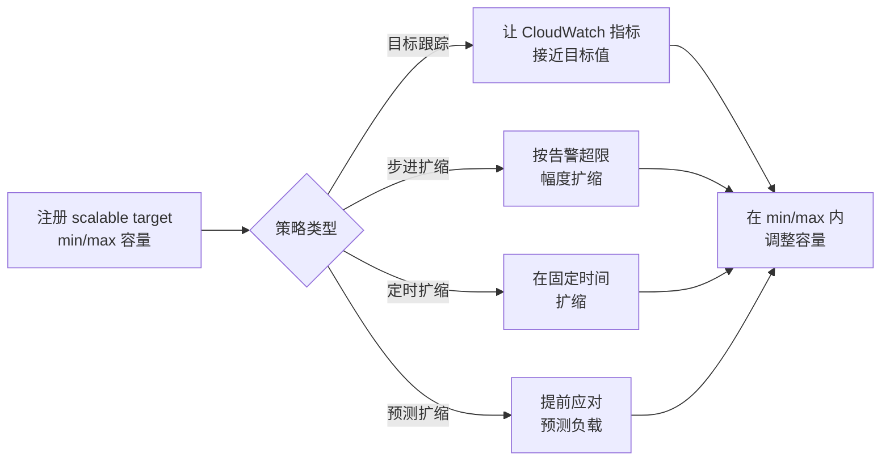

# Application Auto Scaling - Runbook 与参考

[English](README.md) | 简体中文

> 事实核对时间（对照 AWS 官方文档）：2026-08-19

## 心智模型

> Application Auto Scaling 是同一套控制回路统一套用在多种非 EC2 资源上：把资源注册为带 min/max 边界的 scalable target，附加一个监听指标或时钟的策略，让回路在边界内增减容量。

本文主要回答两个问题：

1. 一个指标或一个计划是如何变成容量变化的？
2. 四种策略类型分别适合什么扩缩需求？

## 全景图



四种策略类型最终都收敛到同一个受边界约束的容量变化——区别仅在于触发调整的条件。

## 概述

Application Auto Scaling 为 EC2 实例组之外的 AWS 服务资源提供自动扩缩。你将可扩展资源（例如 DynamoDB 表、ECS 服务、Lambda 函数、Aurora 副本或 EMR 集群）注册为 scalable target，并附加扩缩策略；Application Auto Scaling 根据你定义的条件调整容量。

## 核心概念

- **Scalable target**：注册为可扩展目标的资源，包含服务命名空间、资源 ID 以及最小/最大容量（例如 DynamoDB 表的读写容量单位、ECS 服务期望任务数、Lambda 预置并发）。
- **目标跟踪扩缩（Target tracking）**：让 CloudWatch 指标接近目标值（例如平均 CPU 或队列深度），自动增删容量。
- **步进扩缩（Step scaling）**：根据告警超限的大小应用不同的扩缩调整（大幅偏离 vs 小幅偏离）。
- **定时扩缩（Scheduled scaling）**：在指定时间一次性或按重复计划扩缩（例如工作时间）。
- **预测扩缩（Predictive scaling）**：基于历史模式主动匹配预期负载。
- **自定义资源**：通过 Application Auto Scaling API 为你自己的应用/服务暴露可扩展资源。

受支持资源包括 DynamoDB 表与全局二级索引、ECS 服务、Lambda 预置并发、Aurora 副本、EMR 集群、ElastiCache 复制组与 Memcached 集群、MSK 代理存储、Neptune 集群、SageMaker 端点/推理组件、Spot Fleet 请求、WorkSpaces 池以及 Amazon Keyspaces 表等。

## 常用操作（AWS CLI）

```bash
# 将 DynamoDB 表注册为 scalable target
aws application-autoscaling register-scalable-target \
  --service-namespace dynamodb --resource-id "table/orders" \
  --scalable-dimension "dynamodb:table:ReadCapacityUnits" \
  --min-capacity 5 --max-capacity 100

# 目标跟踪策略
aws application-autoscaling put-scaling-policy \
  --service-namespace dynamodb --resource-id "table/orders" \
  --scalable-dimension "dynamodb:table:ReadCapacityUnits" \
  --policy-name read-target --policy-type TargetTrackingScaling \
  --target-tracking-scaling-policy-configuration file://policy.json

# 定时扩缩（ECS 服务每晚 22:00 缩容）
aws application-autoscaling put-scheduled-action \
  --service-namespace ecs --resource-id "service/prod/web" \
  --scalable-dimension "ecs:service:DesiredCount" \
  --scheduled-action-name nightly-down --schedule "cron(0 22 * * ? *)" \
  --scalable-target-action MinCapacity=2,MaxCapacity=6

# 查看扩缩活动
aws application-autoscaling describe-scaling-activities \
  --service-namespace dynamodb --resource-id "table/orders"
```

## 最佳实践

- 显式注册每个可扩展资源，并设置有意义的 min/max 边界以控制成本、保障容量。
- 优先对反映真实负载的指标（利用率、队列深度、请求数）使用目标跟踪；避免噪声大的指标。
- 对可预测高峰（例如工作时间）组合定时扩缩与目标跟踪，应对未知突发。
- 需要区分小幅/大幅超限响应时使用步进扩缩。
- 在 staging 测试扩缩行为，生产环境监控扩缩活动和告警。
- 为扩缩失败和容量触顶设置 CloudWatch 告警。

## 故障排查

| 症状 | 检查与处理 |
|---|---|
| 资源未扩缩 | 确认资源已注册为 scalable target、策略已附加；检查 CloudWatch 告警状态。 |
| 命名空间/维度错误 | 核对服务命名空间、资源 ID 和 scalable dimension 是否与资源类型匹配。 |
| 扩缩卡在 min/max | 检查最小/最大容量边界以及驱动策略的指标值。 |
| 定时动作不执行 | 检查 cron/rate 计划、时区以及 scalable target 是否仍然存在。 |
| API 被限流 | 扩缩调整有速率限制；查看近期扩缩活动的错误信息。 |

## 配额

每个 scalable target 的扩缩策略和定时动作数量，以及每资源注册数量都有配额。以 Application Auto Scaling 端点和配额页面及 Service Quotas 控制台为准。

## 官方参考

- [什么是 Application Auto Scaling？- 用户指南](https://docs.aws.amazon.com/autoscaling/application/userguide/what-is-application-auto-scaling.html)
- [Application Auto Scaling 端点和配额](https://docs.aws.amazon.com/general/latest/gr/application-autoscaling.html)
- [AWS CLI：application-autoscaling 命令](https://docs.aws.amazon.com/cli/latest/reference/application-autoscaling/)
