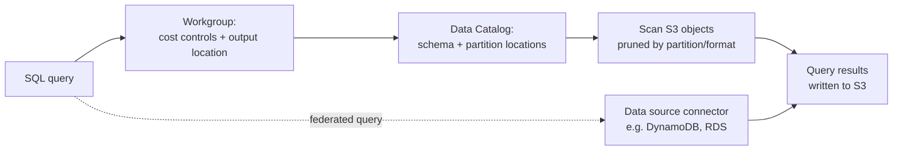

# Amazon Athena - Runbook & Reference

> Facts verified against official AWS documentation: 2026-08-19

> Athena is a query engine with no storage of its own: it plans SQL against metadata in a Data Catalog, reads only the S3 bytes that partitioning and file format let it skip past, and every byte scanned is what you pay for.

This article answers two practical questions:

1. What determines how much a query costs?
2. How does a query relate to a workgroup and to data outside S3?

## Big picture



Partitioning and columnar formats act as filters before Athena ever reads a byte, which is why they are the primary cost lever, not an optional tuning step.

## Overview

Amazon Athena is a serverless interactive query service for analyzing data directly in Amazon S3 using standard SQL. There is no infrastructure to manage: you point Athena at your data, run queries, and pay per query. Athena also supports interactive Apache Spark analytics through notebooks and APIs.

## Key concepts

- **Workgroup**: isolates queries, result settings, and cost controls per team or application.
- **Data Catalog**: table metadata (typically the AWS Glue Data Catalog) that maps storage locations, file formats, and schemas.
- **Query execution**: submitted SQL that Athena plans and runs across S3 objects in parallel.
- **Federated queries**: query data outside S3 (relational stores, DynamoDB, etc.) through Athena data source connectors.
- **Partitioning**: prune scanned data by partition columns; critical for cost and performance.
- **File formats**: Parquet, ORC, Avro, JSON, CSV/TSV, and more; columnar formats minimize bytes scanned.
- **CTAS**: create table as select to convert or compact data.
- **Capacity reservations**: provisioned query capacity for predictable workloads.

## Common operations (AWS CLI)

```bash
# Run a query (output to a result location)
aws athena start-query-execution \
  --query-string "SELECT year, count(*) FROM my_db.alb_logs GROUP BY year" \
  --query-execution-context Database=my_db,Catalog=AwsDataCatalog \
  --result-configuration OutputLocation=s3://query-results-bucket/athena/

# Get status and results
aws athena get-query-execution --query-execution-id <execution-id>
aws athena get-query-results --query-execution-id <execution-id>

# Workgroup management
aws athena create-work-group --name analytics --configuration ResultConfiguration.OutputLocation=s3://query-results-bucket/athena/
aws athena list-work-groups
aws athena update-work-group --work-group analytics \
  --configuration ResultConfiguration.OutputLocation=s3://query-results-bucket/athena/

# Data catalog tables
aws athena list-table-metadata --catalog-name AwsDataCatalog --database-name my_db
```

## Best practices

- Partition tables by date/region and use columnar formats (Parquet) to cut bytes scanned and cost.
- Use workgroups to set result locations and enforce query cost controls.
- Compress and compact data; run `OPTIMIZE` / CTAS maintenance on small files.
- Enable query result reuse and use views for common analytics.
- Use federated queries sparingly; scan local data first for joins where possible.
- Monitor queries in CloudWatch, set budgets on Athena spending, and review scanned bytes per query.
- Secure output buckets: Athena writes results to S3, so bucket policies matter.

## Troubleshooting

| Symptom | Checks and fixes |
|---|---|
| Query fails with table not found | Verify database/table exist in the Glue Data Catalog and the region matches the data. |
| No data returned | Check partition locations, file format registration, and that the data was written with a matching schema. |
| High cost per query | Reduce scanned bytes: partition pruning, Parquet/ORC, and more selective predicates. |
| Permission denied on S3 | Grant Athena (via workgroup/engine) read on the data locations and write on the result bucket. |
| Federation errors | Check the data source connector's Lambda function and its VPC/network configuration. |

## Limits

Athena enforces per-query and per-account limits (for example, query string size, result set size, concurrent queries, and capacity reservations). See the Service Quotas console for current values.

## Official references

- [What is Amazon Athena?](https://docs.aws.amazon.com/athena/latest/ug/what-is.html)
- [Athena service quotas](https://docs.aws.amazon.com/athena/latest/ug/service-limits.html)
- [Amazon Athena pricing](https://aws.amazon.com/athena/pricing/)
- [AWS CLI: athena commands](https://docs.aws.amazon.com/cli/latest/reference/athena/)
