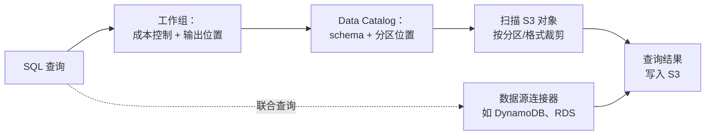

# Amazon Athena - Runbook 与参考

[English](README.md) | 简体中文

> 事实核对时间（对照 AWS 官方文档）：2026-08-19

## 心智模型

> Athena 本身不存储任何数据：它依据 Data Catalog 中的元数据规划 SQL，只读取分区和文件格式允许它跳过之外的 S3 字节，而你付费的正是被扫描的每一个字节。

本文主要回答两个问题：

1. 是什么决定了一次查询的成本？
2. 查询与工作组、以及 S3 之外的数据之间是什么关系？

## 全景图



分区和列式格式在 Athena 读取任何字节之前就先起到过滤作用，这正是它们是控制成本的首要手段而非可选调优步骤的原因。

## 概述

Amazon Athena 是无服务器交互式查询服务，用标准 SQL 直接分析 Amazon S3 中的数据。无需管理基础设施：指向数据、运行查询、按查询付费。Athena 还支持通过笔记本和 API 运行 Apache Spark 交互式分析。

## 核心概念

- **工作组（Workgroup）**：按团队或应用隔离查询、结果设置和成本控制。
- **数据目录（Data Catalog）**：表元数据（通常是 AWS Glue Data Catalog），记录存储位置、文件格式和 schema。
- **查询执行**：提交的 SQL，Athena 并行规划并在 S3 对象上执行。
- **联合查询（Federated queries）**：通过数据源连接器查询 S3 之外的数据（关系库、DynamoDB 等）。
- **分区**：按分区列裁剪扫描数据量，对成本和性能至关重要。
- **文件格式**：Parquet、ORC、Avro、JSON、CSV/TSV 等；列式格式可显著减少扫描字节数。
- **CTAS**：CREATE TABLE AS SELECT，用于转换或压缩数据。
- **容量预留**：为可预测的工作负载预留查询容量。

## 常用操作（AWS CLI）

```bash
# 运行查询（结果输出到指定位置）
aws athena start-query-execution \
  --query-string "SELECT year, count(*) FROM my_db.alb_logs GROUP BY year" \
  --query-execution-context Database=my_db,Catalog=AwsDataCatalog \
  --result-configuration OutputLocation=s3://query-results-bucket/athena/

# 获取状态和结果
aws athena get-query-execution --query-execution-id <execution-id>
aws athena get-query-results --query-execution-id <execution-id>

# 工作组管理
aws athena create-work-group --name analytics --configuration ResultConfiguration.OutputLocation=s3://query-results-bucket/athena/
aws athena list-work-groups
aws athena update-work-group --work-group analytics \
  --configuration ResultConfiguration.OutputLocation=s3://query-results-bucket/athena/

# 查看目录表
aws athena list-table-metadata --catalog-name AwsDataCatalog --database-name my_db
```

## 最佳实践

- 表按日期/区域分区，用列式格式（Parquet）减少扫描字节和成本。
- 用工作组设置结果位置并强制查询成本控制。
- 压缩和合并数据；定期对零碎小文件做 CTAS/OPTIMIZE。
- 启用查询结果复用，常用分析用视图。
- 谨慎使用联合查询；能先在本地扫描的数据先本地关联。
- 用 CloudWatch 监控查询，设置 Athena 支出预算，关注每次查询扫描字节。
- 保护结果桶：Athena 会把结果写入 S3，桶策略很重要。

## 故障排查

| 症状 | 检查与处理 |
|---|---|
| 表找不到 | 确认数据库/表在 Glue Data Catalog 中且区域与数据一致。 |
| 查询无结果 | 检查分区位置、文件格式注册，以及写入数据时的 schema 是否匹配。 |
| 单次查询成本高 | 减少扫描字节：分区裁剪、Parquet/ORC、更精确的谓词。 |
| S3 权限拒绝 | 给 Athena（工作组/引擎）授权读取数据位置、写入结果桶。 |
| 联合查询报错 | 检查数据源连接器的 Lambda 函数及其 VPC/网络配置。 |

## 配额

Athena 对单查询和账号有配额（如查询字符串大小、结果集大小、并发查询、容量预留）。以 Service Quotas 控制台当前值为准。

## 官方参考

- [什么是 Amazon Athena？](https://docs.aws.amazon.com/athena/latest/ug/what-is.html)
- [Athena 服务配额](https://docs.aws.amazon.com/athena/latest/ug/service-limits.html)
- [Amazon Athena 定价](https://aws.amazon.com/athena/pricing/)
- [AWS CLI：athena 命令](https://docs.aws.amazon.com/cli/latest/reference/athena/)
