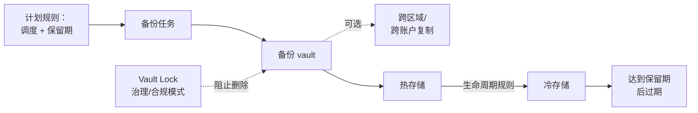

# AWS Backup - Runbook 与参考

[English](README.md) | 简体中文

> 事实核对时间（对照 AWS 官方文档）：2026-08-19

## 心智模型

> AWS Backup 把"何时、保留多久"与"存到哪里"分开处理：计划里的规则决定备份频率和保留期，vault（及其可选的 Vault Lock）决定结果的不可变程度，复制规则决定是否还要落地到另一个区域或账户。

本文主要回答两个问题：

1. 一份备份从创建到过期之间会经历什么？
2. Vault Lock 到底阻止了什么，针对谁？

## 全景图



Vault Lock 与生命周期是正交的——它不改变备份转换或过期的时间点，只是在此之前阻止删除，合规模式下连管理员也无法删除。

## 概述

AWS Backup 是一项全托管备份服务，跨受支持的 AWS 服务集中管理备份策略、监控和合规。你只需定义一次备份计划并应用到资源；AWS Backup 自动处理备份调度、保留、生命周期转换以及跨区域/跨账户复制。

## 核心概念

- **备份计划（Backup plan）**：定义何时执行备份、保留多久以及存入哪个 vault 的规则；一个计划可包含多条规则。
- **备份 vault**：存储备份的容器，用 vault 策略控制访问；vault 是区域性资源。
- **Vault Lock**：以治理（governance）或合规（compliance）模式强制备份不可变（WORM），即使管理员也不能删除。
- **生命周期（Lifecycle）**：备份在指定时间后从热存储转为冷存储，并在保留期结束时过期。
- **跨区域与跨账户备份**：将备份复制到其他区域或账户，用于容灾和隔离。
- **增量备份**：对受支持的资源类型，AWS Backup 在首次全量备份后只存储增量变化。
- **Audit Manager 集成**：为合规目的报告和监控备份活动。

受支持的资源包括 EC2、EBS、S3、RDS、Aurora、DynamoDB、EFS、FSx、DocumentDB、Neptune、Redshift 与 Redshift Serverless、Timestream、VMware Cloud on AWS、EKS（通过 Backup for EKS）、EC2 上的 SAP HANA 以及 CloudFormation 等。

## 常用操作（AWS CLI）

```bash
# 创建 vault 和备份计划
aws backup create-backup-vault --backup-vault-name prod
aws backup create-backup-plan --backup-plan file://plan.json

# 列出计划、vault 和任务
aws backup list-backup-plans
aws backup list-backup-vaults
aws backup list-backup-jobs --by-state RUNNING

# 为计划分配资源
aws backup create-backup-selection \
  --backup-plan-id <plan-id> \
  --backup-selection file://selection.json

# 手动启动备份并监控
aws backup start-backup-job --resource-arn <resource-arn> \
  --backup-vault-name prod
aws backup describe-backup-job --backup-job-id <job-id>
```

## 最佳实践

- 按工作负载类别（例如数据库、应用、文件）集中规划，并用基于标签或资源的规则应用。
- 受监管数据使用合规模式的 Vault Lock；先测试治理模式再强制执行。
- 关键数据配置跨区域复制，重要账户数据配置跨账户复制以实现与生产账户隔离。
- 设置生命周期规则，仅在恢复时间允许冷存储取回时才使用冷备份。
- 用 CloudWatch 事件和告警监控备份/恢复任务，定期演练恢复。
- 用 IAM 和 vault 策略限制 vault 访问；启用 AWS Backup Audit Manager 做合规报告。

## 故障排查

| 症状 | 检查与处理 |
|---|---|
| 备份任务失败 | 查看任务状态消息、资源权限，以及资源是否处于受支持状态。 |
| 恢复缓慢 | 冷存储取回耗时更长；时间敏感的恢复请使用热副本。 |
| Vault Lock 无法移除 | 合规模式按设计是永久的；需要其他保护时创建新 vault。 |
| 跨账户副本缺失 | 核对目标账户 vault 策略是否授予备份访问权限，复制角色是否已配置。 |
| 计划未应用到资源 | 确认备份选择中的标签/ARN 与资源匹配，且计划已分配。 |

## 配额

每账户每区域备份计划、vault 和任务数，以及恢复和复制配额都有限制。冷存储有最低保留期限。以 AWS Backup 端点和配额页面及 Service Quotas 控制台为准。

## 官方参考

- [什么是 AWS Backup？- 开发者指南](https://docs.aws.amazon.com/aws-backup/latest/devguide/whatisbackup.html)
- [AWS Backup 支持的资源](https://docs.aws.amazon.com/aws-backup/latest/devguide/whatisbackup.html#supported-resources)
- [AWS Backup Vault Lock](https://docs.aws.amazon.com/aws-backup/latest/devguide/vault-lock.html)
- [AWS Backup 端点和配额](https://docs.aws.amazon.com/general/latest/gr/aws-backup.html)
- [AWS Backup 定价](https://aws.amazon.com/backup/pricing/)
- [AWS CLI：backup 命令](https://docs.aws.amazon.com/cli/latest/reference/backup/)
