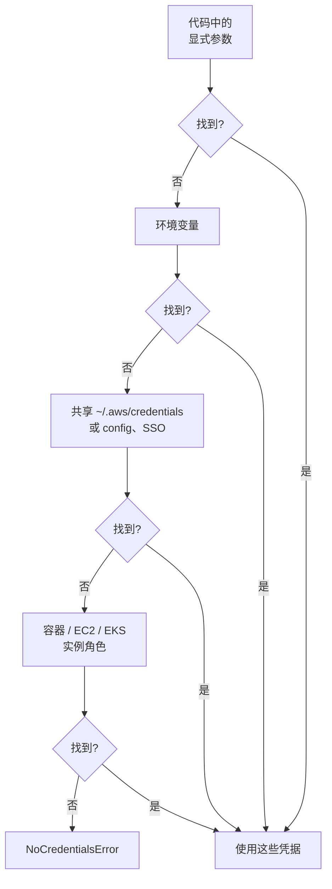

# boto3（AWS SDK for Python）- Runbook 与参考

[English](README.md) | 简体中文

> 事实核对时间（对照 AWS 官方文档）：2026-08-19

## 心智模型

> boto3 在任何客户端调用之前，先按固定的回退顺序解析一次凭据——所以调用失败时，问题通常出在凭据链本身，而不是这次调用。

本文主要回答两个问题：

1. boto3 按什么顺序查找凭据？`NoCredentialsError` 应该去哪里修？
2. 什么时候该用 client，什么时候该用 resource？

## 全景图



链条在第一个匹配项处就停止，所以一个过期的环境变量可能会悄悄遮蔽掉链条后面正确配置的 IAM 角色。

## 概述

boto3 是 AWS 的 Python SDK。它提供低层服务客户端（与服务 API 几乎一一对应）、部分服务的高层资源抽象，以及分页、等待器、重试和多会话凭据处理等核心能力。

## 核心概念

- **Client（客户端）**：低层接口；`boto3.client('s3')` 返回方法对应 API 操作的客户端。
- **Resource（资源）**：高层对象接口；`boto3.resource('s3')` 提供集合和属性（仅部分服务支持）。
- **Session（会话）**：管理配置和凭据；可用 `boto3.session.Session()` 或默认的模块级会话。
- **凭据链**：环境变量、共享 credentials/config 文件、IAM 角色、SSO、容器凭据。
- **Paginators**：用 `client.get_paginator(...)` 处理多页 API 响应。
- **Waiters**：轮询直到资源达到目标状态（如 EC2 实例 running）。
- **botocore 异常**：`botocore.exceptions.ClientError` 携带错误码和消息。

## 常用操作

```python
import boto3
from botocore.exceptions import ClientError

# 客户端和资源
s3 = boto3.client("s3", region_name="ap-southeast-1")
s3r = boto3.resource("s3")

# 分页列出对象
paginator = s3.get_paginator("list_objects_v2")
for page in paginator.paginate(Bucket="my-bucket", Prefix="logs/"):
    for obj in page.get("Contents", []):
        print(obj["Key"], obj["Size"])

# 上传下载
s3.upload_file("/tmp/file.txt", "my-bucket", "data/file.txt")
s3.download_file("my-bucket", "data/file.txt", "/tmp/file.txt")

# 查询 EC2 实例
ec2 = boto3.client("ec2")
instances = ec2.describe_instances(Filters=[{"Name": "instance-state-name", "Values": ["running"]}])

# 错误处理
try:
    s3.get_object(Bucket="my-bucket", Key="missing.txt")
except ClientError as e:
    print(e.response["Error"]["Code"], e.response["Error"]["Message"])

# 用会话扮演角色
sts = boto3.client("sts")
creds = sts.assume_role(RoleArn="arn:aws:iam::123456789012:role/AppRole", RoleSessionName="job")
session = boto3.Session(
    aws_access_key_id=creds["Credentials"]["AccessKeyId"],
    aws_secret_access_key=creds["Credentials"]["SecretAccessKey"],
    aws_session_token=creds["Credentials"]["SessionToken"],
)
```

## 最佳实践

- 优先 IAM 角色和 SSO，避免硬编码密钥；绝不提交凭据到仓库。
- 复用 client/session 而不是每次调用创建；boto3 会管理连接池。
- 列表 API 用 paginator，等待状态用 waiter，而不是自己写 sleep 循环。
- 显式设置区域和重试配置（`botocore.config.Config(retries={"max_attempts": 5, "mode": "standard"})`）。
- 捕获 `ClientError` 并按 `Error.Code` 分支，而不是笼统捕获异常。
- 固定 boto3/botocore 版本，先在预发环境测试升级。

## 故障排查

| 症状 | 检查与处理 |
|---|---|
| `NoCredentialsError` | 检查凭据链：环境变量、共享文件、角色。 |
| `ClientError: AccessDenied` | 核对 IAM 策略和使用中的角色/profile。 |
| 列表操作慢 | 用 paginator 的 `PageSize`、过滤条件和更窄的前缀。 |
| 限流（`ThrottlingException`） | 增加重试次数/退避；确有必要再申请提高配额。 |
| `EndpointConnectionError` | 检查网络、VPC 端点和区域配置。 |

## 配额

boto3 本身没有配额；服务 API 配额适用。以 Service Quotas 控制台各服务当前值为准。

## 官方参考

- [boto3 文档](https://boto3.amazonaws.com/v1/documentation/api/latest/index.html)
- [boto3 快速入门](https://boto3.amazonaws.com/v1/documentation/api/latest/guide/quickstart.html)
- [botocore 异常参考](https://botocore.amazonaws.com/v1/documentation/api/latest/reference/exceptions.html)
