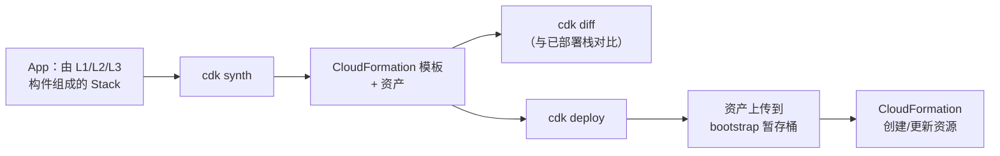

# AWS Cloud Development Kit（CDK）- Runbook 与参考

[English](README.md) | 简体中文

> 事实核对时间（对照 AWS 官方文档）：2026-08-19

## 心智模型

> CDK 从不直接与 AWS 对话——它把你的代码编译成 CloudFormation 模板，真正供给资源的是 CloudFormation；每个 CDK 命令本质上都是 CloudFormation 部署之前或周围的一个步骤。

本文主要回答两个问题：

1. 每个 CDK CLI 命令实际产出什么？它们的执行顺序是怎样的？
2. L1、L2、L3 构件与它们最终变成的 CloudFormation 资源是什么关系？

## 全景图



`cdk bootstrap` 是每个账号/区域一次性的前置步骤，创建这条部署路径依赖的暂存桶和角色——它不属于每次部署都会走的流程本身。

## 概述

AWS Cloud Development Kit（AWS CDK）是开源框架，用代码（TypeScript、JavaScript、Python、Java、C#/.NET 或 Go）定义云基础设施，并通过 AWS CloudFormation 部署。CDK v2 是当前主版本；v1 于 2022 年 6 月 1 日进入维护期，2023 年 6 月 1 日结束支持。

## 核心概念

- **Construct（构件）**：基本构建单元；L1 构件对应 CloudFormation 资源，L2 构件带合理默认值，L3 构件是模式。
- **Stack（堆栈）**：部署单元，对应一个 CloudFormation 栈。
- **App**：一个或多个 Stack 的容器；CDK 项目的入口。
- **合成（Synthesis）**：`cdk synth` 把应用转换为 CloudFormation 模板。
- **Bootstrap**：`cdk bootstrap` 为部署区域准备暂存桶和角色。
- **工具包（CDK CLI）**：合成、diff、部署、销毁等命令。
- **Asset（资产）**：部署时上传的本地文件（打包代码、镜像等）。

## 常用操作（AWS CLI）

```bash
# 初始化项目（Python 示例）
cdk init app --language python

# 安装依赖并 bootstrap 目标账号/区域
python -m pip install -r requirements.txt
cdk bootstrap aws://123456789012/us-east-1

# 合成并查看 CloudFormation 模板
cdk synth
cdk diff

# 部署 / 销毁
cdk deploy
cdk deploy --profile dev
cdk destroy

# 列出应用中的栈
cdk list
```

```python
# app.py（Python，CDK v2）
from aws_cdk import App, Stack, aws_s3 as s3

class StorageStack(Stack):
    def __init__(self, scope, id, **kwargs):
        super().__init__(scope, id, **kwargs)
        s3.Bucket(self, "DataBucket",
                  versioned=True,
                  encryption=s3.BucketEncryption.S3_MANAGED,
                  enforce_ssl=True)

app = App()
StorageStack(app, "StorageStack")
app.synth()
```

## 最佳实践

- 使用 CDK v2 并固定 construct 库版本；关注维护策略。
- 从 L2 构件开始获得安全默认值；需要精确属性时才降到 L1。
- 按职责拆分 Stack（状态、网络、应用），明确依赖边界。
- 写测试，CI 里先跑 `cdk diff` 再部署；用 CodePipeline 等做可重复交付。
- 每个账号/区域执行一次 `cdk bootstrap`，严格控制 bootstrap 权限。
- 不要把密钥放进代码；用 Secrets Manager/SSM Parameter 并通过 IAM 授权。

## 故障排查

| 症状 | 检查与处理 |
|---|---|
| `BootstrapError` | 用正确凭据为目标账号/区域执行 `cdk bootstrap`。 |
| Stack 更新失败 | 查看 CloudFormation 事件日志；修复资源约束后重新部署。 |
| Asset 上传失败 | 检查暂存桶策略和 IAM 权限。 |
| 版本不匹配 | 保持 CDK CLI 与库版本兼容。 |
| 更新导致资源替换 | 检查 CloudFormation 替换行为；显式规划状态变更。 |

## 配额

CloudFormation 配额适用（如模板大小、每栈资源数）。以 Service Quotas 控制台当前值为准。

## 官方参考

- [什么是 AWS CDK？](https://docs.aws.amazon.com/cdk/v2/guide/home.html)
- [AWS CDK API 参考](https://docs.aws.amazon.com/cdk/api/v2/docs/aws-construct-library.html)
- [AWS CDK Workshop](https://cdkworkshop.com/)
