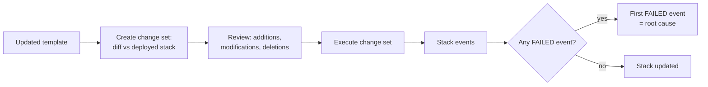

# AWS CloudFormation - Runbook & Reference

> Facts verified against official AWS documentation: 2026-08-19

> CloudFormation treats infrastructure as one unit driven by diffing, not by direct commands: every update — safe or not — is really "compute a change set, then execute it," and the stack's event log is the only reliable place to find why a change failed.

This article answers two practical questions:

1. What is the safe path from "I changed the template" to "the change is live"?
2. Where do I look first when a stack creation or update fails?

## Big picture



The change set step exists specifically so the diff can be reviewed before anything is applied — skipping straight to `update-stack` removes that safety check, not the underlying mechanism.

## Overview

AWS CloudFormation models and provisions AWS resources as code. You write a template describing the resources you want; CloudFormation creates, updates, and deletes them as a single unit (a stack), resolving dependencies for you.

## Key concepts

- **Template**: YAML or JSON describing resources and their properties.
- **Stack**: a collection of resources created from one template; managed as a unit.
- **Stack set**: apply the same stack to multiple accounts and Regions.
- **Change set**: preview what an update will change before applying it.
- **Drift detection**: compare live resources against the template.
- **Nested stacks**: compose stacks from other stacks for reuse.
- **Resource types**: EC2, RDS, S3, Lambda, IAM, and thousands more.

## Common operations (AWS CLI)

```bash
# Validate a template
aws cloudformation validate-template --template-body file://template.yaml

# Create a stack
aws cloudformation create-stack --stack-name my-stack \
  --template-body file://template.yaml --parameters ParameterKey=Env,ParameterValue=prod

# Deploy (create or update, with IAM capability when templates create IAM resources)
aws cloudformation deploy --stack-name my-stack \
  --template-file template.yaml --capabilities CAPABILITY_NAMED_IAM

# Change sets (safe updates)
aws cloudformation create-change-set --stack-name my-stack \
  --template-body file://template.yaml --change-set-name my-change
aws cloudformation execute-change-set --stack-name my-stack --change-set-name my-change

# Inspect and debug
aws cloudformation describe-stacks --stack-name my-stack
aws cloudformation describe-stack-events --stack-name my-stack
aws cloudformation list-stacks

# Delete
aws cloudformation delete-stack --stack-name my-stack
```

## Best practices

- Treat templates as code: version control, review, and test in non-production environments.
- Use **change sets** for production updates; review what will change before applying.
- Set `DeletionPolicy` / `UpdateReplacePolicy` on stateful resources (databases, S3 buckets).
- Avoid hardcoding: use parameters, `AWS::SSM::Parameter` values, and Secrets Manager references.
- Grant least-privilege permissions; be deliberate about `CAPABILITY_IAM`.
- Enable **drift detection** on production stacks and separate stacks by lifecycle (network, data, application).

## Troubleshooting

| Symptom | Checks and fixes |
|---------|------------------|
| Stack creation fails and rolls back | Run `describe-stack-events` and find the first `CREATE_FAILED` event for the root cause. |
| Update fails | Review the change set; roll back to the previous template version if needed. |
| IAM resource errors | Re-run with `--capabilities CAPABILITY_NAMED_IAM` or scope down the template's IAM permissions. |
| Dependency errors | Check resource references and output names across stacks; use `Fn::ImportValue` correctly. |
| Drift detected | Compare the template with live resources and decide whether to update the stack or fix the resource. |

## Limits

Template body limit is 51,200 bytes when passed directly; 1 MB when uploaded to S3. See the Service Quotas console for stack limits.

## Official references

- [What is AWS CloudFormation? - CloudFormation User Guide](https://docs.aws.amazon.com/AWSCloudFormation/latest/UserGuide/Welcome.html)
- [AWS CLI: cloudformation commands](https://docs.aws.amazon.com/cli/latest/reference/cloudformation/)
