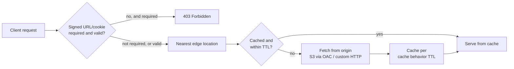

# Amazon CloudFront - Runbook & Reference

> Facts verified against official AWS documentation: 2026-08-19

> CloudFront answers every request from the nearest edge first: a cache hit never touches your origin, and only a cache miss — shaped by the cache behavior's TTL and forwarded headers/cookies — turns into an origin fetch, which is why cache configuration is the main lever over both cost and freshness.

This article answers two practical questions:

1. What decides whether a request is served from cache or forwarded to the origin?
2. How do signed URLs/cookies and OAC fit into that path for private content?

## Big picture



Origin Access Control and signed URLs/cookies are two independent gates: OAC stops the origin from being reached directly, while signed URLs/cookies stop CloudFront itself from serving the object to an unauthorized viewer.

## Overview

Amazon CloudFront is a content delivery network (CDN) that speeds up distribution of static and dynamic content through a worldwide network of edge locations. Requests are routed to the lowest-latency edge; cached objects are served directly, and cache misses are fetched from your origin.

## Key concepts

- **Distribution**: the CloudFront configuration that maps your domain to origins and cache behaviors.
- **Origins**: S3 buckets, ELB/API Gateway, or custom HTTP servers that hold the definitive content.
- **Edge locations / POPs**: geographically distributed caches.
- **Cache behavior**: path patterns, TTL (default 24 hours, minimum 0), and which headers/cookies to forward.
- **Signed URLs and signed cookies**: control access to private content.
- **Invalidation**: remove cached objects before their TTL expires.
- **Alternate domains**: use your own domain with an ACM certificate.
- **Standard vs. multi-tenant distributions**: unique per-site configs vs. SaaS/multi-tenant management.

## Common operations (AWS CLI)

```bash
# Create a distribution (config JSON)
aws cloudfront create-distribution --distribution-config file://distribution-config.json
aws cloudfront list-distributions
aws cloudfront get-distribution --id E1ABCDEFGHIJK2

# Update
aws cloudfront update-distribution --id E1ABCDEFGHIJK2 \
  --distribution-config file://distribution-config.json --if-match <etag>

# Invalidate cached objects
aws cloudfront create-invalidation --distribution-id E1ABCDEFGHIJK2 \
  --paths "/images/*" "/index.html"

# Delete (disable first)
aws cloudfront delete-distribution --id E1ABCDEFGHIJK2 --if-match <etag>
```

## Best practices

- Use an S3 origin with **Origin Access Control (OAC)** so objects are only reachable through CloudFront.
- Set `Cache-Control` on objects and design cache behaviors deliberately; don't forward cookies/headers you don't need.
- Use **signed URLs/cookies** for private content instead of public buckets.
- Add an **ACM certificate** and force HTTPS on the distribution.
- Enable **access logs** and monitor with CloudWatch; attach **AWS WAF** for web-layer protection.
- Keep origin costs low: higher cache hit ratio means fewer origin fetches.

## Troubleshooting

| Symptom | Checks and fixes |
|---------|------------------|
| Content not updating | Check TTL and cache behavior; create an invalidation for the changed paths. |
| `403` from S3 origin | Verify OAC/OAI is configured and the bucket policy allows CloudFront access. |
| `502` from origin | Check origin health, custom origin settings, and security groups. |
| Mixed content / TLS errors | Ensure the ACM certificate covers the domain and HTTPS is enforced. |
| Slow first byte | Check origin latency and cache hit ratio; warm the cache or tune TTL. |
| Private content leaking | Verify signed URL/cookie configuration and that the bucket is not public. |

## Limits

Per-account quotas apply to distributions, invalidation paths, and key groups. See the Service Quotas console for current values.

## Official references

- [What is Amazon CloudFront? - CloudFront Developer Guide](https://docs.aws.amazon.com/AmazonCloudFront/latest/DeveloperGuide/Introduction.html)
- [CloudFront pricing](https://aws.amazon.com/cloudfront/pricing/)
- [AWS CLI: cloudfront commands](https://docs.aws.amazon.com/cli/latest/reference/cloudfront/)
