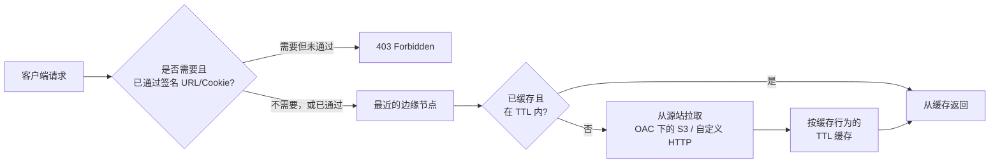

# Amazon CloudFront - Runbook 与参考

[English](README.md) | 简体中文

> 事实核对时间（对照 AWS 官方文档）：2026-08-19

## 心智模型

> CloudFront 总是先用最近的边缘节点回应请求：缓存命中完全不会碰到源站，只有缓存未命中——其形态由缓存行为的 TTL 和转发的请求头/Cookie 决定——才会变成一次源站请求，这正是缓存配置同时是成本和内容新鲜度主要杠杆的原因。

本文主要回答两个问题：

1. 是什么决定一个请求由缓存响应还是转发到源站？
2. 签名 URL/Cookie 和 OAC 在私有内容的这条路径中各起什么作用？

## 全景图



Origin Access Control 和签名 URL/Cookie 是两道独立的关卡：OAC 阻止源站被直接访问，而签名 URL/Cookie 阻止 CloudFront 本身把对象返回给未授权的访问者。

## 概述

Amazon CloudFront 是内容分发网络（CDN），通过遍布全球的边缘站点加速静态和动态内容分发。请求被路由到延迟最低的边缘节点；命中缓存的直接返回，未命中则从源站（origin）拉取。

## 核心概念

- **分发（Distribution）**：把域名映射到源站和缓存行为的 CloudFront 配置。
- **源站（Origin）**：S3 桶、ELB/API Gateway 或自定义 HTTP 服务器，保存内容的权威版本。
- **边缘站点 / POP**：地理分布的内容缓存。
- **缓存行为（Cache behavior）**：路径模式、TTL（默认 24 小时，最小 0）、转发哪些请求头/Cookie。
- **签名 URL 与签名 Cookie**：控制私有内容访问。
- **失效（Invalidation）**：在 TTL 到期前移除已缓存对象。
- **备用域名**：搭配 ACM 证书使用你自己的域名。
- **标准 vs 多租户分发**：单站点独立配置 vs SaaS/多租户集中管理。

## 常用操作（AWS CLI）

```bash
# 创建分发（配置 JSON）
aws cloudfront create-distribution --distribution-config file://distribution-config.json
aws cloudfront list-distributions
aws cloudfront get-distribution --id E1ABCDEFGHIJK2

# 更新
aws cloudfront update-distribution --id E1ABCDEFGHIJK2 \
  --distribution-config file://distribution-config.json --if-match <etag>

# 失效缓存对象
aws cloudfront create-invalidation --distribution-id E1ABCDEFGHIJK2 \
  --paths "/images/*" "/index.html"

# 删除（先禁用）
aws cloudfront delete-distribution --id E1ABCDEFGHIJK2 --if-match <etag>
```

## 最佳实践

- S3 源站用 **Origin Access Control（OAC）**，对象只能通过 CloudFront 访问。
- 设置 `Cache-Control`，谨慎设计缓存行为；不要转发用不到的 Cookie/请求头。
- 私有内容用**签名 URL/Cookie**，而不是公开桶。
- 加 **ACM 证书**并强制 HTTPS。
- 开启**访问日志**并用 CloudWatch 监控；挂 **AWS WAF** 做 Web 层防护。
- 提高缓存命中率，减少源站请求，控制成本。

## 故障排查

| 症状 | 检查与处理 |
|------|-----------|
| 内容不更新 | 检查 TTL 和缓存行为；对变更路径做 invalidation。 |
| S3 源站 `403` | 确认 OAC/OAI 已配置且桶策略允许 CloudFront 访问。 |
| 源站 `502` | 检查源站健康、自定义源站设置、安全组。 |
| 混合内容 / TLS 错误 | 确保 ACM 证书覆盖域名且已强制 HTTPS。 |
| 首字节慢 | 检查源站延迟和缓存命中率；预热缓存或调整 TTL。 |
| 私有内容泄露 | 核对签名 URL/Cookie 配置，桶不要设为公开。 |

## 配额

每账户对分发、失效路径、密钥组有配额。以 Service Quotas 控制台为准。

## 官方参考

- [什么是 Amazon CloudFront？- CloudFront 开发者指南](https://docs.aws.amazon.com/AmazonCloudFront/latest/DeveloperGuide/Introduction.html)
- [CloudFront 定价](https://aws.amazon.com/cloudfront/pricing/)
- [AWS CLI：cloudfront 命令](https://docs.aws.amazon.com/cli/latest/reference/cloudfront/)
