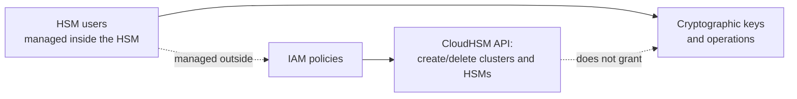

# AWS CloudHSM - Runbook & Reference

> Facts verified against official AWS documentation: 2026-08-19

> CloudHSM splits control into two planes that never overlap: IAM governs who can call the CloudHSM API to manage clusters and HSMs, while HSM users — created and managed inside the HSM itself, invisible to IAM — govern who can use the keys. AWS cannot see either your keys or your HSM users.

This article answers two practical questions:

1. Which permission system do I edit for "can create a cluster" versus "can use this key"?
2. When should I reach for CloudHSM instead of AWS KMS?

## Big picture



Because the two planes are independent, an IAM administrator with full CloudHSM API access still cannot use or see the keys inside a cluster without a valid HSM user.

## Overview

AWS CloudHSM provides dedicated, single-tenant hardware security modules (HSMs) in the AWS Cloud. HSMs process cryptographic operations and store keys in tamper-resistant hardware. CloudHSM gives you full control over keys and algorithms, with AWS managing HSM provisioning, backups, configuration, and maintenance. It is the right choice when you need your own HSMs; for a managed key service, use AWS KMS instead.

## Key concepts

- **Cluster**: a group of HSMs in one VPC; clusters run in FIPS mode (FIPS 140-2/140-3 Level 3 validated keys and algorithms only) or non-FIPS mode (all supported keys/algorithms).
- **Single tenant and private**: HSMs are dedicated to your account, and the data plane is end-to-end encrypted so AWS cannot see your keys.
- **HSM users**: you manage users and permissions inside the HSM (outside IAM); IAM controls the CloudHSM API, HSM users control keys.
- **Client SDKs**: integrate applications using PKCS #11, Java Cryptography Extension (JCE), Cryptography API: Next Generation (CNG), or Key Storage Provider (KSP).
- **Full key control**: generate, store, import, export, and use symmetric keys and asymmetric key pairs; control algorithms.
- **Backups**: AWS automates HSM backups; you manage the cluster and its HSMs.

## Common operations (AWS CLI)

```bash
# Create a cluster and HSMs
aws cloudhsmv2 create-cluster --hsm-type hsm1.medium \
  --subnet-ids subnet-0123456789abcdef0
aws cloudhsmv2 describe-clusters
aws cloudhsmv2 create-hsm --cluster-id <cluster-id> \
  --availability-zone us-east-1a

# Initialize and manage the cluster
aws cloudhsmv2 initialize-cluster --cluster-id <cluster-id> \
  --signed-cert file://cluster-cert.pem \
  --trust-anchor file://customer-ca.pem
aws cloudhsmv2 list-tags --resource-id <cluster-id>

# Backups
aws cloudhsmv2 describe-backups --filters clusterIds=<cluster-id>
aws cloudhsmv2 restore-backup --backup-id <backup-id>

# Delete an HSM or cluster
aws cloudhsmv2 delete-hsm --cluster-id <cluster-id> --hsm-id <hsm-id>
aws cloudhsmv2 delete-cluster --cluster-id <cluster-id>
```

## Best practices

- Use at least two HSMs in different Availability Zones for high availability.
- Choose FIPS mode only when FIPS validation is required; use non-FIPS mode when your workloads need other algorithms.
- Separate duties: IAM for the CloudHSM API, HSM users for keys, and least-privilege policies for both.
- Automate backups and test restore into a new cluster before relying on them.
- Prefer AWS KMS when you want a managed key service; use CloudHSM for single-tenant HSMs or standards (PKCS #11, JCE, CNG/KSP) requirements.
- Monitor cluster health and HSM counts; place HSMs in private subnets with security groups limited to your application CIDRs.

## Troubleshooting

| Symptom | Checks and fixes |
|---|---|
| Cluster initialization fails | Verify the signed certificate matches the cluster and the trust anchor is a valid CA certificate. |
| Clients cannot connect | Check security groups, client SDK configuration, and that HSMs are active in the cluster. |
| HSM user login denied | Confirm the user exists in the HSM and the password policy/retry limits are understood. |
| Backup restore slow | Restore to a new cluster in the same Region; cross-Region restore has additional constraints. |
| KMS/CloudHSM confusion | KMS is fully managed; CloudHSM requires you to manage HSM users and application integration. |

## Limits

HSMs per cluster, clusters per account per Region, and backup limits apply. See the AWS CloudHSM endpoints and quotas page and Service Quotas console for current values.

## Official references

- [What is AWS CloudHSM?](https://docs.aws.amazon.com/cloudhsm/latest/userguide/introduction.html)
- [AWS CloudHSM quotas](https://docs.aws.amazon.com/cloudhsm/latest/userguide/limits.html)
- [AWS CloudHSM pricing](https://aws.amazon.com/cloudhsm/pricing/)
- [AWS CLI: cloudhsmv2 commands](https://docs.aws.amazon.com/cli/latest/reference/cloudhsmv2/)
