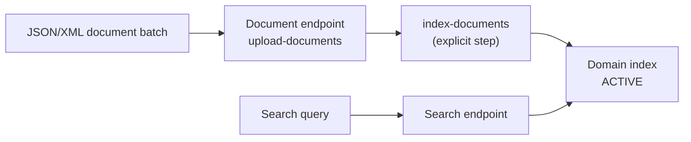

# Amazon CloudSearch - Runbook & Reference

English | [简体中文](README_ZH.md)

> Facts verified against official AWS documentation: 2026-08-19

## Mental model

> A CloudSearch domain has two separate front doors — a document endpoint for writes and a search endpoint for reads — and data uploaded through the first is not searchable until an explicit indexing step runs, so "upload" and "make searchable" are two distinct operations, not one.

This article answers one practical question:

1. What has to happen, in order, between uploading a document and being able to search for it?

## Big picture



Because indexing is a separate, explicit call, a successful upload with no subsequent indexing run is the most common reason a document is "there" but not yet searchable.

## Overview

Amazon CloudSearch is a fully managed search service for building search solutions over large collections of data such as web pages, documents, forum posts, and product information. You create a search domain, upload data, and query through an HTTP search endpoint. Note: Amazon CloudSearch is no longer available to new customers; existing customers can continue using the service.

## Key concepts

- **Search domain**: a domain contains your searchable data and the search instances that serve requests; create separate domains for separate collections.
- **Indexing**: CloudSearch indexes structured data and plain text; the index is deployed to one or more search instances.
- **Search features**: full-text search with language-specific text processing, boolean, prefix and range searches, term boosting, faceting, highlighting, and autocomplete suggestions.
- **Endpoints**: a configuration endpoint (per Region) manages domains; each domain has a document endpoint (`doc-<domain>-<id>...`) for uploads and a search endpoint (`search-<domain>-<id>...`) for queries; results are JSON or XML.
- **Scaling**: add/remove search instances as data volume and traffic change.

## Common operations (AWS CLI)

```bash
# Create and manage a domain
aws cloudsearch create-domain --domain-name products
aws cloudsearch describe-domains --domain-names products

# Upload documents (JSON/XML batches via the document endpoint)
aws cloudsearchdomain upload-documents --endpoint-url https://doc-products-xxxxxxxxx.us-east-1.cloudsearch.amazonaws.com \
  --documents file://batch.json --content-type application/json

# Index and search
aws cloudsearch index-documents --domain-name products
aws cloudsearchdomain search --endpoint-url https://search-products-xxxxxxxxx.us-east-1.cloudsearch.amazonaws.com \
  --query "laptop" --query-parser simple --size 10

# Delete a domain
aws cloudsearch delete-domain --domain-name products
```

## Best practices

- Define a clear indexing schema (fields, facets, suggester) before uploading large batches.
- Batch document uploads and index once per batch to reduce indexing overhead.
- Size search instances to your data volume and query traffic; monitor latency and scale out proactively.
- Use facet and suggester options for rich result UX; secure the search endpoint (SigV4 or access policies) when it should not be public.
- Existing customers: plan migration to current search services if you are starting new projects, since new customers cannot onboard.

## Troubleshooting

| Symptom | Checks and fixes |
|---|---|
| Documents not searchable | Confirm documents uploaded to the document endpoint and `index-documents` ran successfully. |
| Search returns no results | Check the query parser, field names, and that the index is in ACTIVE state. |
| Domain endpoint unknown | Get the endpoints from `describe-domains`; they include account/domain identifiers. |
| Slow search | Increase search instances or reduce result size; review facet/aggregation usage. |
| Access denied | Sign requests with SigV4 or configure access policies for anonymous query endpoints. |

## Limits

Domains per account, search instances per domain, document sizes, and API rates have quotas; service onboarding is limited to existing customers. See the Amazon CloudSearch endpoints and quotas page for current values.

## Official references

- [What is Amazon CloudSearch?](https://docs.aws.amazon.com/cloudsearch/latest/developerguide/what-is-cloudsearch.html)
- [Amazon CloudSearch endpoints and quotas](https://docs.aws.amazon.com/general/latest/gr/cloudsearch.html)
- [Amazon CloudSearch pricing](https://aws.amazon.com/cloudsearch/pricing/)
- [AWS CLI: cloudsearch and cloudsearchdomain commands](https://docs.aws.amazon.com/cli/latest/reference/cloudsearch/)
