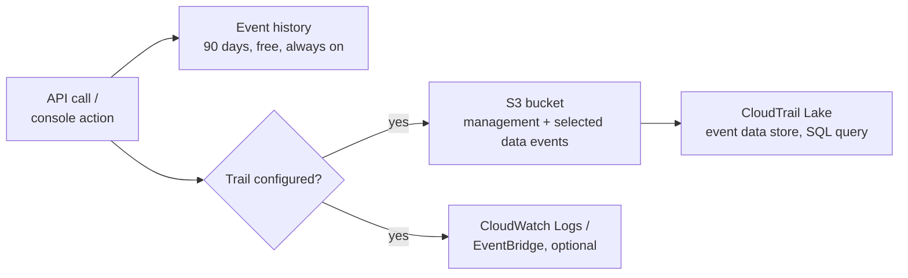

# AWS CloudTrail - Runbook & Reference

> Facts verified against official AWS documentation: 2026-08-19

> CloudTrail has three layers of increasing commitment: Event history is always-on and free but capped at 90 days, a trail is an explicit choice to keep management/data events longer by shipping them to S3, and CloudTrail Lake is a queryable audit warehouse built on top of that shipped data.

This article answers two practical questions:

1. Why would events be missing after 90 days, and what fixes that?
2. What is the difference between a management event and a data event, and why does that distinction affect cost?

## Big picture



Event history cannot be extended — it is a fixed 90-day window regardless of configuration; long-term retention and querying always requires creating a trail or a Lake event data store.

## Overview

AWS CloudTrail records actions taken by users, roles, and AWS services in your account (console, CLI, SDK, and API) as events. It supports operational and risk auditing, governance, and compliance. CloudTrail provides Event history, trails, and CloudTrail Lake.

## Key concepts

- **Event history**: a viewable, searchable, immutable record of the past 90 days of management events in each Region; free and available by default.
- **Trail**: delivers management events (and optionally data/Insights events) to an S3 bucket, with optional delivery to CloudWatch Logs and EventBridge.
- **Management events**: control-plane operations (who did what, when, from where).
- **Data events**: resource operations (S3 object-level activity, Lambda invocations, DynamoDB operations).
- **Insights events**: detect unusual API activity (rate and error anomalies) in management events.
- **CloudTrail Lake**: a managed audit data lake with event data stores; store events up to about 7-10 years depending on the pricing option; query with SQL and visualize dashboards; federate to Athena.
- **Organization trails**: one trail for all accounts in an AWS Organizations organization; member accounts can't disable or modify it.

## Common operations (AWS CLI)

```bash
# Create a multi-Region trail
aws cloudtrail create-trail --name default --s3-bucket-name trail-bucket \
  --is-multi-region-trail --include-global-service-events

# Enable logging and check status
aws cloudtrail start-logging --name default
aws cloudtrail get-trail-status --name default

# Event selectors (management + S3 data events)
aws cloudtrail put-event-selectors --trail-name default \
  --event-selectors file://event-selectors.json

# Search recent management events
aws cloudtrail lookup-events --lookup-attributes AttributeKey=EventSource,AttributeValue=ec2.amazonaws.com

# CloudTrail Lake: create an event data store
aws cloudtrail create-event-data-store --name audit-store \
  --retention-period 2557 \
  --advanced-event-selectors file://advanced-selectors.json

# List trails
aws cloudtrail list-trails
```

## Best practices

- Create an organization trail in the management account and deliver to a dedicated, encrypted, private S3 bucket.
- Enable CloudTrail Insights for anomaly detection on management events.
- Record data events selectively (high-value buckets, Lambda) to control cost.
- Protect the trail bucket with a bucket policy (deny public access) and enable S3 versioning; use KMS encryption.
- Deliver to CloudWatch Logs for real-time alerts, and use CloudTrail Lake for long-term query/audit.
- Monitor trail status with CloudWatch alarms so logging doesn't silently stop.
- Restrict `cloudtrail:StopLogging` and `DeleteTrail` with IAM and SCPs.

## Troubleshooting

| Symptom | Checks and fixes |
|---|---|
| No events delivered | Verify the trail is logging, the S3 bucket policy allows CloudTrail writes, and KMS key permissions are correct. |
| Data events missing | Check event selectors and advanced event selectors for the trail. |
| Event history only 90 days | Event history is fixed at 90 days; create a trail or Lake event data store for longer retention. |
| Organization members can't see events | Confirm the organization trail is enabled and member account permissions allow `cloudtrail:GetTrail`. |
| Lake queries return nothing | Check event data store selectors, retention, and ingestion status. |

## Limits

Event history is retained 90 days; Lake event data stores support up to about 7 years (2,557 days) or 10 years (3,653 days) depending on pricing option. Trails, event data stores, and delivery rates have quotas. See the Service Quotas console for current values.

## Official references

- [What Is AWS CloudTrail?](https://docs.aws.amazon.com/awscloudtrail/latest/userguide/cloudtrail-user-guide.html)
- [AWS CloudTrail quotas](https://docs.aws.amazon.com/awscloudtrail/latest/userguide/WhatIsCloudTrail-Limits.html)
- [AWS CloudTrail pricing](https://aws.amazon.com/cloudtrail/pricing/)
- [AWS CLI: cloudtrail commands](https://docs.aws.amazon.com/cli/latest/reference/cloudtrail/)
