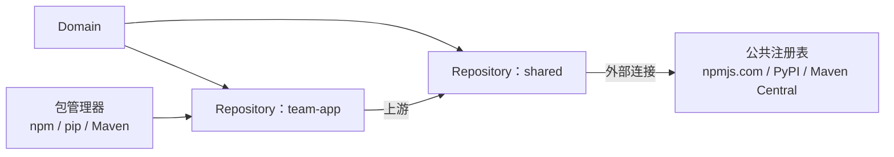

# AWS CodeArtifact - Runbook 与参考

[English](README.md) | 简体中文

> 事实核对时间（对照 AWS 官方文档）：2026-08-19

## 心智模型

> CodeArtifact 的仓库构成一张有向图，而不是一份平铺列表：一个仓库可以把另一个仓库（包括背后连着公共注册表的仓库）声明为自己的上游，于是同一个包管理器端点可以透明地解析出实际分散在多个仓库中的包。

本文主要回答一个问题：

1. 当某个包版本的解析结果出乎意料时，上游链条中到底是哪个仓库提供了它？

## 全景图



由于上游关系可以链式串联，开发者发布到 `team-app` 的包可能会遮蔽掉本应从 `shared` 或公共注册表解析出的同名包——解析顺序遵循上游链，而不是字母顺序或时间顺序。

## 概述

AWS CodeArtifact 是托管制品仓库服务，用于存储和共享软件开发包。它支持主流包管理器（npm、yarn、pip、twine、Maven、Gradle、NuGet），支持私有包和到公共仓库的外部连接，且存储包的数量和总大小没有限制。

## 核心概念

- **Domain**：顶层容器，对仓库分组并提供组织边界和策略；建议一个组织使用一个生产 domain，下辖一个或多个仓库。
- **Repository**：多语言包集合（支持任意受支持的包类型）；每个仓库属于且仅属于一个 domain。
- **上游仓库（Upstream）**：让一个仓库中的包对同一 domain 中的另一个仓库可用，包括通过外部连接获取的包。
- **外部连接**：将仓库连接到公共仓库（npmjs.com、Maven Central、PyPI、NuGet Gallery）；包按需获取并缓存。
- **认证**：用户使用由 AWS 凭证生成的授权令牌认证；包不能对外公开。
- **包管理器**：npm/yarn/pip/twine/Maven/Gradle/NuGet 通过仓库端点 URL 发布和消费。

## 常用操作（AWS CLI）

```bash
# 创建 domain 和仓库
aws codeartifact create-domain --domain my-org
aws codeartifact create-repository --domain my-org --repository shared

# 获取授权令牌（用于包管理器配置）
aws codeartifact get-authorization-token --domain my-org \
  --domain-owner 123456789012 --query authorizationToken --output text

# 发布包（npm 示例）
npm publish --registry https://my-org-123456789012.d.codeartifact.us-east-1.amazonaws.com/npm/shared/

# 管理包
aws codeartifact list-packages --domain my-org --repository shared
aws codeartifact list-package-versions --domain my-org --repository shared \
  --package my-pkg --format npm
aws codeartifact delete-package --domain my-org --repository shared \
  --format npm --package my-pkg
```

## 最佳实践

- 每个组织一个生产 domain，按团队/项目分仓库。
- 将公共源配置为上游，让构建不依赖单一互联网源；控制流入的版本。
- 用 domain 资源策略控制跨账户访问；IAM 遵循最小权限。
- CI/CD 中自动轮换授权令牌；绝不提交令牌。
- 启用外部连接缓存并监控包版本；删除无用版本。
- 用 CloudTrail 记录包活动用于审计。

## 故障排查

| 症状 | 检查与处理 |
|---|---|
| 包管理器认证失败 | 获取新授权令牌，核对仓库端点和区域。 |
| 无法发布 | 检查 IAM 权限（`codeartifact:PublishPackageVersion`）和仓库策略。 |
| 上游包缺失 | 核对上游仓库配置和外部连接状态。 |
| npm/yarn 缓存过期 | 清理本地包管理器缓存或提升版本。 |
| 跨账户访问被拒 | 确认 domain 资源策略授权消费账户，令牌使用正确的 domain owner。 |

## 配额

每账户 domain 和仓库数、每仓库上游数以及 API 请求速率有限制。以 AWS CodeArtifact 配额页面和 Service Quotas 控制台为准。

## 官方参考

- [什么是 AWS CodeArtifact？- 用户指南](https://docs.aws.amazon.com/codeartifact/latest/ug/welcome.html)
- [AWS CodeArtifact 配额](https://docs.aws.amazon.com/codeartifact/latest/ug/service-limits.html)
- [AWS CodeArtifact 定价](https://aws.amazon.com/codeartifact/pricing/)
- [AWS CLI：codeartifact 命令](https://docs.aws.amazon.com/cli/latest/reference/codeartifact/)
