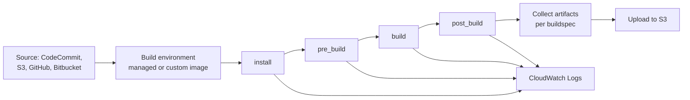

# AWS CodeBuild - Runbook & Reference

English | [简体中文](README_ZH.md)

> Facts verified against official AWS documentation: 2026-08-19

## Mental model

> A CodeBuild run is entirely scripted by one file: the buildspec's phases execute in a fixed order in a fresh container, so a failure at "install" versus "build" versus "post_build" points to a completely different part of that same file, not a different system.

This article answers one practical question:

1. In what order do buildspec phases run, and what does failing at each phase usually mean?

## Big picture



Because phases run strictly in order in the same container, a dependency installed in `build` instead of `install` will still work by accident — but a network or registry failure will always surface first at whichever phase issues that network call, which is the fastest way to localize the fix.

## Overview

AWS CodeBuild is a fully managed build service that compiles source code, runs unit tests, and produces deployable artifacts. It removes the need to provision, patch, and scale build servers: CodeBuild provides prepackaged build environments for popular languages and tools, supports custom environments, and scales automatically to handle peak build demand. You pay only for the build minutes you consume.

## Key concepts

- **Build project**: the configuration for a build, including source, environment (image, compute), build commands (`buildspec`), artifacts, and logs.
- **Buildspec**: a YAML file (`buildspec.yml`) in the source that defines install/pre_build/build/post_build phases and artifacts.
- **Build environment**: a managed or custom Docker image with the runtime and tools (Maven, Gradle, npm, etc.).
- **Source providers**: AWS CodeCommit, S3, GitHub/GitHub Enterprise, Bitbucket, or no source.
- **Artifacts**: build outputs uploaded to S3 or available in the build environment.
- **Integration**: add CodeBuild as a build/test action in a CodePipeline stage, or run standalone via console/CLI/SDK.

## Common operations (AWS CLI)

```bash
# Create a build project
aws codebuild create-project --name web-build \
  --source type=CODECOMMIT,location=https://git-codecommit.us-east-1.amazonaws.com/v1/repos/my-app \
  --environment type=LINUX_CONTAINER,image=aws/codebuild/standard:7.0,computeType=BUILD_GENERAL1_SMALL \
  --service-role arn:aws:iam::123456789012:role/codebuild-role \
  --artifacts type=S3,location=my-build-artifacts

# Start and monitor a build
aws codebuild start-build --project-name web-build
aws codebuild batch-get-builds --ids <build-id>
aws codebuild list-builds-for-project --project-name web-build

# Logs (CloudWatch)
aws logs tail /aws/codebuild/web-build --follow
```

## Best practices

- Put build logic in `buildspec.yml` so builds are reproducible and reviewable in code.
- Use specific, pinned image versions and custom images for deterministic environments.
- Upload artifacts to versioned S3 buckets and keep a retention policy.
- Set build concurrency and timeouts to control cost; use reserved capacity for predictable workloads.
- Cache dependencies (Maven, npm) to speed builds and reduce cost.
- Restrict IAM roles: build projects need least-privilege permissions for source, artifacts, and secrets.
- Fail fast: add lint, tests, and security scans (for example, SAST) as early build phases.

## Troubleshooting

| Symptom | Checks and fixes |
|---|---|
| Build fails at install/pre_build | Check dependency versions and network access for package registries; review build logs. |
| Artifact not uploaded | Verify the S3 bucket, IAM permissions, and artifact configuration. |
| Build stuck | Check timeout settings, resource limits (compute), and Docker hub pulls. |
| Secrets needed in build | Store them in Secrets Manager/Parameter Store and reference them with permission boundaries. |
| VPC-only resources unreachable | Configure the build project to run in a VPC with the required subnets/security groups. |

## Limits

Build projects per account, concurrent builds, build minutes, and artifact sizes have quotas. See the AWS CodeBuild quotas page and Service Quotas console for current values.

## Official references

- [What is AWS CodeBuild?](https://docs.aws.amazon.com/codebuild/latest/userguide/welcome.html)
- [AWS CodeBuild quotas](https://docs.aws.amazon.com/codebuild/latest/userguide/limits.html)
- [AWS CodeBuild pricing](https://aws.amazon.com/codebuild/pricing/)
- [AWS CLI: codebuild commands](https://docs.aws.amazon.com/cli/latest/reference/codebuild/)
