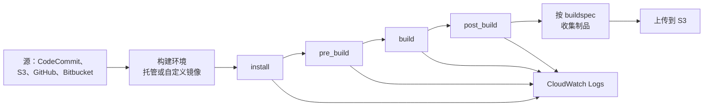

# AWS CodeBuild - Runbook 与参考

[English](README.md) | 简体中文

> 事实核对时间（对照 AWS 官方文档）：2026-08-19

## 心智模型

> CodeBuild 的一次运行完全由一个文件脚本化：buildspec 的各阶段在一个全新容器中按固定顺序执行，所以失败发生在 "install" 还是 "build" 还是 "post_build"，指向的是同一个文件里完全不同的部分，而不是不同的系统。

本文主要回答一个问题：

1. buildspec 各阶段的执行顺序是怎样的？每个阶段失败通常意味着什么？

## 全景图



由于各阶段在同一个容器内严格按顺序执行，把依赖装在 `build` 而不是 `install` 里偶尔也能凑巧跑通——但网络或仓库故障总会最先出现在发起该网络调用的那个阶段，这是定位问题最快的线索。

## 概述

AWS CodeBuild 是全托管构建服务，负责编译源代码、运行单元测试并生成可部署的制品。它免去供给、修补和扩展构建服务器的负担：CodeBuild 为流行语言和工具提供预置构建环境，支持自定义环境，并自动扩展以应对峰值构建请求。你只为消耗的构建分钟数付费。

## 核心概念

- **构建项目（Build project）**：构建的配置，包括源、环境（镜像、计算）、构建命令（buildspec）、制品和日志。
- **Buildspec**：源中的 YAML 文件（`buildspec.yml`），定义 install/pre_build/build/post_build 阶段和制品。
- **构建环境**：托管或自定义 Docker 镜像，包含运行时和工具（Maven、Gradle、npm 等）。
- **源提供方**：AWS CodeCommit、S3、GitHub/GitHub Enterprise、Bitbucket 或无源。
- **制品（Artifacts）**：上传到 S3 或在构建环境中可用的构建输出。
- **集成**：在 CodePipeline 的构建/测试阶段加入 CodeBuild 动作，或通过控制台/CLI/SDK 独立运行。

## 常用操作（AWS CLI）

```bash
# 创建构建项目
aws codebuild create-project --name web-build \
  --source type=CODECOMMIT,location=https://git-codecommit.us-east-1.amazonaws.com/v1/repos/my-app \
  --environment type=LINUX_CONTAINER,image=aws/codebuild/standard:7.0,computeType=BUILD_GENERAL1_SMALL \
  --service-role arn:aws:iam::123456789012:role/codebuild-role \
  --artifacts type=S3,location=my-build-artifacts

# 启动并监控构建
aws codebuild start-build --project-name web-build
aws codebuild batch-get-builds --ids <build-id>
aws codebuild list-builds-for-project --project-name web-build

# 日志（CloudWatch）
aws logs tail /aws/codebuild/web-build --follow
```

## 最佳实践

- 构建逻辑写在 `buildspec.yml` 中，保证构建可复现、可审查。
- 使用固定版本镜像和自定义镜像，保证环境确定性。
- 制品上传到带版本管理的 S3 桶，并设置保留策略。
- 设置构建并发和超时控制成本；可预测负载使用预留容量。
- 缓存依赖（Maven、npm）加快构建、降低成本。
- 限制 IAM 角色：构建项目只需源、制品和密钥的最小权限。
- 尽早失败：lint、测试和安全扫描（如 SAST）放在构建早期阶段。

## 故障排查

| 症状 | 检查与处理 |
|---|---|
| install/pre_build 阶段失败 | 检查依赖版本和包仓库的网络访问；查看构建日志。 |
| 制品未上传 | 核对 S3 桶、IAM 权限和制品配置。 |
| 构建卡住 | 检查超时设置、资源限制（计算）和 Docker Hub 拉取。 |
| 构建需要密钥 | 存入 Secrets Manager/Parameter Store，并在权限边界内引用。 |
| VPC 内资源不可达 | 配置构建项目在 VPC 内运行，使用所需子网/安全组。 |

## 配额

每账户构建项目数、并发构建数、构建分钟数和制品大小有限制。以 AWS CodeBuild 配额页面和 Service Quotas 控制台为准。

## 官方参考

- [什么是 AWS CodeBuild？- 用户指南](https://docs.aws.amazon.com/codebuild/latest/userguide/welcome.html)
- [AWS CodeBuild 配额](https://docs.aws.amazon.com/codebuild/latest/userguide/limits.html)
- [AWS CodeBuild 定价](https://aws.amazon.com/codebuild/pricing/)
- [AWS CLI：codebuild 命令](https://docs.aws.amazon.com/cli/latest/reference/codebuild/)
