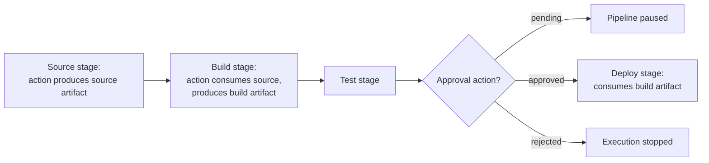

# AWS CodePipeline - Runbook & Reference

English | [简体中文](README_ZH.md)

> Facts verified against official AWS documentation: 2026-08-19

## Mental model

> A pipeline is a strict sequence of stages, each an ordered list of actions, connected only by artifacts: an action can only see the artifacts the actions before it explicitly output, so a missing input in stage N almost always traces back to a name mismatch in stage N-1's output.

This article answers one practical question:

1. When an action can't find its input, where in the stage/action/artifact chain should I look?

## Big picture



Because artifacts—not shared state—are the only thing passed between actions, renaming an output artifact in one action without updating the next action's input name is the single most common cause of a "missing artifact" failure.

## Overview

AWS CodePipeline is a continuous delivery service that models, visualizes, and automates the stages of a software release. A pipeline describes how code changes flow from source through build and test to deployment; each stage contains actions provided by AWS services (CodeCommit, CodeBuild, CodeDeploy, Lambda, S3) or third-party integrations (GitHub, Jenkins, etc.).

## Key concepts

- **Pipeline**: a workflow with stages executed in order; pipelines run automatically when the source changes or on demand.
- **Stage**: a logical phase (for example, Source, Build, Test, Deploy) containing one or more actions.
- **Action**: a step in a stage (source, build, test, deploy, approval, invoke); actions have input/output artifacts.
- **Artifact**: the files passed between stages (for example, source bundle or build output), stored in an S3 artifact bucket.
- **Approval action**: manual gate that pauses the pipeline until someone approves or rejects.
- **Execution**: a run of the pipeline; you can view history, retry failed actions, and track transitions.

## Common operations (AWS CLI)

```bash
# Create a pipeline from a definition
aws codepipeline create-pipeline --cli-input-json file://pipeline.json

# Manage and monitor
aws codepipeline list-pipelines
aws codepipeline get-pipeline-state --name my-pipeline
aws codepipeline list-pipeline-executions --pipeline-name my-pipeline

# Start and update
aws codepipeline start-pipeline-execution --name my-pipeline
aws codepipeline update-pipeline --pipeline file://pipeline.json
aws codepipeline delete-pipeline --name my-pipeline
```

## Best practices

- Keep the pipeline definition in code (CloudFormation or CLI JSON) and version it with your application.
- Model clear stages (Source, Build, Test, Deploy) with approvals before production deployment.
- Use CodeBuild for build/test actions and CodeDeploy/ECS/Lambda/CloudFormation for deployment actions.
- Make actions fail fast; add notifications for pipeline state changes (SNS/EventBridge) and CloudWatch alarms.
- Use separate pipelines or stages per environment (dev, staging, prod) with appropriate approvals.
- Store artifacts in a dedicated, encrypted S3 bucket with lifecycle rules; restrict pipeline roles to least privilege.

## Troubleshooting

| Symptom | Checks and fixes |
|---|---|
| Pipeline stuck on approval | Check that the approver(s) received the notification and the action is not expired. |
| Action failed | Open the action details/execution logs; verify source, build, or deployment configuration. |
| Artifacts missing between stages | Confirm artifact names match between action inputs/outputs and the artifact bucket policy. |
| Source change not triggering | Verify the source action (CodeCommit event, GitHub webhook, S3) and pipeline configuration. |
| IAM errors | Ensure the pipeline service role and action roles have the required permissions. |

## Limits

Pipelines per account, stages and actions per pipeline, artifact sizes, and executions have quotas. See the AWS CodePipeline quotas page and Service Quotas console for current values.

## Official references

- [What is AWS CodePipeline?](https://docs.aws.amazon.com/codepipeline/latest/userguide/welcome.html)
- [AWS CodePipeline quotas](https://docs.aws.amazon.com/codepipeline/latest/userguide/limits.html)
- [AWS CodePipeline pricing](https://aws.amazon.com/codepipeline/pricing/)
- [AWS CLI: codepipeline commands](https://docs.aws.amazon.com/cli/latest/reference/codepipeline/)
