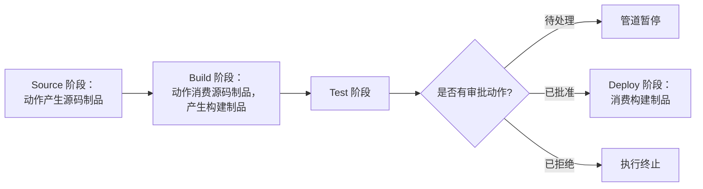

# AWS CodePipeline - Runbook 与参考

[English](README.md) | 简体中文

> 事实核对时间（对照 AWS 官方文档）：2026-08-19

## 心智模型

> 管道是一系列严格有序的阶段，每个阶段是一份有序的动作列表，动作之间只通过制品连接：一个动作只能看到它之前的动作显式输出的制品，所以阶段 N 缺少输入，几乎总能追溯到阶段 N-1 输出的命名不匹配。

本文主要回答一个问题：

1. 当某个动作找不到它的输入时，应该在阶段/动作/制品这条链条中的哪里查找？

## 全景图



由于动作之间传递的只有制品而非共享状态，某个动作重命名了输出制品却没有同步更新下一个动作的输入名称，是"制品缺失"故障最常见的原因。

## 概述

AWS CodePipeline 是持续交付服务，用于建模、可视化和自动化软件发布的各阶段。管道描述代码变更如何从源经过构建和测试进入部署；每个阶段包含 AWS 服务（CodeCommit、CodeBuild、CodeDeploy、Lambda、S3）或第三方（GitHub、Jenkins 等）提供的动作。

## 核心概念

- **管道（Pipeline）**：按顺序执行阶段的工作流；源变更时自动运行，也可手动触发。
- **阶段（Stage）**：逻辑阶段（例如 Source、Build、Test、Deploy），包含一个或多个动作。
- **动作（Action）**：阶段中的步骤（source、build、test、deploy、approval、invoke）；动作有输入/输出制品。
- **制品（Artifact）**：阶段间传递的文件（例如源码包或构建输出），存放在 S3 制品桶。
- **审批动作（Approval）**：手动闸门，暂停管道直到有人批准或拒绝。
- **执行（Execution）**：管道的一次运行；可查看历史、重试失败动作和跟踪流转。

## 常用操作（AWS CLI）

```bash
# 从定义创建管道
aws codepipeline create-pipeline --cli-input-json file://pipeline.json

# 管理和监控
aws codepipeline list-pipelines
aws codepipeline get-pipeline-state --name my-pipeline
aws codepipeline list-pipeline-executions --pipeline-name my-pipeline

# 启动和更新
aws codepipeline start-pipeline-execution --name my-pipeline
aws codepipeline update-pipeline --pipeline file://pipeline.json
aws codepipeline delete-pipeline --name my-pipeline
```

## 最佳实践

- 管道定义放进代码（CloudFormation 或 CLI JSON）并随应用版本管理。
- 建模清晰阶段（Source、Build、Test、Deploy），生产部署前加审批。
- 构建/测试用 CodeBuild，部署用 CodeDeploy/ECS/Lambda/CloudFormation。
- 动作尽快失败；为管道状态变化配置通知（SNS/EventBridge）和 CloudWatch 告警。
- 每个环境（dev、staging、prod）用独立管道或阶段，并配置相应审批。
- 制品放在专用、加密、带生命周期规则的 S3 桶；管道角色遵循最小权限。

## 故障排查

| 症状 | 检查与处理 |
|---|---|
| 管道卡在审批 | 检查审批人是否收到通知，动作是否过期。 |
| 动作失败 | 打开动作详情/执行日志；核对源、构建或部署配置。 |
| 阶段间缺少制品 | 确认动作输入/输出与制品名称匹配，以及制品桶策略。 |
| 源变更未触发 | 核对源动作（CodeCommit 事件、GitHub webhook、S3）和管道配置。 |
| IAM 报错 | 确保管道服务角色和动作角色具备所需权限。 |

## 配额

每账户管道数、每管道阶段/动作数、制品大小和执行次数有限制。以 AWS CodePipeline 配额页面和 Service Quotas 控制台为准。

## 官方参考

- [什么是 AWS CodePipeline？- 用户指南](https://docs.aws.amazon.com/codepipeline/latest/userguide/welcome.html)
- [AWS CodePipeline 配额](https://docs.aws.amazon.com/codepipeline/latest/userguide/limits.html)
- [AWS CodePipeline 定价](https://aws.amazon.com/codepipeline/pricing/)
- [AWS CLI：codepipeline 命令](https://docs.aws.amazon.com/cli/latest/reference/codepipeline/)
