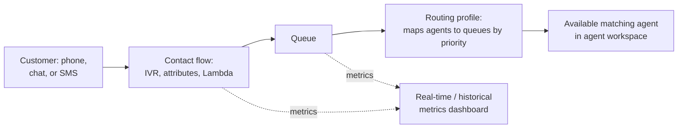

# Amazon Connect - Runbook & Reference

English | [简体中文](README_ZH.md)

> Facts verified against official AWS documentation: 2026-08-19

## Mental model

> A contact's entire journey is scripted by one flow object, and it never reaches an agent directly: the flow puts it in a queue, and a routing profile — not the flow — is what actually decides which agent picks it up, so routing problems and flow problems have different root causes even though they feel the same to a caller.

This article answers one practical question:

1. When a contact isn't reaching an agent, is the flow or the routing profile/queue the more likely cause?

## Big picture



A contact can be stuck for two very different reasons that look identical to the customer: the flow never queues it correctly, or the routing profile has no agent configured for that queue — the fix is in a different console area for each.

## Overview

Amazon Connect is a cloud contact center that lets you build and manage customer communication experiences. Amazon Connect now refers to a portfolio of agentic solutions for business functions; the legacy contact center product is called Amazon Connect Customer (or simply Customer). Connect Customer provides voice, chat, SMS, and task channels, intelligent routing, real-time metrics, and AI-powered capabilities, and you pay only for what you use.

## Key concepts

- **Contact center**: the hub where customers reach agents through voice, chat, SMS, or tasks, and where interactions are recorded, routed, and measured.
- **Phone numbers and channels**: provision phone numbers (local, toll-free, DID) and enable chat/SMS channels for customer entry points.
- **Flows (contact flows)**: visual, drag-and-drop workflows that define how contacts are handled (IVR menus, queueing, attributes, transfers, Lambda integration).
- **Queues and routing profiles**: queues hold contacts waiting for agents; routing profiles map agents to queues and prioritize contact types.
- **Agent workspace**: the agent UI for handling contacts, chat, and tasks, with integrated CRM and other applications.
- **Supervisor and analytics**: real-time and historical metrics, dashboards, and reporting for queue performance and agent productivity.
- **Integration**: connect to AWS services (Lambda, Lex, DynamoDB, S3, Kinesis) and third-party CRM/ticketing systems.
- **Pay-per-use**: you pay for usage (voice minutes, chat/SMS messages, tasks) without long-term contracts.

## Common operations (AWS CLI)

```bash
# List instances and claim a phone number
aws connect list-instances
aws connect claim-phone-number --phone-number countryCode=+1,type=TOLL_FREE

# Create a queue, routing profile, and user
aws connect create-queue --instance-id <instance-id> --name support \
  --hours-of-operation-id <hours-id>
aws connect create-routing-profile --instance-id <instance-id> \
  --name main --default-outbound-queue-id <queue-id> \
  --queue-configs file://queues.json
aws connect create-user --instance-id <instance-id> --username agent1 \
  --routing-profile-id <profile-id> --identity-info file://identity.json \
  --phone-config '{"PhoneType":"SOFT_PHONE"}'

# Monitor contacts
aws connect list-contact-flow --instance-id <instance-id>
aws connect get-current-metric-data --instance-id <instance-id> \
  --filters file://filters.json --current-metrics file://metrics.json
```

## Best practices

- Design flows with clear entry points, error handling, and escalation paths; test flows in a staging instance first.
- Use routing profiles and queues to match contact priority and agent skill instead of manual transfers.
- Integrate Lambda for dynamic data (customer lookup, attribute enrichment) and Lex for self-service.
- Record and transcribe calls where compliance requires; store recordings in encrypted S3.
- Monitor real-time metrics (queue length, abandonment) and set alarms for degradation.
- Control access with IAM and Connect permission profiles; keep the root user out of day-to-day administration.

## Troubleshooting

| Symptom | Checks and fixes |
|---|---|
| Calls not routing | Check the contact flow, queue/routing profile association, and phone number status. |
| Agents cannot receive contacts | Verify agent user setup, routing profile, and channel availability. |
| Flow errors | Test the flow with sample attributes; check Lambda integration and permissions. |
| No metrics | Confirm the queue/agent is in the metrics filters and the instance Region matches. |
| Recording missing | Check recording configuration, S3 bucket permissions, and encryption keys. |

## Limits

Phone numbers per instance, concurrent contacts, and API request rates have quotas; contact limits vary by Region and instance type. See the Amazon Connect endpoints and quotas page and Service Quotas console for current values.

## Official references

- [What is Amazon Connect?](https://docs.aws.amazon.com/connect/latest/adminguide/what-is-amazon-connect.html)
- [Amazon Connect endpoints and quotas](https://docs.aws.amazon.com/general/latest/gr/connect.html)
- [Amazon Connect pricing](https://aws.amazon.com/connect/pricing/)
- [AWS CLI: connect commands](https://docs.aws.amazon.com/cli/latest/reference/connect/)
