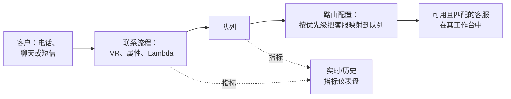

# Amazon Connect - Runbook 与参考

[English](README.md) | 简体中文

> 事实核对时间（对照 AWS 官方文档）：2026-08-19

## 心智模型

> 联系人的整个旅程由一个流程对象脚本化，而且它从不直接到达客服：流程把它放进队列，真正决定哪个客服接手的是路由配置（routing profile），而不是流程本身——所以路由问题和流程问题的根因不同，尽管在来电者看来它们感觉一样。

本文主要回答一个问题：

1. 当联系人无法到达客服时，更可能的原因是流程本身，还是路由配置/队列？

## 全景图



联系人卡住可能出于两个在客户看来完全一样，但原因截然不同的问题：流程没有正确把它放入队列，或者路由配置对该队列没有配置任何客服——两种情况需要在控制台的不同位置修复。

## 概述

Amazon Connect 是云联络中心，用于构建和管理客户沟通体验。Amazon Connect 现在指面向业务职能的智能体（agentic）解决方案组合；传统联络中心产品称为 Amazon Connect Customer（或简称 Customer）。Connect Customer 提供语音、聊天、短信和任务渠道、智能路由、实时指标和 AI 能力，按使用量付费。

## 核心概念

- **联络中心**：客户通过语音、聊天、短信或任务联系客服，交互被记录、路由和度量的中枢。
- **电话号码与渠道**：申请电话号码（本地、免费、DID）并启用聊天/短信渠道作为客户入口。
- **流程（Flows，即 contact flows）**：可视化拖拽工作流，定义联系人如何处理（IVR 菜单、排队、属性、转接、Lambda 集成）。
- **队列与路由配置（Queues and routing profiles）**：队列暂存等待客服的联系人；路由配置将客服映射到队列并按优先级分配联系类型。
- **客服工作台（Agent workspace）**：客服处理电话、聊天和任务的界面，可集成 CRM 和其他应用。
- **主管与分析**：实时和历史指标、仪表盘和报表，用于衡量队列绩效和客服生产力。
- **集成**：连接 AWS 服务（Lambda、Lex、DynamoDB、S3、Kinesis）和第三方 CRM/工单系统。
- **按量付费**：按使用量（语音分钟数、聊天/短信消息、任务）付费，无长期合同。

## 常用操作（AWS CLI）

```bash
# 列出实例并申请电话号码
aws connect list-instances
aws connect claim-phone-number --phone-number countryCode=+1,type=TOLL_FREE

# 创建队列、路由配置和用户
aws connect create-queue --instance-id <instance-id> --name support \
  --hours-of-operation-id <hours-id>
aws connect create-routing-profile --instance-id <instance-id> \
  --name main --default-outbound-queue-id <queue-id> \
  --queue-configs file://queues.json
aws connect create-user --instance-id <instance-id> --username agent1 \
  --routing-profile-id <profile-id> --identity-info file://identity.json \
  --phone-config '{"PhoneType":"SOFT_PHONE"}'

# 监控联系人
aws connect list-contact-flow --instance-id <instance-id>
aws connect get-current-metric-data --instance-id <instance-id> \
  --filters file://filters.json --current-metrics file://metrics.json
```

## 最佳实践

- 流程设计要包含清晰的入口、错误处理和升级路径；先在 staging 实例测试流程。
- 用路由配置和队列按联系优先级与客服技能匹配，而不是手动转接。
- 用 Lambda 做动态数据（客户查询、属性丰富），用 Lex 做自助服务。
- 合规需要时录音并转写，录音存加密 S3。
- 监控实时指标（队列长度、放弃率），异常时设置告警。
- 用 IAM 和 Connect 权限配置控制访问；日常管理不使用根用户。

## 故障排查

| 症状 | 检查与处理 |
|---|---|
| 电话不路由 | 检查联系流程、队列/路由配置关联和电话号码状态。 |
| 客服无法接收联系人 | 核对客服用户设置、路由配置和渠道可用性。 |
| 流程报错 | 用示例属性测试流程；检查 Lambda 集成和权限。 |
| 没有指标 | 确认队列/客服在指标过滤器中，且实例区域匹配。 |
| 录音缺失 | 检查录音配置、S3 桶权限和加密密钥。 |

## 配额

每实例电话号码数、并发联系人数和 API 请求速率有限制；联系数量按区域和实例类型变化。以 Amazon Connect 端点和配额页面及 Service Quotas 控制台为准。

## 官方参考

- [什么是 Amazon Connect？- 管理员指南](https://docs.aws.amazon.com/connect/latest/adminguide/what-is-amazon-connect.html)
- [Amazon Connect 端点和配额](https://docs.aws.amazon.com/general/latest/gr/connect.html)
- [Amazon Connect 定价](https://aws.amazon.com/connect/pricing/)
- [AWS CLI：connect 命令](https://docs.aws.amazon.com/cli/latest/reference/connect/)
