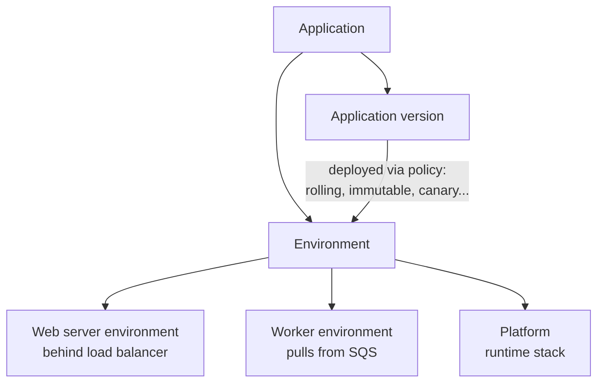

# AWS Elastic Beanstalk - Runbook & Reference

English | [简体中文](README_ZH.md)

> Facts verified against official AWS documentation: 2026-08-19

## Mental model

> AWS Elastic Beanstalk is a managed service that deploys and scales web applications and worker processes on familiar AWS resources such as EC2, S3, and load balancers. You upload code and Elastic Beanstalk handles capacity provisioning, load balancing, scaling, health monitoring, and updates, while you keep control of the underlying resources.

## Big picture



## Key concepts

- **Application**: the logical container for versions and environments.
- **Environment**: a running deployment of an application version.
  - **Web server environment**: processes HTTP/HTTPS requests behind a load balancer.
  - **Worker environment**: runs background tasks by pulling messages from an SQS queue.
- **Platform**: the runtime stack, including Go, Java (Corretto, Tomcat), .NET (Linux), Node.js, PHP, Python, Ruby, and Docker (single-container and multi-container); the platform maintains your chosen runtime version.
- **Configuration**: environment settings for instances, scaling, load balancing, updates, and health; saved configurations can be reused.
- **Deployment policies**: all-at-once, rolling, rolling with additional batch, immutable, traffic splitting (canary), and blue/green via environment CNAME swap.
- **Health**: enhanced health reporting gives instance-level health and causes; the environment health page aggregates results.

## Common operations (CLI)

```bash
# Initialize a project directory and create an environment
eb init my-app --platform python-3.11 --region us-east-1
eb create my-app-prod --instance-type t3.small

# Deploy a new version
eb deploy my-app-prod

# Status, open the site, and view logs
eb status my-app-prod
eb open my-app-prod
eb logs my-app-prod

# Update configuration and terminate
eb config my-app-prod
eb terminate my-app-prod
```

## Best practices

- Use environments for separate stages (dev, staging, prod) and keep application versions immutable.
- Set environment variables in configuration rather than hard-coding them; use Secrets Manager for sensitive values.
- Configure scaling policies and alarms for the load you expect; verify health checks before routing traffic.
- Use immutable or traffic-splitting deployments for production to avoid downtime.
- Pin the platform version and test upgrades in a lower environment before applying them.
- For worker environments, make jobs idempotent and design for SQS retries and dead-letter queues.

## Troubleshooting

| Symptom | Checks and fixes |
|---|---|
| Environment `Degraded`/`Severe` | Open the environment health page and inspect instance-level causes and recent events. |
| Deployment fails | Review build/application logs (`eb logs`) and confirm the artifact is valid for the platform. |
| Instances unhealthy | Verify security groups, health check path, and that the app binds to the expected port. |
| Worker jobs not processed | Check the SQS queue, worker environment scaling, and application error logs. |
| Changes not applied | Confirm `eb config` save/deploy cycle and environment status are not mid-update. |

## Limits

Elastic Beanstalk itself has no additional charge; you pay for the underlying AWS resources it provisions. Application counts, environment counts, and platform version availability are subject to service quotas and supported platform lifecycle. See the Elastic Beanstalk platform and Service Quotas documentation for current values.

## Official references

- [What is AWS Elastic Beanstalk?](https://docs.aws.amazon.com/elasticbeanstalk/latest/dg/Welcome.html)
- [AWS Elastic Beanstalk platforms](https://docs.aws.amazon.com/elasticbeanstalk/latest/platforms/platforms-supported.html)
- [AWS Elastic Beanstalk quotas](https://docs.aws.amazon.com/elasticbeanstalk/latest/dg/limits.html)
- [AWS Elastic Beanstalk pricing](https://aws.amazon.com/elasticbeanstalk/pricing/)
- [AWS CLI: elasticbeanstalk commands](https://docs.aws.amazon.com/cli/latest/reference/elasticbeanstalk/)
