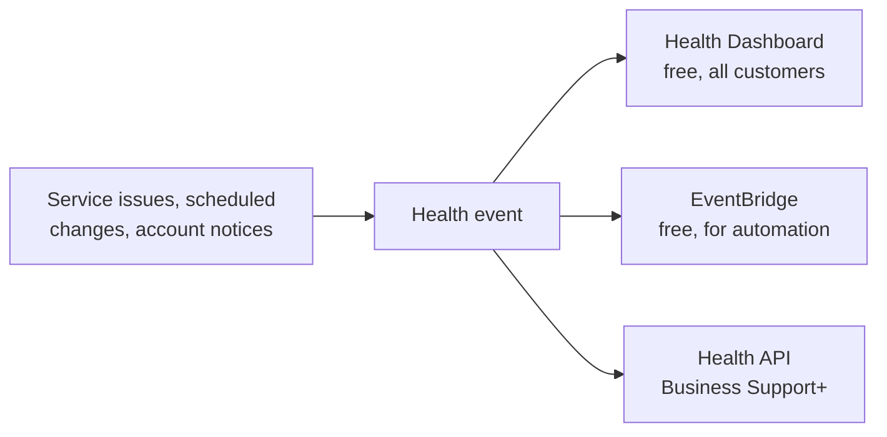

# AWS Health - Runbook & Reference

English | [简体中文](README_ZH.md)

> Facts verified against official AWS documentation: 2026-08-19

## Mental model

> AWS Health provides visibility into the performance and availability of your AWS services and accounts. It delivers events about service disruptions, scheduled changes, and account notifications so you can prepare for planned activities, troubleshoot in-progress issues, and automate responses. The AWS Health Dashboard is available to all customers at no additional cost.

## Big picture



## Key concepts

- **Health events**: notifications about service issues, scheduled maintenance, and account-specific events that may affect your resources.
- **AWS Health Dashboard**: the console view of events affecting your account; no setup or code required.
- **EventBridge**: all customers can receive AWS Health events through Amazon EventBridge at no additional cost; use rules to trigger automation and alerts.
- **AWS Health API**: programmatic access for integrating with internal/third-party systems; available with Business Support+ (or Business/Enterprise plans in some Regions) and above.
- **Event types**: account notifications (security, billing), scheduled changes, and ongoing service events; each event can have affected resources and guidance.

## Common operations (AWS CLI)

```bash
# Describe health events (API requires appropriate support plan)
aws health describe-events --filter file://filter.json \
  --region us-east-1
aws health describe-event-details --event-arns <event-arn>
aws health describe-affected-entities --event-arns <event-arn>

# EventBridge integration: use the default event bus
# Rule pattern: {"source": ["aws.health"], "detail-type": ["AWS Health Event"]}
aws events put-rule --name aws-health-alerts \
  --event-pattern '{"source":["aws.health"]}'
```

## Best practices

- Subscribe to AWS Health events via EventBridge for all accounts/Regions and route to SNS/Slack/incident tooling.
- Set up the Health API integration in your operations tooling to build a single pane of glass for events.
- Monitor scheduled changes and account notifications early so maintenance windows don't surprise you.
- Combine Health events with CloudWatch alarms and Trusted Advisor to distinguish AWS-side from account-side issues.
- Review event guidance and affected-resource lists to scope impact during incidents.
- For organizations, use organization-level health visibility so management accounts see member events.

## Troubleshooting

| Symptom | Checks and fixes |
|---|---|
| No events visible | Confirm the Region and account filter; the dashboard is account-specific. |
| EventBridge rule not firing | Check the event pattern (`aws.health` source) and the rule's target permissions. |
| API access denied | Verify your support plan and IAM permissions for `health:DescribeEvents`. |
| Event details missing | Use `describe-event-details` and check affected entities for scope. |
| Notifications delayed | Health events are near-instant but some event types are posted after verification; use EventBridge for the fastest delivery. |

## Limits

The dashboard and EventBridge events are free; the Health API has request-rate quotas and requires a qualifying support plan. See the AWS Health endpoints and quotas page for current values.

## Official references

- [What is AWS Health?](https://docs.aws.amazon.com/health/latest/ug/what-is-aws-health.html)
- [AWS Health endpoints and quotas](https://docs.aws.amazon.com/general/latest/gr/health.html)
- [AWS Health API Reference](https://docs.aws.amazon.com/health/latest/APIReference/Welcome.html)
- [AWS CLI: health commands](https://docs.aws.amazon.com/cli/latest/reference/health/)
