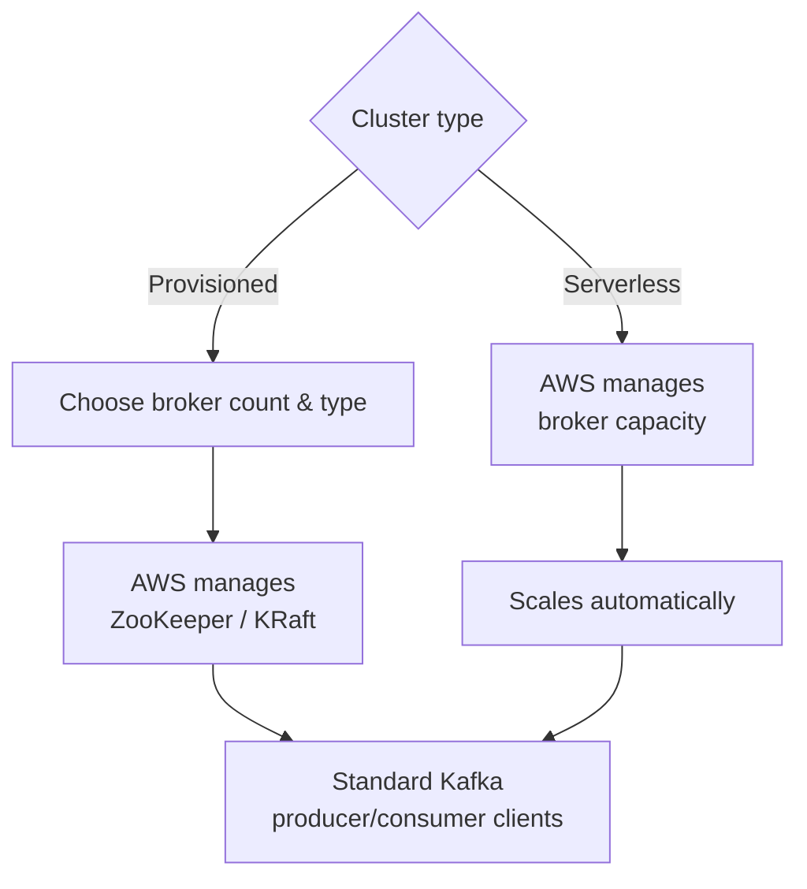

# Amazon MSK - Runbook & Reference

> Facts verified against official AWS documentation: 2026-08-19

> MSK manages the Kafka control plane for you — provisioned gives you broker-level control, serverless removes capacity planning entirely — while your applications keep speaking standard Kafka data-plane APIs either way.

## Overview

Amazon Managed Streaming for Apache Kafka (Amazon MSK) is a fully managed service for building and running applications that use Apache Kafka. AWS manages the control plane (cluster create/update/delete); you use standard Apache Kafka data-plane APIs for producing and consuming, so existing applications and tools work unchanged.



## Key concepts

- **Cluster**: a group of broker nodes; minimum one broker per Availability Zone.
- **MSK Provisioned**: you choose broker count/type (Standard or Express brokers); AWS manages ZooKeeper nodes or KRaft controllers.
- **MSK Serverless**: AWS manages broker capacity; you provision at cluster level and scale automatically.
- **Topics, producers, consumers**: standard Kafka APIs and tools (kafka-clients, kcat, etc.).
- **MSK Connect**: managed connectors that stream data to/from Kafka clusters.
- **MSK Replicator**: replicates data between MSK clusters in the same or different Regions.
- **Authentication**: IAM access control, SASL/SCRAM, TLS, or mutual TLS.
- **Monitoring**: CloudWatch metrics and open monitoring with Prometheus/Grafana.
- **KRaft vs. ZooKeeper**: KRaft replaces ZooKeeper for metadata management in newer Kafka versions.

## Common operations (AWS CLI)

```bash
# Create a provisioned cluster (KRaft mode, IAM auth)
aws kafka create-cluster-v2 --cluster-name events-prod \
  --provisioned '{
    "BrokerNodeGroupInfo": {
      "InstanceType": "kafka.m5.large",
      "ClientSubnets": ["subnet-1","subnet-2","subnet-3"]
    },
    "KafkaVersion": "3.7.0",
    "NumberOfBrokerNodes": 3
  }'

# Create a serverless cluster
aws kafka create-cluster-v2 --cluster-name events-serverless --serverless '{
  "VpcConfigs": [{"SubnetIds": ["subnet-1","subnet-2"]}],
  "ClientAuthentication": {"Sasl": {"Iam": {"Enabled": true}}}
}'

# Describe and list clusters
aws kafka describe-cluster-v2 --cluster-arn <cluster-arn>
aws kafka list-clusters-v2

# Get bootstrap brokers for client config
aws kafka get-bootstrap-brokers --cluster-arn <cluster-arn>

# Delete
aws kafka delete-cluster --cluster-arn <cluster-arn>
```

## Best practices

- Choose MSK Serverless for variable traffic and MSK Provisioned for predictable capacity and control.
- Place brokers across at least three AZs and size broker types for peak throughput.
- Use IAM access control or SASL/SCRAM with secrets in Secrets Manager; enable TLS.
- Set topic replication factor to at least 3 and tune retention to the consumer replay window.
- Monitor with CloudWatch and Prometheus; alert on broker CPU, disk, and request handler utilization.
- Test client/consumer behavior with `kafka-consumer-groups` before scaling partitions.
- Use MSK Replicator for cross-Region DR and MSK Connect for managed connectors.

## Troubleshooting

| Symptom | Checks and fixes |
|---|---|
| Producers/consumers can't connect | Verify bootstrap brokers, security group rules, and authentication config. |
| `NotEnoughReplicasException` / under-replicated partitions | Check broker health/disk and replication factor. |
| Disk full | Increase storage or shorten retention; monitor `KafkaDataLogsDiskUsed`. |
| Throttling | Scale broker count/type or use Serverless capacity. |
| Auth failures | Check SASL/IAM configuration, SCRAM secrets, and client properties. |

## Limits

Clusters per account, brokers per cluster, storage, and Serverless capacity have quotas. See the Service Quotas console for current values.

## Official references

- [Welcome to the Amazon MSK Developer Guide](https://docs.aws.amazon.com/msk/latest/developerguide/what-is-msk.html)
- [Amazon MSK service quotas](https://docs.aws.amazon.com/msk/latest/developerguide/limits.html)
- [Amazon MSK pricing](https://aws.amazon.com/msk/pricing/)
- [AWS CLI: kafka commands](https://docs.aws.amazon.com/cli/latest/reference/kafka/)
