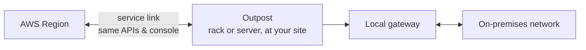

# AWS Outposts - Runbook & Reference

> Facts verified against official AWS documentation: 2026-08-19

> An Outpost is a physical extension of an AWS Region into your building: it runs the same APIs locally over a service link back to the Region, while a local gateway connects Outpost resources to your on-premises network.

## Overview

AWS Outposts brings AWS infrastructure, services, APIs, and tools to your premises. An Outpost is a pool of AWS compute and storage capacity installed at your site, operated and managed by AWS as an extension of an AWS Region. You use the same APIs and console as in the Region, with local low latency and local data processing.



## Key concepts

- **Outpost site**: the customer-managed physical location where the Outpost is installed.
- **Outposts racks**: industry-standard 42U racks with servers, switches, and cabling owned and managed by AWS.
- **Outposts servers**: 1U/2U servers for sites with limited space or smaller capacity needs.
- **ACE rack**: aggregation/core/edge rack required for deployments of four or more compute racks.
- **Service link**: the network route between the Outpost and its associated Region.
- **Local gateway (LGW)**: the logical router connecting Outposts rack resources to your on-premises network.
- **Outpost subnets**: create subnets on the Outpost and launch resources (EC2, EBS, ECS, EKS, RDS, EMR, ElastiCache, S3 on Outposts, ALB) that stay local.
- **Ownership and management**: AWS delivers, installs, monitors, patches, and maintains the hardware.

## Common operations (AWS CLI)

```bash
# Create a site and an Outpost
aws outposts create-site --name dc-south --country-code MY
aws outposts create-outpost --name prod-outpost --site-id <site-id> \
  --availability-zone ap-southeast-1a --availability-zone-id apse1-az4

# List and inspect
aws outposts list-outposts
aws outposts get-outpost --outpost-id <outpost-id>
aws outposts list-sites

# Manage capacity (view/update)
aws outposts get-outpost-instance-types --outpost-id <outpost-id>
aws outposts update-outpost --outpost-id <outpost-id> --name prod-outpost-v2
```

## Best practices

- Validate facility requirements (power, cooling, space, networking) before ordering; plan for the service link bandwidth to the Region.
- Order the right form factor: racks for capacity, servers for small sites; install the ACE rack when scaling to four or more compute racks.
- Design VPC/subnet architecture so Outpost resources are isolated yet connected to the Region.
- Use local compute/storage for latency-sensitive workloads and data residency; keep backups/snapshots synced to the Region.
- Monitor Outpost capacity and utilization; plan hardware growth with AWS.
- Treat the Outpost as an extension of the Region: use the same IAM, security groups, and monitoring tools.

## Troubleshooting

| Symptom | Checks and fixes |
|---|---|
| Instances fail to launch | Verify Outpost capacity, subnet placement, and instance type availability on the Outpost. |
| High latency to Region | Check service link bandwidth and local gateway routing. |
| Local storage full | Monitor EBS/S3 on Outposts capacity and offload cold data to the Region. |
| Hardware issue | AWS monitors and manages hardware; open a support case for replacement. |
| Networking problems | Validate LGW configuration and on-premises routing/peering. |

## Limits

Outposts capacity, instance types, racks per site, and supported services depend on Region and order configuration. See AWS Outposts documentation and the Service Quotas console for current values.

## Official references

- [What is AWS Outposts?](https://docs.aws.amazon.com/outposts/latest/userguide/what-is-outposts.html)
- [AWS Outposts product page](https://aws.amazon.com/outposts/)
- [AWS Outposts pricing](https://aws.amazon.com/outposts/pricing/)
- [AWS CLI: outposts commands](https://docs.aws.amazon.com/cli/latest/reference/outposts/)
