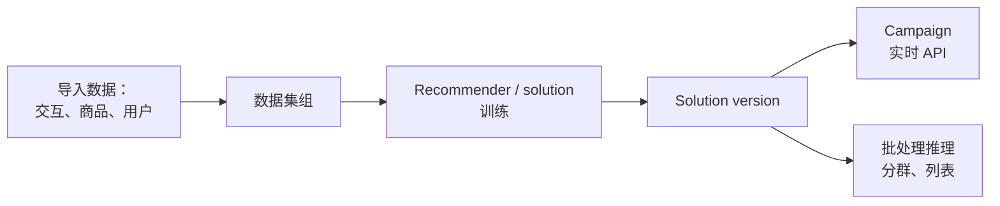

# Amazon Personalize - Runbook 与参考

[English](README.md) | 简体中文

> 事实核对时间（对照 AWS 官方文档）：2026-08-19

## 心智模型

> Personalize 把导入的交互数据训练成一个 solution version，再以两种方式提供服务：实时 campaign 用于在线推荐，批处理任务用于离线列表和分群。

## 概述

Amazon Personalize 是全托管机器学习服务，使用你的数据为用户生成商品推荐，并根据用户对商品/商品元数据的亲和度生成用户分群。它支持实时个性化 API 和批量操作，提供用例优化型 recommender 以及完全可定制的资源。



## 核心概念

- **数据集**：交互（用户-商品事件）、商品、用户、动作和动作交互；批量数据来自 CSV，另有实时事件。
- **Recommender 与 solution**：用例优化型 recommender（例如 Top picks、More like X、Recommended for you）或基于你的数据训练的自定义 solution。
- **实时与批量**：实时 API 做在线推荐；批处理推理用于邮件列表、营销活动和用户分群。
- **用户分群（User segments）**：可能与你目录中商品互动的一组用户，用于定向活动。
- **Next best action**：基于用户行为推荐动作（例如加入忠诚计划、下载 App）。
- **搜索重排**：对搜索结果（例如来自 OpenSearch）重排实现个性化。
- **数据准备**：用 SageMaker AI Data Wrangler 从 40+ 数据源导入；用 Amplify 或 SDK 记录实时事件。

## 常用操作（AWS CLI）

```bash
# 创建数据集组并导入交互数据
aws personalize create-dataset-group --name app-personalization
aws personalize create-dataset --dataset-group-arn <group-arn> \
  --dataset-type Interactions --schema-arn <schema-arn>
aws personalize create-dataset-import-job --dataset-arn <dataset-arn> \
  --job-name interactions-import \
  --data-source '{"dataLocation":"s3://bucket/interactions.csv"}' \
  --role-arn arn:aws:iam::123456789012:role/personalize-role

# 创建 solution version 并部署 campaign
aws personalize create-solution --dataset-group-arn <group-arn> \
  --name top-picks --recipe-arn <recipe-arn>
aws personalize create-solution-version --solution-arn <solution-arn>
aws personalize create-campaign --name prod --solution-version-arn <sv-arn> \
  --min-provisioned-tps 1

# 获取推荐（runtime）
aws personalize-runtime get-recommendations --campaign-arn <campaign-arn> \
  --user-id user-123
```

## 最佳实践

- 收集干净的交互数据（用户、商品、时间戳），并用实时事件保持推荐新鲜。
- 先用用例优化型 recommender，需要深度调优时再迁移到自定义 solution。
- 上线前用离线指标和 A/B 测试评估 campaign。
- 邮件/营销与分群用批量工作流；实时端点只留给在线流量。
- 电商/流媒体用 Personalize 重排搜索结果。
- 监控数据质量、事件摄取和 campaign 延迟；按计划重训。

## 故障排查

| 症状 | 检查与处理 |
|---|---|
| 没有推荐 | 检查数据集导入状态、用户/商品 ID，以及 campaign/solution version 状态。 |
| 导入任务失败 | 核对 CSV schema、S3 权限和导入 IAM 角色。 |
| 冷启动用户 | 无历史用户使用热门商品 recipe/回退。 |
| 推荐过期 | 导入新交互数据并重训/更新 solution version。 |
| 端点成本高 | 降低 min-provisioned TPS，非交互场景用批量操作。 |

## 配额

每账户数据集、solution、campaign 和 API 请求速率有限制。以 Amazon Personalize 端点和配额页面及 Service Quotas 控制台为准。

## 官方参考

- [什么是 Amazon Personalize？- 开发者指南](https://docs.aws.amazon.com/personalize/latest/dg/what-is-personalize.html)
- [Amazon Personalize 端点和配额](https://docs.aws.amazon.com/general/latest/gr/personalize.html)
- [Amazon Personalize 定价](https://aws.amazon.com/personalize/pricing/)
- [AWS CLI：personalize 和 personalize-runtime 命令](https://docs.aws.amazon.com/cli/latest/reference/personalize/)
