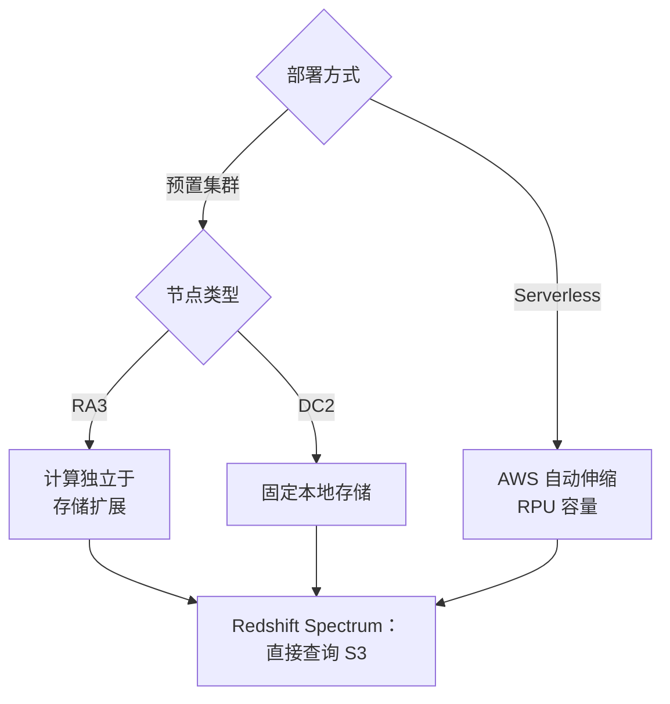

# Amazon Redshift - Runbook 与参考

[English](README.md) | 简体中文

> 事实核对时间（对照 AWS 官方文档）：2026-08-19

## 心智模型

> Redshift 是列式、大规模并行的数据仓库：可以选择自行调整规格的预置集群（RA3 让计算独立于存储扩展；DC2 是固定本地存储），也可以选择由 AWS 自动伸缩 RPU 容量的 Serverless；两种方式都能通过 Spectrum 直接查询 S3 中的冷数据。

## 概述

Amazon Redshift 是完全托管的 PB 级数据仓库。它采用列式存储和大规模并行处理（MPP），适合快速 SQL 分析，并兼容你现有的 BI 和 SQL 工具。Redshift Serverless 免去集群管理，自动供给容量、按需求扩展，空闲时停止计费。



## 核心概念

- **集群（预置模式）**：一个领导者节点加一组计算节点；由你管理节点类型、数量和维护窗口。
- **Redshift Serverless**：命名空间（数据库）和工作组；容量以 RPU（Redshift Processing Units）自动伸缩。
- **节点类型**：RA3 把计算与托管存储分离，可按需单独扩计算；DC2 使用固定本地存储。
- **列式存储与压缩**：面向分析优化的存储布局；合理设置排序列和分布键减少 I/O。
- **Redshift Spectrum**：直接查询 S3 中的数据，无需先加载进仓库。
- **并发扩展（Concurrency scaling）**：按需增加临时容量处理并发查询。
- **快照**：自动快照（保留最长 35 天）和手动快照，可恢复到其他区域。
- **Python UDF**：支持已于 2026 年 6 月 30 日后结束；请把剩余函数迁移到 SQL UDF 或 Lambda UDF。

## 常用操作（AWS CLI）

```bash
# 创建预置集群
aws redshift create-cluster --cluster-identifier dw-prod \
  --node-type ra3.xlplus --number-of-nodes 2 \
  --master-username adminuser --master-user-password <password> \
  --publicly-accessible

# 列出和查看集群
aws redshift describe-clusters
aws redshift describe-clusters --cluster-identifier dw-prod

# 暂停/恢复节省成本
aws redshift pause-cluster --cluster-identifier dw-prod
aws redshift resume-cluster --cluster-identifier dw-prod

# 快照
aws redshift create-cluster-snapshot --cluster-identifier dw-prod --snapshot-identifier dw-prod-backup
aws redshift restore-from-cluster-snapshot --cluster-identifier dw-restored \
  --snapshot-identifier dw-prod-backup

# Serverless：创建命名空间和工作组
aws redshift-serverless create-namespace --namespace-name analytics
aws redshift-serverless create-workgroup --workgroup-name analytics-wg \
  --namespace-name analytics --base-capacity 8
```

## 最佳实践

- 多数工作负载选 RA3（存储独立扩展）；需求波动大时用 Serverless。
- 合理设计分布键和排序列，定期 vacuum/analyze（或启用自动维护）。
- 用 COPY 从 S3 批量加载列式格式，避免逐行插入。
- 冷数据用 Redshift Spectrum 查 S3，仓库容量留给热数据。
- 用工作负载管理（WLM）、并发扩展和查询监控规则保障 SLA。
- 用 KMS 加密、集群放私有子网、轮换凭据（或接 IAM/Secrets Manager）。
- 自动化快照并演练跨区域恢复，作为灾备的一部分。

## 故障排查

| 症状 | 检查与处理 |
|---|---|
| 查询慢 | 检查分布/排序列、表统计、WLM 队列；冷数据考虑 Spectrum。 |
| DC2 磁盘满 | 扩容、下移冷数据，或迁移到 RA3 托管存储。 |
| COPY 失败 | 检查源文件格式、S3 IAM 角色权限和列映射。 |
| 连接数限制 | 扩大集群、使用连接池，或加并发扩展。 |
| 快照恢复慢 | 确认快照可用，并按需选择足够大的恢复集群。 |
| Python UDF 报错 | Python UDF 已不再支持执行；请迁移到 SQL UDF 或 Lambda UDF。 |

## 配额

集群数、节点数、快照数和 Serverless 容量有每账号配额。以 Service Quotas 控制台当前值为准。

## 官方参考

- [什么是 Amazon Redshift？- 管理指南](https://docs.aws.amazon.com/redshift/latest/mgmt/welcome.html)
- [Amazon Redshift 数据库开发者指南](https://docs.aws.amazon.com/redshift/latest/dg/welcome.html)
- [Amazon Redshift 行为变更](https://docs.aws.amazon.com/redshift/latest/mgmt/behavior-changes.html)
- [Amazon Redshift 定价](https://aws.amazon.com/redshift/pricing/)
- [AWS CLI：redshift 命令](https://docs.aws.amazon.com/cli/latest/reference/redshift/)
