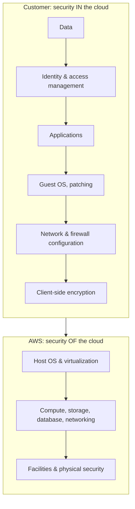

# AWS Shared Responsibility Model - Runbook & Reference

English | [简体中文](README_ZH.md)

> Facts verified against official AWS documentation: 2026-08-19

## Mental model

> Security and compliance in AWS are a shared responsibility between AWS and the customer.

## Overview

Security and compliance in AWS are a shared responsibility between AWS and the customer. AWS operates, manages, and controls the components from the host operating system and virtualization layer down to the physical security of the facilities. The customer is responsible for the guest operating system (including updates and security patches), associated application software, and the configuration of AWS-provided security controls.



More of the stack shifts to AWS as the service model moves from IaaS (EC2) to PaaS (RDS) to SaaS (fully managed).

## Key concepts

- **AWS responsibility ("security of the cloud")**: physical facilities, hardware, software, networking, and the virtualization layer; AWS operates and verifies the related IT controls.
- **Customer responsibility ("security in the cloud")**: guest OS updates and patching, application software, data, identity and access management, network and firewall configuration, encryption, and compliance with applicable regulations.
- **Service model impact**: responsibilities vary by service type — IaaS (EC2: more customer control) vs. PaaS (RDS: AWS manages the OS) vs. SaaS (fully managed: AWS manages more).
- **Shared IT controls**: some controls are shared (for example, patch management is shared for infrastructure but the customer manages guest OS patching).
- **Customer verification**: use AWS Artifact reports and compliance documentation to evaluate and verify controls for your own audit.

## Common operations

The model is a governance framework rather than an API; apply it in practice by:

```bash
# Examples: map the model to operational controls
aws iam list-account-aliases                      # customer: identity configuration
aws ec2 describe-security-groups                  # customer: network/firewall configuration
aws s3api get-bucket-encryption --bucket my-bucket # customer: data protection
aws backup list-backup-plans                       # customer: backup/DR controls
```

## Best practices

- Document responsibility for every workload: data, OS, network, identity, and compliance controls.
- Apply IAM least privilege and enable MFA; AWS manages the control plane but you configure access.
- Patch guest OS and applications; use Systems Manager Patch Manager for automation.
- Encrypt data at rest and in transit with KMS/TLS; manage keys and rotation.
- Back up and test recovery for your data; AWS durability does not replace your backups.
- Use AWS Artifact to obtain compliance reports and verify AWS-side controls with your auditors.

## Troubleshooting

| Symptom | Checks and fixes |
|---|---|
| Security incident on an instance | Customer-side: check guest OS, applications, IAM, and security groups; use GuardDuty/Detective evidence. |
| Compliance audit questions | Use AWS Artifact reports for AWS-side controls; provide your own evidence for customer-side controls. |
| Responsibility confusion for managed services | Check the service documentation; RDS/Lambda manage more on your behalf than EC2. |

## Limits

The model is a governance framework; actual obligations depend on the services used, their integration, and applicable laws/regulations. See the official shared responsibility model documentation.

## Official references

- [AWS Shared Responsibility Model](https://aws.amazon.com/compliance/shared-responsibility-model/)
- [Shared responsibility model (whitepaper)](https://docs.aws.amazon.com/whitepapers/latest/aws-risk-and-compliance/shared-responsibility-model.html)
- [AWS Artifact](https://aws.amazon.com/artifact/)
