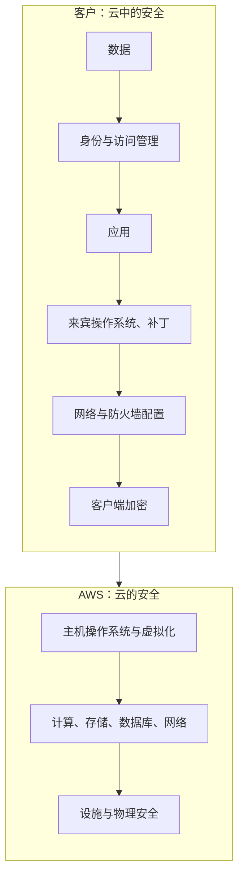

# AWS 共担责任模型 - Runbook 与参考

[English](README.md) | 简体中文

> 事实核对时间（对照 AWS 官方文档）：2026-08-19

## 心智模型

> AWS 的安全与合规由 AWS 和客户共同承担。

## 概述

AWS 的安全与合规由 AWS 和客户共同承担。AWS 负责运营、管理和控制从主机操作系统与虚拟化层到设施物理安全的组件。客户负责来宾操作系统（包括更新与安全补丁）、相关应用软件，以及 AWS 提供安全控件的配置。



服务模型从 IaaS（EC2）到 PaaS（RDS）再到 SaaS（全托管），AWS 承担的比例逐步增加。

## 核心概念

- **AWS 责任（“云的安全”）**：物理设施、硬件、软件、网络和虚拟化层；AWS 运营并验证相关 IT 控制。
- **客户责任（“云中的安全”）**：来宾操作系统更新与补丁、应用软件、数据、身份与访问管理、网络与防火墙配置、加密，以及适用法规的合规。
- **服务模型的影响**：责任因服务类型而异——IaaS（EC2：客户控制更多）与 PaaS（RDS：AWS 管理操作系统）或 SaaS（全托管：AWS 管理更多）。
- **共担的 IT 控制**：部分控制是共担的（例如补丁管理：基础设施层面共担，来宾 OS 补丁由客户管理）。
- **客户验证**：使用 AWS Artifact 报告和合规文档，评估并验证 AWS 侧控制，用于自身审计。

## 常用操作

该模型是治理框架而非 API；实践中这样落地：

```bash
# 示例：将模型映射到运维控制
aws iam list-account-aliases                      # 客户：身份配置
aws ec2 describe-security-groups                  # 客户：网络/防火墙配置
aws s3api get-bucket-encryption --bucket my-bucket # 客户：数据保护
aws backup list-backup-plans                       # 客户：备份/容灾控制
```

## 最佳实践

- 为每个工作负载记录责任：数据、操作系统、网络、身份和合规控制。
- 实施 IAM 最小权限并启用 MFA；AWS 管理控制平面，但你配置访问。
- 修补来宾操作系统和应用；用 Systems Manager Patch Manager 自动化。
- 用 KMS/TLS 加密静态和传输数据；管理密钥和轮换。
- 为你的数据备份并演练恢复；AWS 的持久性不能替代你的备份。
- 用 AWS Artifact 获取合规报告，与审计人员核验 AWS 侧控制。

## 故障排查

| 症状 | 检查与处理 |
|---|---|
| 实例上发生安全事件 | 客户侧：检查来宾 OS、应用、IAM 和安全组；用 GuardDuty/Detective 取证。 |
| 合规审计问题 | AWS 侧用 AWS Artifact 报告；客户侧提供自身证据。 |
| 托管服务责任混淆 | 查阅服务文档；RDS/Lambda 替你管理的内容多于 EC2。 |

## 配额

该模型是治理框架；实际义务取决于所用服务、集成方式及适用法律法规。以官方共担责任模型文档为准。

## 官方参考

- [AWS 共担责任模型](https://aws.amazon.com/compliance/shared-responsibility-model/)
- [共担责任模型（白皮书）](https://docs.aws.amazon.com/whitepapers/latest/aws-risk-and-compliance/shared-responsibility-model.html)
- [AWS Artifact](https://aws.amazon.com/artifact/)
