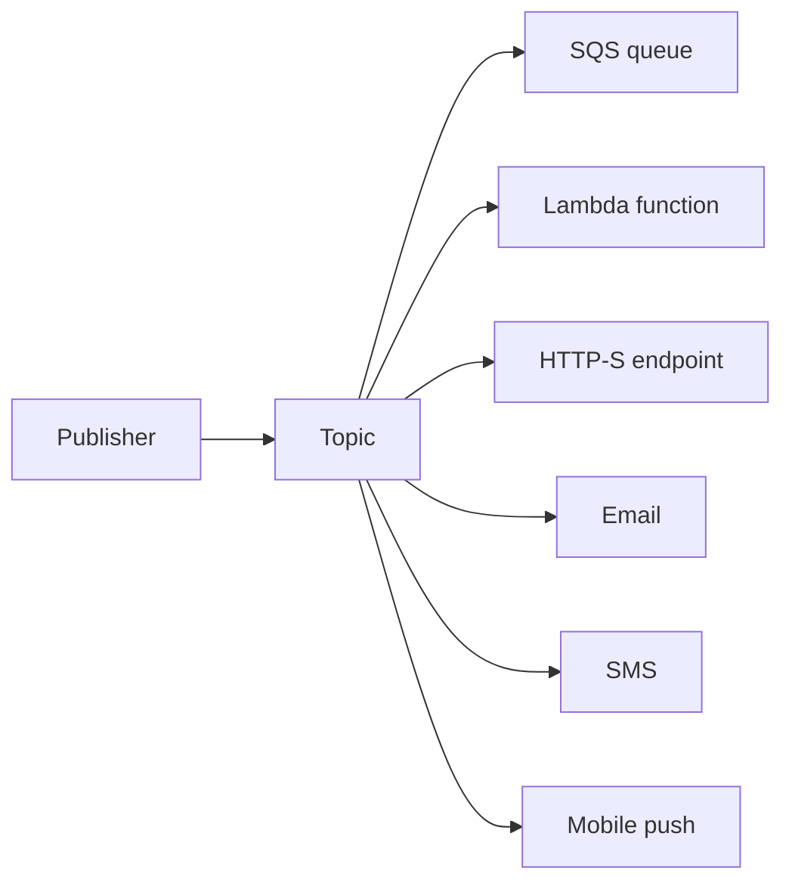

# Amazon SNS - Runbook & Reference

> Facts verified against official AWS documentation: 2026-08-19

> Amazon Simple Notification Service (Amazon SNS) is a fully managed publish/subscribe service.

## Overview

Publishers send messages to a topic, which delivers them to subscribed endpoints.



## Key concepts

- **Topics**: logical access points and communication channels; publishers send to a topic.
- **Subscribers**: SQS queues, Lambda functions, HTTP(S) endpoints, email, mobile push, SMS, Amazon Data Firehose.
- **A2A and A2P**: application-to-application (SQS/Lambda/HTTP) and application-to-person (SMS/email/push) messaging.
- **Fanout**: one publish delivers to many endpoints for parallel asynchronous processing.
- **Filter policies**: subscription-level message filtering to reduce deliveries and cost.
- **Dead-letter queues**: capture failed deliveries for SQS/Lambda subscriptions.
- **Security**: SSE with KMS, IAM policies, topic policies.

## Common operations (AWS CLI)

```bash
# Topic
aws sns create-topic --name my-topic
aws sns list-topics

# Subscribe endpoints (must confirm for email/HTTP)
aws sns subscribe --topic-arn arn:aws:sns:ap-southeast-1:123456789012:my-topic \
  --protocol sqs --notification-endpoint arn:aws:sqs:ap-southeast-1:123456789012:my-queue
aws sns subscribe --topic-arn ...:my-topic --protocol email --notification-endpoint ops@example.com

# Filter policy on a subscription
aws sns set-subscription-attributes --subscription-arn <arn> \
  --attribute-name FilterPolicy --attribute-value '{"event":["order_created"]}'

# Publish
aws sns publish --topic-arn ...:my-topic --message '{"event":"order_created"}' \
  --message-attributes '{"event":{"DataType":"String","StringValue":"order_created"}}'

# Admin
aws sns get-topic-attributes --topic-arn ...:my-topic
aws sns unsubscribe --subscription-arn <arn>
aws sns delete-topic --topic-arn ...:my-topic
```

## Best practices

- Use **SNS + SQS fanout** for reliable asynchronous processing and buffering.
- Apply **filter policies** so subscribers only receive relevant messages.
- Configure **DLQs** on subscriptions to capture delivery failures and alarm on them.
- Use message attributes for routing/filtering; keep payloads small (max 256 KB).
- Encrypt with **SSE-KMS** for sensitive messages; scope IAM to topic ARNs.
- For SMS: test in the SMS sandbox first and set spending limits.

## Troubleshooting

| Symptom | Checks and fixes |
|---------|------------------|
| Message not delivered to SQS | Confirm the subscription and that the SQS queue policy allows SNS; check the DLQ. |
| Email/HTTP subscription inactive | The subscription must be confirmed from the confirmation message. |
| Filtered messages not arriving | Verify the filter policy matches the message attributes in the publish call. |
| SMS not sending | Check the SMS sandbox, spending limits, and Region availability. |
| Duplicates in fanout | Expected with at-least-once delivery; make consumers idempotent. |
| Delivery failures | Review the subscription DLQ and CloudWatch delivery metrics. |

## Limits

- Message size: up to 256 KB.
- Account-level topic quotas apply (see Service Quotas).

## Official references

- [What is Amazon SNS? - Amazon SNS Developer Guide](https://docs.aws.amazon.com/sns/latest/dg/welcome.html)
- [AWS CLI: sns commands](https://docs.aws.amazon.com/cli/latest/reference/sns/)
