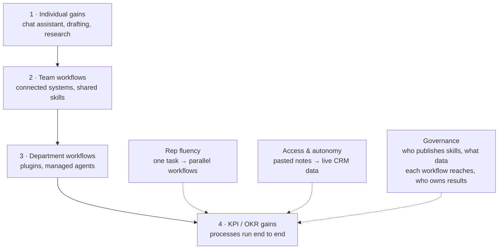

# Building an AI-Native Revenue Organization

> Two sales teams can buy the same number of Claude seats and get very different returns. The
> difference is not the model — it is what the organization built around it: which systems Claude
> can read and write, how much of the work it is trusted to finish, and whether the best sellers'
> methods are written down as files everyone can run.

Anthropic's guide frames this as a **maturity ladder**, not a deployment. A traditional SaaS rollout
is front-loaded — big setup cost, then maintenance. This one is the opposite shape: seats and
training are step one, and the returns keep growing as the organization extends Claude more access
and more trust.

This note answers four questions:

1. What does the maturity ladder actually measure?
2. What has to be decided *before* the pilot starts?
3. How do you measure ROI in a way a CFO will accept?
4. Which failure modes stall a rollout that had a successful pilot?

## Source

- Primary source: [Building an AI-native revenue organization](https://claude.com/blog/building-an-ai-native-revenue-organization) (Anthropic, September 15, 2026) and the linked eBook of the same name (28 pages)
- Reviewed: September 18, 2026
- Scope note: this is vendor marketing material. The numbers below are **Anthropic's reported customer figures**, not independently verified benchmarks.

Sections marked *Analysis* are my own reading, not claims from the source.

## The problem it starts from

The guide opens on a set of symptoms revenue leaders report:

- Half the team barely touches the AI it already has.
- Top sellers build private skills and prompts nobody else uses.
- Leadership has no visibility into actual usage or spend.
- Account context is scattered across Salesforce, email, Gong recordings, and Slack, and sellers
  reassemble it before every call — roughly **30 minutes of prep for 15 minutes of conversation**,
  multiplied across a book of hundreds of accounts.

The first three are organizational, not technical. That framing is the whole argument of the guide:
individual time savings are real but bounded; compounding requires the org to change.

## Reported results

| Organization | Reported result |
| --- | --- |
| Cox Communications | 7x return on first-year AI investment; lead validation and enrichment cost down 86%; accuracy from 18% → 97% |
| Cyera | 88% of ~1,500 employees use Claude weekly; full-company rollout in 17 days with 40 tools connected |
| Workato | Deal prep fell from 3–4 hours to 45 minutes |
| Anthropic (internal) | ~80% of the sales org adopted the Sales plugin within months; one leader with a 4,000-account book estimates ~90 minutes saved per day, with every account scored overnight |

*Analysis.* These are self-selected success stories published by the vendor, and "7x return" is an
aggregate AI-program figure for Cox rather than a Claude-only measurement. Treat them as existence
proofs of the ceiling, not as a forecast for your own org.

## The maturity ladder

**Question this diagram answers:** what changes as an organization moves up, and what does it have
to invest at each step?

The rungs are not really about Claude's capability — they are about **scope of trust**. Reading the
three enablers as a set is the useful part:

- **Fluency** moves a rep from single tasks to running several workflows in parallel.
- **Access and autonomy** move a workflow from "rep pastes call notes into chat" to "forecast built
  from live CRM data".
- **Governance** is the one the guide flags as continuous, not a phase: it must keep pace with the
  other two for the whole life of the program.

## Decisions to make before the pilot

| Decision | What the guide recommends |
| --- | --- |
| Owner | RevOps: they own the CRM Claude connects to *and* the pipeline reporting the program is measured by |
| Connectors | Connect the tools reps already live in (Zoom, Granola, Gong, HubSpot, Clay, ZoomInfo, Fireflies, Microsoft 365); manual transcript uploads are a signal of a missing connector |
| IT | Name an IT owner for workspace provisioning, SSO, and admin consents; agree provisioning dates **before** committing to a pilot date |
| Security | Start the review early; it covers data boundaries, the connector permission model, auditability, and telemetry export |
| Success metrics | Pick exactly **one activity metric** (e.g. call-prep briefs generated) and **one revenue metric** (e.g. pipeline per rep, cycle length); baseline both before deployment |
| Spend visibility | Set limits by org, group, and user; gate costlier capabilities by role; track usage analytics from day one, not from the first readout |
| Pilot cohort | Two or three teams with motivated leads, rather than volunteers scattered across the org; provision plugins at the admin level |

> **The one most teams skip.** Baselining before deployment. Without a pre-deployment baseline and a
> concurrent control group, the pilot readout degrades into anecdotes, and the scale decision gets
> made on enthusiasm.

## What a rep actually gets

Anthropic's Sales plugin ships commands and skills; the guide lists them explicitly.

| Command | What it does |
| --- | --- |
| `/call-summary` | Processes call notes or a transcript, extracts action items, drafts the follow-up, generates an internal summary |
| `/forecast` | Builds weighted projections from pipeline data |
| `/pipeline-review` | Scores deal health and risk |

| Skill | What it does |
| --- | --- |
| `account-research` | Company or person research: company intel, key contacts, recent news, hiring signals |
| `call-prep` | Account context, attendee research, suggested agenda, discovery questions |
| `daily-briefing` | Prioritized daily brief: meetings, pipeline alerts, email priorities, suggested actions |
| `draft-outreach` | Research-first outreach: research the prospect, then draft email and LinkedIn messages |
| `competitive-intelligence` | Product comparison, pricing intel, recent releases, differentiation matrix, talk tracks |
| `create-an-asset` | Custom sales assets: landing pages, decks, one-pagers, workflow demos |

Three mechanics worth pulling out of the prose:

- **Setup is an interview.** On first run the plugin asks the rep for their name, quota targets,
  product positioning, and competitor list, and commits them to a settings file.
- **Connectors inherit permissions.** Claude can only reach what the rep is already allowed to reach
  in the underlying system. This is the answer to most of the security review.
- **Skills are editable files.** A top performer's renewal-prep routine, written once, can be
  provisioned into the team bundle; updating the file updates it for everyone. Salesforce has a
  dedicated plugin (Salesforce in Claude, beta) that bundles its own Salesforce and Slack
  connections, so live CRM data is available as soon as it is installed.

Beyond the plugins, the guide points at Claude for Excel (quota and comp models), Claude for
PowerPoint (proposal and QBR decks), and Claude Tag in Slack.

## The three-phase rollout

**Question this diagram answers:** who does what, in what order, and what gates the move to the next
phase?

```mermaid
flowchart LR
    accTitle: Three-phase Claude rollout for a sales organization
    accDescr: A setup phase runs IT provisioning and RevOps connector configuration in parallel while champions are selected. A pilot phase runs two or three teams with two or three use cases each, champions writing the first skills. A scale phase moves those skills into the shared bundle and provisions the rest of the org in waves of roughly 25, then 150, then everyone.
    subgraph SETUP["Set up"]
        A1["IT: workspace, SSO, admin consents"]
        A2["RevOps: connectors, admin-level plugins"]
        A3["Select champions<br/>2–3 per dept, or 1 per 25–50 users"]
    end
    subgraph PILOT["Pilot"]
        B1["2–3 teams<br/>2–3 use cases each"]
        B2["Champions: live demos,<br/>office hours, first skills"]
    end
    subgraph SCALE["Scale"]
        C1["Pilot skills → shared team bundle"]
        C2["Provision in waves<br/>25 → 150 → everyone"]
        C3["Outputs enter standing meetings<br/>forecast calls, QBR decks"]
    end
    SETUP --> PILOT --> SCALE
```

The gate between pilot and scale is stated as three signals, all of which must hold:

1. Reps are still producing **after the novelty has worn off**.
2. The quality checks are holding.
3. Pilot teams are outperforming on the chosen outcome metric: even if the gap is still small.

The guide also names its best early predictor of how scaling will go: **the number of
champion-created skills that pilot teams use regularly**. Field examples — Cyera ran a full-day
kickoff livestream with 20 department-specific sessions plus twice-weekly office hours; Cox seeded
champions across teams and scaled through train-the-trainer.

## Measuring ROI

Returns show up in four stages, in this order: **usage → output → CRM outcomes → cost**. Sort them
into three groups:

| Group | Definition | Example from the guide |
| --- | --- | --- |
| Efficiency | Same work, done faster | Workato: deal prep 3–4 hours → 45 minutes |
| Expansion | More output from the same team | More accounts covered, more pipeline per rep |
| New capabilities | Work that didn't happen at all before | Reaching the long tail of accounts no rep had time to touch; every account in a book scored overnight |

Two measurement rules are the substantive advice here:

- **Compare cohorts, not calendars.** During the pilot, one set of teams sells with Claude and the
  rest do not, while the CRM tracks the same metrics for both. Compare the two side by side for the
  *same quarter* (pipeline per rep, cycle length, win rate) rather than comparing one team
  before-and-after. Both groups sell into the same market in the same season, so the difference is
  easier to attribute.
- **Don't lead with hours saved.** If the case for AI rests on time freed up, its value is capped at
  what the team is paid for that time — that is the only way a CFO can price it. Lead with expansion
  and new capabilities instead.

On reading a spend report: high spend alone is not a signal. Read each rep's spend against what they
produced (briefs, opportunity updates, proposals). A champion near the top of the table who also
produces daily is the program working as designed — the extra headroom champions get at setup exists
for exactly that. A rep who spends heavily and produces little gets **coaching first**; lower the cap
only if coaching doesn't change the output.

## Barriers that stall an org-wide rollout

| Pitfall | How it fails | Fix, at setup |
| --- | --- | --- |
| Pilot with no end date | Nobody named the scale-decision date or the decider; the sponsoring executive moves to next quarter's priorities. A year later it is still 25 seats and too small for the CFO to notice. | Put a scale-decision date on the sponsor's calendar, name the decider, and agree what a "yes" requires |
| Scaling seats without scaling champions | Provisioning goes 25 → 150 while champion count stays at 3; office hours can't absorb it and later waves get a bad first week | Hold 1 champion per 25–50 users through every wave; incoming managers name their champions *before* provisioning, so current champions can train them |
| Ignoring spend until the first invoice | Usage-based billing means costs rise with provisioning; the budget owner learns the number from the invoice, and the reflex is to restrict access mid-scale | Set limits by org, group, and user before the pilot; read usage analytics weekly |

All three are the same failure in different clothes: a decision that was never assigned an owner and
a date.

## Analysis: what I'd take from this

- **The transferable part is the measurement design, not the product.** Concurrent cohort comparison
  with a pre-set activity metric and revenue metric is a sound way to evaluate *any* internal tooling
  rollout, and it is the part most teams get wrong by defaulting to before/after.
- **"Governance is continuous" is the honest claim.** Who can publish a skill, what data a workflow
  can reach, and who owns the output are questions that get harder, not easier, as autonomy grows.
  A rollout plan that treats governance as a setup-phase checkbox will hit its ceiling at stage 2.
- **The champion ratio is the load-bearing number.** 1 per 25–50 users is a staffing commitment with
  dedicated hours attached. An org that provisions seats without funding that ratio has bought
  stage 1 and budgeted for stage 3.
- **What the guide doesn't cover:** failure cases, cost-per-seat figures, what happens when a
  connector's permission model doesn't match how the team actually works, and any customer who tried
  this and stalled. Chapters 1, 4, and 7 also carry their maturity model, role-to-use-case mapping,
  and getting-started checklist as images rather than text, so this note reconstructs those from the
  surrounding prose.

## Related notes

- [The AI-Native SDLC Playbook](../ai-native-sdlc-playbook/README.md): the same "redesign the
  organization, not just the tooling" argument, applied to software delivery.
- [Introduction to Claude Code Agent Skills](../agent-skills/README.md): the mechanics behind
  "skills are editable files you can provision to a team".
