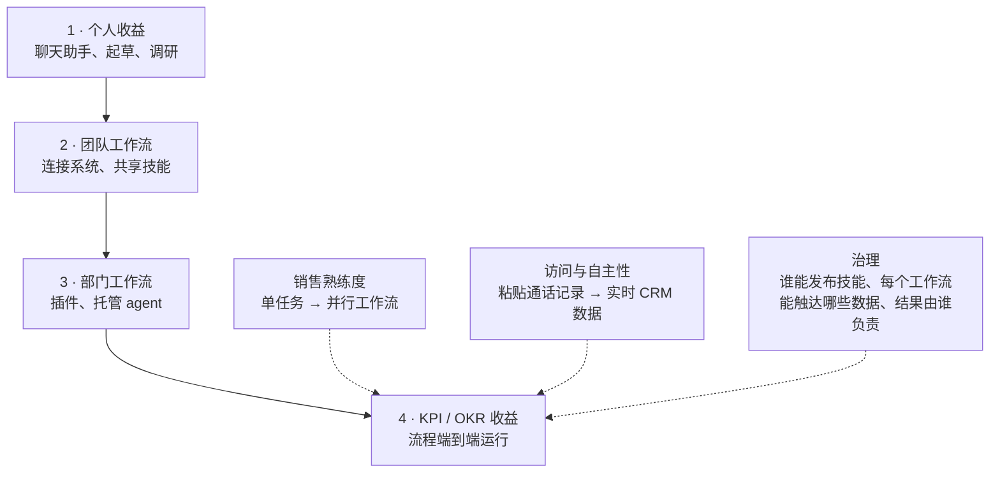
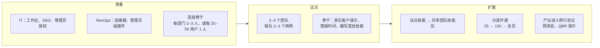

# 构建 AI 原生的收入组织

English version: [README.md](README.md)

## 心智模型

> 两个销售团队可以买同样数量的 Claude 席位，却得到完全不同的回报。差别不在模型，而在组织围绕它
> 建了什么：Claude 能读写哪些系统、组织信任它把多少工作做完，以及顶尖销售的方法有没有被写成
> 人人都能运行的文件。

Anthropic 的这份指南把它描述为一条**成熟度阶梯**，而不是一次部署。传统 SaaS 上线是前重后轻——
前期投入大，之后进入维护模式。这件事恰好相反：席位和培训只是第一步，回报会随着组织向 Claude
开放更多访问权限和更多信任而持续增长。

本文回答四个问题：

1. 成熟度阶梯实际衡量的是什么？
2. 在试点开始**之前**必须定下哪些事？
3. 怎样度量 ROI，才能让 CFO 接受？
4. 哪些失败模式会让一次成功的试点最终卡在全组织推广阶段？

## 来源

- 主要来源：[Building an AI-native revenue organization](https://claude.com/blog/building-an-ai-native-revenue-organization)（Anthropic，2026 年 9 月 15 日）及其链接的同名电子书（28 页）
- 阅读日期：2026 年 9 月 18 日
- 范围说明：这是厂商的营销材料。下文的数字是 **Anthropic 公布的客户数据**，不是经过独立验证的基准。

标注为*分析*的部分是我自己的解读，不是来源中的论断。

## 它从什么问题出发

指南开篇列出收入负责人反馈的一组症状：

- 一半的团队几乎不碰手里已有的 AI。
- 顶尖销售自己攒了一套技能和提示词，别人用不上。
- 管理层看不到真实的使用情况和支出。
- 客户上下文散落在 Salesforce、邮件、Gong 录音和 Slack 里，销售每次通话前都要重新拼一遍——大约
  **准备 30 分钟，换来 15 分钟的对话**，再乘以数百个客户的客户本。

前三条是组织问题，不是技术问题。这个判断就是整份指南的论点：个人层面的时间节省是真实的但有上限，
要产生复利效应，组织本身必须改变。

## 公布的结果

| 组织 | 公布的结果 |
| --- | --- |
| Cox Communications | AI 投资首年 7 倍回报；线索验证与丰富成本下降 86%；准确率从 18% 提升到 97% |
| Cyera | 约 1,500 名员工中 88% 每周使用 Claude；全公司推广 17 天完成，接入 40 个工具 |
| Workato | 单笔交易准备时间从 3–4 小时降到 45 分钟 |
| Anthropic（内部） | 销售组织约 80% 在 Sales 插件发布数月内完成采用；一位管理 4,000 个客户本的负责人估算每天节省约 90 分钟，并可以在夜间为每个客户打分 |

*分析。* 这些是厂商自己挑选并发布的成功案例，Cox 的"7 倍回报"是整个 AI 项目的综合数字，而不是
只针对 Claude 的测量。把它们当作上限的存在性证明，而不是对自己组织的预测。

## 成熟度阶梯

**这张图回答的问题：** 组织向上移动时改变的是什么，每一步又需要投入什么？

这些台阶衡量的其实不是 Claude 的能力，而是**信任的范围**。把三项能力当成一组来读才有用：

- **熟练度**把销售从单个任务推进到并行运行多个工作流。
- **访问与自主性**把工作流从"销售把通话记录粘进聊天框"推进到"用实时 CRM 数据生成预测"。
- **治理**是指南明确指出属于持续性、而非某一阶段的事：它必须与前两项同步推进，贯穿项目全生命周期。

## 试点之前要定的事

| 决策 | 指南的建议 |
| --- | --- |
| 负责人 | RevOps——他们既拥有 Claude 要连接的 CRM，也拥有用来衡量项目效果的管道与预测报表 |
| 连接器 | 接入销售本来就在用的工具（Zoom、Granola、Gong、HubSpot、Clay、ZoomInfo、Fireflies、Microsoft 365）；还需要手动上传转录文件，说明缺了一个连接器 |
| IT | 指定 IT 负责人处理工作区开通、SSO 和管理员授权；在确定试点日期**之前**先敲定开通日期 |
| 安全 | 尽早启动评审；评审范围通常包括数据边界、连接器权限模型、可审计性和遥测导出 |
| 成功指标 | 只选**一个活动指标**（如生成的通话准备简报数）和**一个收入指标**（如人均管道、成交周期），并在部署前建立基线 |
| 支出可见性 | 按组织、群组、用户设置额度；按角色控制高成本能力的访问；从第一天就跟踪用量分析，而不是等到第一次复盘 |
| 试点队列 | 选两三个有积极负责人的团队——不要散落在各处的个人志愿者；插件在管理员层面统一下发 |

> **大多数团队会跳过的一条。** 部署前建立基线。没有事前基线和同期对照组，试点复盘就会退化成
> 一堆轶事，而扩大规模的决定最后靠的是热情。

## 销售实际拿到的是什么

Anthropic 的 Sales 插件自带命令和技能，指南把它们逐条列了出来。

| 命令 | 作用 |
| --- | --- |
| `/call-summary` | 处理通话记录或转录，提取待办事项，起草跟进邮件，生成内部纪要 |
| `/forecast` | 基于管道数据构建加权预测 |
| `/pipeline-review` | 为交易的健康度和风险打分 |

| 技能 | 作用 |
| --- | --- |
| `account-research` | 公司或人物调研——公司情报、关键联系人、近期新闻、招聘信号 |
| `call-prep` | 客户上下文、与会人调研、建议议程、探询问题 |
| `daily-briefing` | 每日优先级简报——会议、管道预警、邮件优先级、建议动作 |
| `draft-outreach` | 调研优先的触达——先研究潜在客户，再起草邮件和 LinkedIn 消息 |
| `competitive-intelligence` | 产品对比、定价情报、近期发布、差异化矩阵、话术 |
| `create-an-asset` | 定制销售物料——落地页、演示稿、一页纸、工作流演示 |

有三个机制值得从正文里单独拎出来：

- **初始设置是一次访谈。** 首次运行时插件会询问销售的姓名、配额目标、产品定位和竞品列表，并写入
  一个设置文件。
- **连接器继承权限。** Claude 只能触达销售本人在底层系统中已被允许访问的内容。安全评审的大部分
  问题答案就在这里。
- **技能是可编辑的文件。** 顶尖销售的续约准备流程写一次，就可以下发到团队技能包；改文件即等于
  为所有人更新技能。Salesforce 有专门的插件（Salesforce in Claude，beta），自带 Salesforce 和
  Slack 连接，装好即有实时 CRM 数据。

插件之外，指南还指向 Claude for Excel（配额与提成模型）、Claude for PowerPoint（方案与 QBR 演示稿）
和 Slack 里的 Claude Tag。

## 三阶段推广

**这张图回答的问题：** 谁在什么时候做什么，进入下一阶段的关口是什么？

从试点进入扩展的关口是三个必须同时成立的信号：

1. 新鲜感消退之后，销售**仍在持续产出**。
2. 质量检查依然守得住。
3. 试点团队在选定的结果指标上领先——哪怕差距还很小。

指南还点名了它认为最好的早期预测指标：**试点团队经常使用的、由骨干编写的技能数量**。现场案例——
Cyera 举办了一整天的启动直播，包含 20 场按部门划分的专场，之后每周两次答疑；Cox 在各团队播下骨干，
用"培训培训者"的方式扩展。

## 度量 ROI

回报按这个顺序分四个阶段显现：**用量 → 产出 → CRM 中的结果 → 成本**。再把它们归为三类：

| 类别 | 定义 | 指南中的例子 |
| --- | --- | --- |
| 效率 | 同样的工作做得更快 | Workato：交易准备从 3–4 小时降到 45 分钟 |
| 扩张 | 同样的团队产出更多 | 覆盖更多客户、人均管道更高 |
| 新能力 | 以前根本没发生过的工作 | 触达此前没人有时间碰的长尾客户；夜间为客户本里每个客户打分 |

真正有价值的建议是两条度量规则：

- **比队列，不比时间段。** 试点期间一部分团队用 Claude 卖，其余不用，而 CRM 对两边跟踪同一组指标。
  拿两组做*同一个季度*的横向对比（人均管道、成交周期、赢单率），而不是拿同一个团队做前后对比。
  两组在同一市场、同一季节销售，差异更容易归因到项目本身。
- **不要以"节省的工时"开场。** 如果 AI 的论证建立在省下的时间上，它的价值上限就是这些时间对应的
  薪酬——CFO 只能这么定价。改从扩张和新能力切入。

关于读支出报表：单看支出高低不是信号。要把每位销售的支出放在其产出（简报、商机更新、方案）的语境
里读。排在前列同时每天都在产出的骨干，正说明项目按设计运转——准备阶段给骨干额外额度就是为了这个。
支出高但产出少的销售，**先辅导**；只有辅导改变不了产出时才下调额度。

## 会让全组织推广卡住的障碍

| 陷阱 | 如何失败 | 在准备阶段的对策 |
| --- | --- | --- |
| 试点没有结束日期 | 没人定下扩展决策的日期，也没指定拍板的人；发起的高管转向下个季度的优先事项。一年后项目还是 25 个席位，收益小到 CFO 看不见。 | 把扩展决策日期放进发起人的日历，指定拍板人，并事先约定"通过"的标准 |
| 只扩席位不扩骨干 | 开通量从 25 涨到 150，骨干还是 3 个；答疑时间承接不了，后几波开通的销售第一周体验很差 | 每一波都保持每 25–50 用户 1 名骨干；开通前先让接入团队的经理提名骨干，由现有骨干培训他们 |
| 到第一张账单才关心支出 | 按用量计费意味着成本随开通量上升；预算负责人从账单才知道数字，本能反应是收缩权限，而这正好打断扩展 | 试点前就按组织、群组、用户设好额度，并每周查看用量分析 |

三者其实是同一种失败的不同外衣：一个从未指定负责人和日期的决策。

## 分析：我会带走什么

- **可迁移的是度量设计，不是产品。** 事先设定一个活动指标和一个收入指标、再做同期队列对比，适用于
  评估*任何*内部工具的推广，而这恰恰是大多数团队做错的地方——他们默认用前后对比。
- **"治理是持续的"这句话说得诚实。** 谁能发布技能、某个工作流能触达哪些数据、产出由谁负责，这些
  问题会随着自主性提高而变难，而不是变简单。把治理当成准备阶段一个勾选项的推广计划，天花板就在第
  2 阶段。
- **骨干配比是承重的那个数字。** 每 25–50 用户配 1 名骨干是一项带专门工时的人力承诺。只开席位不为
  这个配比买单的组织，买的是第 1 阶段，预算却是照第 3 阶段做的。
- **指南没有覆盖的：** 失败案例、每席位成本数字、连接器权限模型与团队实际工作方式不匹配时会发生
  什么，以及任何尝试过但卡住的客户。第 1、4、7 章的成熟度模型、角色与用例对应表和上手清单都是图片
  而非文字，因此本文是根据上下文正文重建的。

## 相关笔记

- [AI 原生 SDLC 实践手册](../ai-native-sdlc-playbook/README_ZH.md) — 同样是"要重新设计组织，而不只是
  换工具"的论点，只不过用在软件交付上。
- [Claude Code Agent Skills 入门](../agent-skills/README_ZH.md) — "技能是可下发给团队的可编辑文件"
  背后的机制。
