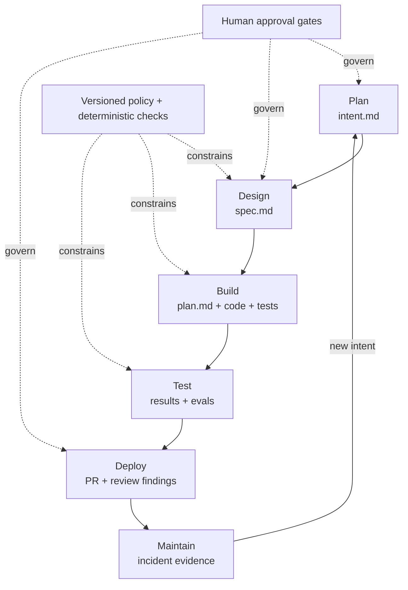

# The AI-Native SDLC Playbook

> An AI-native SDLC is a versioned artifact loop: each stage consumes the previous stage's durable
> output, agents accelerate work between gates, and humans remain accountable for approvals that
> require risk or judgment.

The goal is not unrestricted autonomy. Agents operate inside version-controlled policies,
deterministic checks, scoped permissions, sandboxes, and protected deployment gates. Humans remain
accountable for decisions involving risk and judgment.

## The lifecycle as an artifact loop

The loop shows how intent survives implementation and how production evidence becomes future
planning input:

The return edge is the essential change from a linear pipeline: operational evidence becomes a new
planning artifact instead of disappearing after remediation.

## Source

- Article: [The AI-Native SDLC playbook](https://claude.com/blog/the-ai-native-sdlc-playbook)
- Author: Louis Claxton
- Publisher: Claude by Anthropic
- Published: August 21, 2026

This guide is an original summary of Anthropic's playbook, not a replacement for the source.

| Stage | Committed artifact | Main change |
| --- | --- | --- |
| Plan | `intent.md` | Capture the original problem, desired outcome, constraints, and open questions directly from the source. |
| Design | `spec.md` | Turn accepted intent into requirements and design while applying organizational policy. |
| Build | `plan.md`, code, and tests | Review the implementation plan before code is generated; keep repository guidance close to the code. |
| Test | Test, build, screenshot, and eval results | Give the agent a fast feedback loop and continuously test agent configuration. |
| Deploy | PR and review findings | Layer automated reviews, preserve branch protection, and reserve human approval for critical changes. |
| Maintain | Incident record and a new `intent.md` | Detect problems deterministically, let agents diagnose through gated routes, and feed findings back into planning. |

The Git history becomes the audit trail: what was requested, what the agent produced, which policy
was applied, and who approved the result.

## The six stages

### 1. Plan: capture intent once

The originator brainstorms with an agent and records the result in `intent.md`. A product owner
corrects and accepts it before work advances. The artifact should state the problem, proposed
outcome, affected users and systems, constraints, and unresolved questions.

Start with an `intent/` directory in the product repository. A separate repository is useful only
when one intent spans many repositories.

Useful measures:

- Time from the first conversation to committed intent
- Percentage of intents accepted for design
- Requirements changes made after design or implementation begins

### 2. Design: apply policy while writing the specification

The agent turns accepted intent into `spec.md`, guided by versioned skills or instructions covering
security, compliance, brand, and UX. The product owner reviews the result, resolves flagged policy
conflicts with their owners, and decides whether it proceeds.

This shifts policy work earlier: concerns are exposed while the design is cheap to change, rather
than during a late review.

### 3. Build: approve a plan before implementation

An engineer asks the agent to create a `plan.md` that names affected files, execution order, risks,
and proof. The engineer challenges and approves that plan before implementation begins. If the
implementation diverges, the plan changes with it.

Keep durable repository knowledge in a short, reviewed `CLAUDE.md`: build and test commands,
conventions, architecture, and recurring mistakes. Put reusable organization-wide policy in skills,
not in an ever-growing repository instruction file.

Parallel sessions should use separate Git worktrees and touch independent files. Start with two or
three streams; review capacity, not generation speed, is the practical limit.

### 4. Test: make verification part of the agent's loop

Give every task a runnable definition of done: one command for tests, one for the build, and visual
comparison for UI work. The agent should run these checks and correct its work before a person
reviews it.

For bug fixes, first reproduce the failure with a test, then protect that test while the agent fixes
the implementation. Separately, run continuous evaluations when agent instructions, prompts, tools,
or models change. Evals test the development system; ordinary tests check the product.

### 5. Deploy: automate review, preserve hard gates

Use multiple focused review passes for concerns such as correctness, security, performance, and
policy compliance. Consolidate their findings so people review the important disagreements and
high-risk areas instead of rereading every generated line equally.

Introduce pipeline autonomy gradually:

1. Begin with read-only work such as build-failure triage and changelog drafts.
2. Let agents propose changes only through pull requests and branch protection.
3. Run jobs in sandboxes with short-lived, scoped credentials.
4. Expose deployment and rollback as allowlisted tools per environment.
5. Allow more autonomy in development than in production.
6. Keep the production gate human-controlled and rehearse rollback regularly.

### 6. Maintain: close the loop from production

Use deterministic monitoring—not a model—to detect a breached control band. Escalation can then be
tiered: log a small deviation, invoke a read-only diagnosis for a larger one, and allow only a
pre-approved PR or runbook at the highest tier.

The agent records the anomaly, evidence, impact, and open questions as a new `intent.md`. A service
owner triages it, normal review gates remain in force, and a shipped fix adds a regression eval so
the same class of incident is less likely to recur.

## Governance principles

- Declare one source of truth for every artifact; when legacy tools remain authoritative, link them
  to exact commits.
- Treat instructions, skills, hooks, permission rules, and control-band configuration as reviewed,
  version-controlled code.
- Use deterministic checks for enforcement and agents for judgment or diagnosis.
- Give automated jobs their own identity, narrow permissions, and no standing production access.
- Keep human approval for regulated, critical, destructive, or production-impacting decisions.
- Measure outcomes such as rework, first-pass CI success, review time, change failure rate, and
  repeat incidents—not generated lines of code.

## A practical adoption order

Do not automate the whole loop first. A small useful sequence is:

1. Make build, test, and lint runnable with simple commands.
2. Add a concise, maintained `CLAUDE.md`.
3. Require reviewed intent and implementation plans for meaningful changes.
4. Give agents local feedback loops and add evals for recurring failures.
5. Add read-only CI triage and focused PR reviewers.
6. Permit agent-written changes only through existing review and deployment gates.
7. Close one maintenance loop around a stable, low-noise production signal.

## Critical reading

This is an Anthropic-authored operating model built around Claude products, so its product choices
are not vendor-neutral evidence. The durable ideas are broader: explicit artifacts, policy as code,
fast feedback, least privilege, deterministic enforcement, traceable approvals, and autonomy that
increases only when verification and rollback are trustworthy.

## Every stage leaves a reviewable artifact

AI-native development is a redesign of the whole delivery system, not just faster coding. The most
useful shift is to make each stage leave a reviewable artifact and let automation move work between
well-defined gates, while human attention stays concentrated on intent, risk, and accountability.
