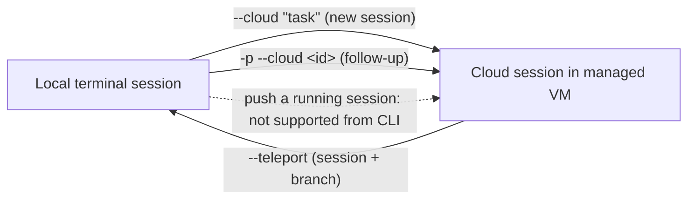
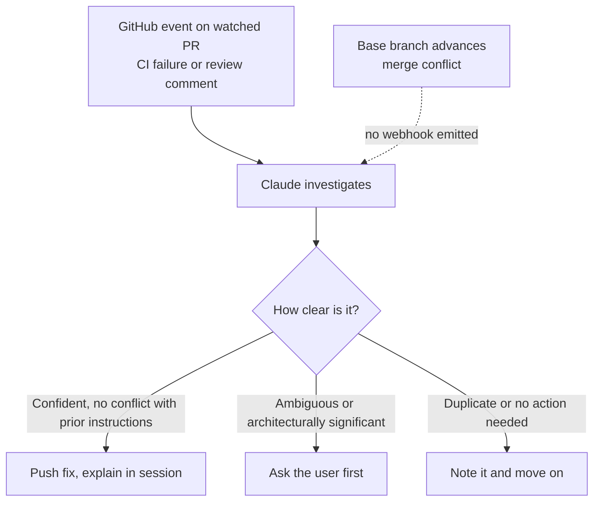

# Claude Code Cloud Sessions

English | [简体中文](README_ZH.md)

## Mental model

> A cloud session is an ordinary Claude Code session whose machine is not yours. It runs in an
> Anthropic-managed VM that clones your repository from GitHub, keeps running after you close the
> laptop, and can be picked up later from a browser, a phone, or back in your own terminal.

Two consequences follow from "the machine is not yours", and most of the product's surface area
exists to handle them. First, the session needs its own copy of the code, so GitHub access and
repository cloning become explicit configuration rather than an accident of your working directory.
Second, the session needs its own network and secrets policy, because nothing about your laptop's
environment carries over.

This article answers three questions:

1. Where do cloud sessions run, and how do they get your code?
2. How does work move between your terminal and the cloud in both directions?
3. What does a cloud session *not* do, and what breaks in practice?

## Source

- Primary source: [Use Claude Code in the cloud](https://code.claude.com/docs/en/claude-code-on-the-web) (Anthropic, Claude Code documentation)
- Reviewed: September 18, 2026
- Status at time of review: cloud sessions are a **research preview** for Pro, Max, and Team users, and for Enterprise users with premium seats or Chat + Claude Code seats

Sections marked *Analysis* are my own reading, not claims from the documentation.

## Where a session can start

A "cloud session" is one thing with many front doors. The surface you start from changes nothing
about how the session runs.

| Surface | How you start it |
| --- | --- |
| Browser | [claude.ai/code](https://claude.ai/code), also called Claude Code on the web |
| Mobile | The **Code** tab in the Claude app |
| Desktop app | Select **Cloud** instead of **Local** when starting a session |
| Terminal | `claude --cloud "<task>"` |
| Routines | Scheduled and triggered runs each execute as a cloud session |

The contrast worth holding onto: a session in your terminal, your IDE, or the Desktop app with
**Local** selected runs on your own machine. Steering *that* kind of session from your phone is
Remote Control, a different feature. `--cloud` creates cloud sessions; `--remote-control` does not.

## Cloud environments

Every cloud session runs inside a **cloud environment** — a saved configuration that controls three
things:

- Network access
- Environment variables
- Setup scripts

If you have no environment yet, onboarding sets up a **Default** environment with **Trusted**
network access, either creating it for you or prompting you to create it, depending on your plan.
The same environments apply to every surface above, plus Claude Tag and routines. Claude Tag channel
sessions are the exception: they use organization-level environments only (shared or self-hosted).

Sessions can also be routed to a **self-hosted environment** on your organization's own
infrastructure. That changes who owns several guarantees — isolation, egress restriction, and git
credentials all become your deployment's responsibility rather than Anthropic's.

> **Practical note.** The network policy is the setting most likely to surprise you. A session whose
> environment blocks a domain simply cannot reach it, and the failure surfaces as a proxy `403` or an
> egress-blocked error inside the session rather than as a configuration warning.

## GitHub authentication

Cloud sessions need GitHub access to clone code and push branches. There are two ways to grant it,
and they differ in reach.

| Method | How you connect | Repositories sessions can reach | Best for |
| --- | --- | --- | --- |
| **GitHub App** | Authorize the Claude GitHub App during web onboarding | Any public repository, plus private repositories the app is installed on | Browser onboarding; teams that want Auto-fix |
| **`/web-setup`** | Run `/web-setup` in your terminal to send your local `gh` CLI token to your Claude account | Any repository your `gh` token can reach, app installed or not | Individual developers already using `gh` |

Two constraints that are easy to miss:

- Installing the Claude GitHub App on a repository is what enables **Auto-fix** for its pull requests.
- Threads in a project require the Claude GitHub App on each repository they clone, whichever method you connected with.

**Quick web setup** is an organization setting that lets members connect with `/web-setup`, skips the
app install prompt during onboarding, and has onboarding create the Default environment silently. It
is **off by default on Team and Enterprise**, which also hides `/web-setup` entirely. An Owner turns
it on under **Admin settings > Claude Code**.

Organizations with **Zero Data Retention** enabled cannot use `/web-setup` or other cloud session
features at all.

## Moving work between terminal and cloud

This is the part where the mental model earns its keep. Handoff from the CLI is **one-way**: you can
pull a cloud session down, but you cannot push a running terminal session up. (The Desktop app has a
**Continue in** menu that can send a local session to the cloud; the CLI does not.)



Read it as three supported edges and one dotted non-edge. Each solid edge has its own preconditions,
covered below.

### Terminal to cloud: `--cloud`

```bash
claude --cloud "Fix the authentication bug in src/auth/login.ts"
```

The critical detail: the cloud VM clones **your current directory's GitHub remote at your current
branch, not your local checkout**. Push your local commits first, or they will not be there.
`--cloud` handles a single repository at a time, and the older `--remote` spelling remains as a
deprecated alias.

While the container provisions, the CLI shows a live checklist of setup steps and queues anything you
type, sending it once the session is ready.

Two patterns the documentation calls out:

- **Plan locally, execute in the cloud.** Run `claude --permission-mode plan` to work out the approach without editing source, commit the plan to the repository, then `claude --cloud "Execute the migration plan in docs/migration-plan.md"`.
- **Run tasks in parallel.** Each `--cloud` invocation creates an independent session, so several can run simultaneously.

### When there is no usable GitHub remote

If you run `claude --cloud` from a repository with no git remote, or from a github.com repository the
Claude GitHub App is not installed on, Claude Code **bundles and uploads your local repository**
instead of cloning. This happens even if you connected via `/web-setup`. The bundle carries full
history across all branches plus uncommitted changes to tracked files. Force this path with
`CCR_FORCE_BUNDLE=1`.

On macOS, Linux, and WSL, Claude Code leaves *uncommitted* changes to credential-shaped files out of
the upload and names what it skipped — `.env` files, Terraform `*.tfvars`, and key files such as
`id_rsa` and `*.pem`. The session gets the committed version of each, or no file at all if none is
committed. **In a linked worktree, submodule, or similar layout this protection does not apply**:
those changes are uploaded with the rest, and Claude Code names the files it uploads.

Bundle limits:

| Constraint | Value / behaviour |
| --- | --- |
| Repository required | Must be a git repository with at least one commit |
| Size | Under 100 MB; larger falls back to current branch only, then to a single squashed snapshot, then fails |
| Untracked files | Not included — `git add` anything the session must see |
| Push back | Only when your GitHub connection has push access to that repository |

### Sending follow-ups from any machine

```bash
claude -p "your message" --cloud <session-id>
```

This posts one message and exits. It authenticates with your Anthropic account and sends **no local
session state**, so it does not have to run on the machine that started the session, and it behaves
identically in every shell including PowerShell. You can also pipe on stdin. `<session-id>` accepts a
bare `session_...` or `cse_...` ID, or the `claude.ai/code/<id>` URL with or without scheme and query
string.

`--output-format json` returns `{ok, session_id, url}` on success or `{ok: false, session_id, error}`
on failure. `--output-format stream-json` is not supported with `--cloud <session-id>`.

Notable failure messages, which are worth recognising before you start debugging the wrong layer:

| Message | What it means |
| --- | --- |
| `Cloud sessions aren't available with <provider>.` | Claude Code is configured for a third-party provider such as Amazon Bedrock or Google Vertex AI. Unset it (e.g. `CLAUDE_CODE_USE_BEDROCK`) and `claude auth login`. |
| `Cloud sessions are disabled by your organization's policy.` | The `allow_remote_sessions` organization policy is off. |
| `Couldn't verify your organization's policy for cloud sessions.` | The policy fetch failed, so the send is refused rather than assumed allowed. |
| `Attaching to an existing cloud session is not enabled for your account.` | You ran `--cloud <session-id>` without `-p`. |
| `Session not found: <id>` | The ID or URL doesn't match a session you can access. |
| `cloud session <id> is archived and cannot accept new messages` | Start a new session instead. |

An LLM gateway configured only through `ANTHROPIC_BASE_URL` does *not* count as a third-party
provider for this check, but you still need `claude auth login`.

### Cloud to terminal: `--teleport`

Five entry points, all doing the same thing:

- `claude --teleport` for an interactive picker, or `claude --teleport <session-id>` directly
- `/teleport` (or `/tp`) inside an existing CLI session
- `/tasks`, then press `t`
- **Open in > Terminal** from the session menu at claude.ai/code
- `/teleport` typed *inside the cloud session*, which replies with the exact command (requires Claude Code v2.1.223+ in that environment)

Teleport verifies the repository, fetches and checks out the cloud session's branch, and loads the
full conversation history locally. **The terminal gets its own copy**: work done there stays local and
does not flow back into the cloud session. To keep steering from your phone afterwards, start
`/remote-control` in the local session.

`--teleport` is not `--resume`. `--resume` reopens local history and lists no cloud sessions.

| Requirement | Details |
| --- | --- |
| Clean git state | No uncommitted changes; teleport prompts you to stash |
| Correct repository | Same repository, not a fork. An unparseable remote (e.g. the SSH alias `git@work:owner/repo.git`) prompts for confirmation and is accepted when owner and repo name match |
| Branch available | The session's branch must have been pushed; teleport fetches and checks it out |
| Same account | Must be the same claude.ai account used in the cloud session |

## Working with a running session

### Commands

Cloud sessions support built-in commands that produce text output. Terminal-interface-only commands
such as `/plugin` and `/resume` are unavailable, and picker-style commands behave differently:

- `/model`, `/effort`, `/color`, `/rename` — pass the value as an argument (`/model sonnet`) instead of opening a picker. Requires Claude Code v2.1.205+ in the session's environment.
- `/fast` — toggles fast mode when available on your account. Requires v2.1.271+.
- `/config` — in the browser this opens your settings panel rather than setting a value, and any `key=value` text after it is ignored. To change a setting for a cloud session, set an environment variable on the environment, or commit the key to the repository's `.claude/settings.json`.

Context management specifically:

| Command | Works in cloud sessions | Notes |
| --- | --- | --- |
| `/compact` | Yes | Accepts focus instructions, e.g. `/compact keep the test output` |
| `/context` | Yes | Shows what's currently in the context window |
| `/clear` | No | Start a new session from the sidebar instead |

Auto-compaction has a cloud-specific wrinkle: cloud sessions set `CLAUDE_AUTOCOMPACT_PCT_OVERRIDE`
themselves, so compaction triggers partway through the auto-compact window rather than when it fills
— **and that override wins over the same variable set in your environment variables**. To change
behaviour, set `CLAUDE_CODE_AUTO_COMPACT_WINDOW` instead, or run `/autocompact` with a token count in
a session where that variable isn't set.

Subagents work as they do locally, and `.claude/agents/` definitions are picked up automatically.
Agent teams are off by default; enable with `CLAUDE_CODE_EXPERIMENTAL_AGENT_TEAMS=1` in the
environment variables.

### Permission modes, review, sharing, lifecycle

- **Permission mode** is chosen from the mode dropdown, both at creation and while the session runs. A session resumed after environment expiry, or after a self-hosted runner released it while idle, comes back in the mode it was in.
- **Review** shows a diff indicator such as `+42 -18`; opening it allows inline comments that are sent to Claude with your next message. Diffs are computed from raw git blob content, so repository `textconv` filters and diff drivers do not apply.
- **Sharing** differs by plan. Enterprise/Team choose **Private** or **Team**, with repository access verification **on** by default. Max/Pro choose **Private** or **Public** — public meaning *any* user logged into claude.ai — with repository access verification **off** by default. Since sessions can contain code and credentials from private repositories, check contents before sharing, or tighten this under **Settings > Claude Code > Sharing settings**.
- **Archive** hides a session from the default list; **delete** is permanent and confirmed first.

A queued message can be taken back with the ✕ on it — the text returns to the box. Once Claude has
read it, it stays.

## Auto-fix pull requests

Claude can subscribe to GitHub activity on a PR and respond to CI failures and review comments.



Turning it on, depending on where the PR came from:

- **PRs created in a cloud session**: open the CI status bar in the session and select **Auto-fix**
- **From your terminal**: `/autofix-pr` on the PR's branch — Claude Code detects the open PR with `gh`, spawns a cloud session, and enables auto-fix in one step
- **From mobile**: ask Claude in words, e.g. "watch this PR and fix any CI failures or review comments"
- **Any existing PR**: paste the PR URL into a session and ask

Auto-fix requires the Claude GitHub App on the repository, and it is a per-PR toggle — clear it in the
CI status bar or tell Claude to stop watching.

Three caveats worth reading twice:

1. **Merge conflicts are a blind spot.** GitHub emits no webhook when the base branch advances, so auto-fix cannot react on its own. Open the session and ask Claude to rebase.
2. **Replies are posted under your GitHub account.** Each reply is labelled as coming from Claude Code, but the account is yours.
3. **Comment-triggered automation is a real hazard.** If the repository uses Atlantis, Terraform Cloud, or custom Actions running on `issue_comment` events, a Claude reply can trigger them. Review the repository's automation before enabling auto-fix, and consider leaving it off where a PR comment can deploy infrastructure.

## Security and isolation

Anthropic-hosted sessions are separated by several layers. In a self-hosted environment, several of
these become your responsibility instead — the difference matters more than the list.

| Layer | Anthropic-hosted | Self-hosted |
| --- | --- | --- |
| Isolation | Isolated, Anthropic-managed VM per session | Your infrastructure; isolation is your deployment's responsibility |
| Network | Limited by default, can be disabled; default allowed-domain list applies | You restrict egress at your own network boundary |
| Git credentials | Credentials and signing keys stay outside the sandbox; a proxy authenticates with scoped credentials | Your deployment supplies git credentials |
| API credentials | On Pro and Max, keys added to the environment stay outside the sandbox and are attached after requests leave the session | Not available (and not yet on Team/Enterprise either) |

One line deserves emphasis: **even with network access disabled, Claude Code can still reach the
Anthropic API, which may allow data to exit the VM.** "Network disabled" is not "airgapped".

## Troubleshooting

| Symptom | Cause and fix |
| --- | --- |
| `Session creation failed`, or stalls at provisioning | No VM could be allocated. Check [status.claude.com](https://status.claude.com), retry after a minute, and confirm your GitHub connection reaches the repository. |
| `Unable to get organization UUID`, or `Error loading Claude Code sessions` in the picker | You're authenticated with an API key, or stored account details are stale. Run `/login` with your claude.ai account. |
| `Remote Control session expired` / `Access denied` | `--teleport` uses the Remote Control session infrastructure, so its wording surfaces here. Run `/login` to refresh, and confirm the same account owns the session. |
| `Remote Control may not be available for this organization` | An Owner has not enabled cloud sessions for the organization. |
| Session stopped, VM reclaimed | Environment expiry after inactivity. Reopen from claude.ai/code for a fresh VM with history restored — but background work such as subagents and shell commands is **not** restored. |

A subtle one: a session counts as **inactive while it waits for you to approve an MCP connector tool
call or to sign in to an MCP server**, and it can expire during that wait.

Runtime API errors inside the conversation (`API Error: 500`, `529 Overloaded`, `429`,
`Prompt is too long`) are shared with the CLI and Desktop app and are covered by the general error
reference, not by anything cloud-specific.

## Limitations

- **Rate limits** are shared with all other Claude and Claude Code usage on your account. Parallel tasks consume them proportionately. There is no separate compute charge for the cloud VM.
- **Repository authentication**: teleport only works from the same account.
- **Platform**: cloning and PR creation require GitHub. Self-hosted GitHub Enterprise Server is supported on Team and Enterprise. GitLab, Bitbucket, and other remotes can be sent as a local bundle with `CCR_FORCE_BUNDLE=1`, but the session cannot push results back to them.
- **Organization IP allowlist**: Anthropic-hosted cloud sessions call the API from Anthropic infrastructure, not your network, so an organization IP allowlist makes every such session fail with an authentication error. The same applies to Code Review and to routines on Anthropic-hosted environments. Sessions in a self-hosted environment call from your own network. Contact Anthropic support to exempt Anthropic-hosted services.

## Analysis

Three things stand out to me after reading the whole page.

**The GitHub App is the real gate, not the auth method.** Both authentication paths get you cloning
and pushing, but Auto-fix and project threads need the app specifically. If you connect with
`/web-setup` because it is faster, you have quietly opted out of the automation half of the product.

**The bundle fallback is a security decision, not a convenience feature.** `claude --cloud` in a
repository without the app installed uploads your working tree rather than failing. The credential
skip-list makes that safe for the common case, but it explicitly does not cover linked worktrees and
submodules — a layout that is common in exactly the kind of large monorepo where an accidental upload
matters most. Knowing which path you are on before you press enter is worth the five seconds.

**The one-way handoff shapes how you should work.** Because you cannot push a running terminal session
to the cloud, the useful pattern is to decide *at the start* whether a task is local or remote, and to
use plan mode plus a committed plan file as the bridge when it turns out to be remote. Treating the
cloud as a place you can escalate to mid-task will not work from the CLI.

## Related documentation

- [Cloud environments](https://code.claude.com/docs/en/cloud-environments) — network access, environment variables, setup scripts
- [Get started with cloud sessions](https://code.claude.com/docs/en/web-quickstart)
- [Self-hosted environments](https://code.claude.com/docs/en/self-hosted-environments)
- [Routines](https://code.claude.com/docs/en/routines) — scheduled, API-triggered, and GitHub-event-driven runs
- [Remote Control](https://code.claude.com/docs/en/remote-control) — steering a *local* session from claude.ai
- [Permission modes](https://code.claude.com/docs/en/permission-modes)
- [Security](https://code.claude.com/docs/en/security) and [Data usage](https://code.claude.com/docs/en/data-usage)
