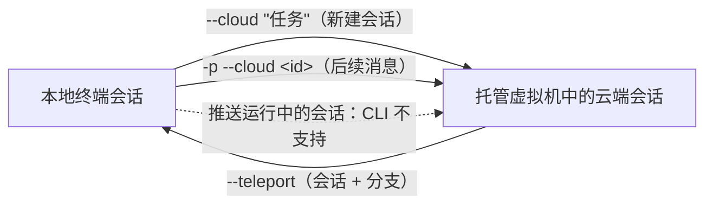
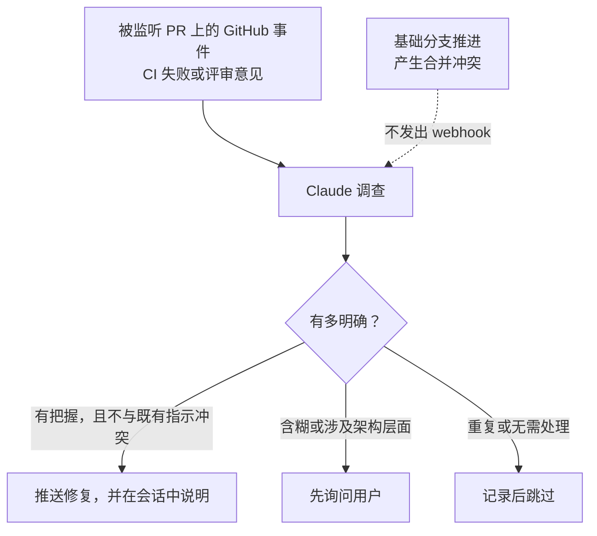

# Claude Code 云端会话

[English](README.md) | 简体中文

## 心智模型

> 云端会话就是一次普通的 Claude Code 会话，只不过运行它的机器不是你的。它跑在 Anthropic 托管的
> 虚拟机里，从 GitHub 克隆你的仓库，在你合上笔记本之后继续运行，之后可以从浏览器、手机，或者回到
> 你自己的终端里接着用。

"机器不是你的"带来两个后果，产品的大部分复杂度都是在处理这两点。第一，会话需要自己的一份代码，
所以 GitHub 访问和仓库克隆变成了显式配置，而不再是"恰好在某个工作目录里"的副产品。第二，会话需要
自己的网络和密钥策略，因为你本机环境的任何东西都不会自动带过去。

本文回答三个问题：

1. 云端会话在哪里运行，它如何拿到你的代码？
2. 工作如何在终端与云端之间双向流动？
3. 云端会话**不能**做什么，实践中哪些地方会出问题？

## 来源

- 主要来源：[Use Claude Code in the cloud](https://code.claude.com/docs/en/claude-code-on-the-web)（Anthropic，Claude Code 官方文档）
- 查阅时间：2026 年 9 月 18 日
- 查阅时的状态：云端会话处于 **research preview**，面向 Pro、Max、Team 用户，以及拥有 premium seat 或 Chat + Claude Code seat 的 Enterprise 用户

标注为*分析*的部分是我自己的理解，不是文档中的论断。

## 从哪里启动会话

"云端会话"只有一种，但有很多扇门。你从哪个入口启动，不改变会话的运行方式。

| 入口 | 启动方式 |
| --- | --- |
| 浏览器 | [claude.ai/code](https://claude.ai/code)，也就是 Claude Code on the web |
| 移动端 | Claude 应用中的 **Code** 标签页 |
| 桌面应用 | 启动会话时选择 **Cloud** 而不是 **Local** |
| 终端 | `claude --cloud "<任务描述>"` |
| Routines | 定时与触发式运行，每次执行都是一次云端会话 |

需要记住的对比：在终端、IDE，或桌面应用选择 **Local** 启动的会话，运行在你自己的机器上。从手机去
操控*那一类*会话叫 Remote Control，是另一个功能。`--cloud` 创建云端会话；`--remote-control` 不会。

## 云端环境

每个云端会话都运行在一个**云端环境**里 —— 一份保存下来的配置，控制三件事：

- 网络访问
- 环境变量
- 启动脚本（setup scripts）

如果你还没有环境，onboarding 会建立一个使用 **Trusted** 网络访问级别的 **Default** 环境；具体是
自动创建还是提示你创建，取决于你的套餐。上表中所有入口共用同一批环境，Claude Tag 和 routines 也是。
唯一例外是 Claude Tag 的 channel 会话：它们只使用组织级环境（共享环境或自托管环境）。

会话也可以被路由到组织自己基础设施上的**自托管环境**。这会改变若干保障的归属方 —— 隔离、出口流量
限制、git 凭据都从 Anthropic 的责任变成你自己部署的责任。

> **实践提醒。** 网络策略是最容易让人措手不及的设置。如果环境屏蔽了某个域名，会话就是访问不到它，
> 而失败通常表现为会话内部的代理 `403` 或 egress-blocked 错误，而不是一条配置告警。

## GitHub 认证

云端会话需要 GitHub 访问权限来克隆代码、推送分支。有两种授权方式，覆盖范围不同。

| 方式 | 连接方法 | 会话可访问的仓库 | 适合谁 |
| --- | --- | --- | --- |
| **GitHub App** | 在 web onboarding 过程中授权 Claude GitHub App | 任意公开仓库，加上已安装该 App 的私有仓库 | 浏览器 onboarding；需要 Auto-fix 的团队 |
| **`/web-setup`** | 在终端运行 `/web-setup`，把本地 `gh` CLI token 发送到你的 Claude 账号 | 你的 `gh` token 能访问的任意仓库，无论是否安装了 App | 已经在用 `gh` 的个人开发者 |

两条容易被忽略的约束：

- 在仓库上安装 Claude GitHub App，才是启用该仓库 pull request **Auto-fix** 的前提。
- project 中的线程要求它克隆的每个仓库都安装了 Claude GitHub App，无论你用哪种方式连接的 GitHub。

**Quick web setup** 是一个组织级设置：允许成员用 `/web-setup` 连接，跳过 onboarding 中的 App 安装
提示，并让 onboarding 直接创建 Default 环境。它在 **Team 和 Enterprise 上默认关闭**，关闭时
`/web-setup` 命令本身也不可见。Owner 可在 **Admin settings > Claude Code** 中开启。

启用了 **Zero Data Retention** 的组织完全无法使用 `/web-setup` 及其他云端会话功能。

## 在终端与云端之间搬运工作

这里是心智模型真正派上用场的地方。从 CLI 出发，交接是**单向的**：你可以把云端会话拉下来，但不能把
正在运行的终端会话推上去。（桌面应用有一个 **Continue in** 菜单，可以把本地会话送到云端；CLI 没有。）



把它读作三条支持的边和一条虚线的"不存在的边"。每条实线边都有自己的前置条件，见下文。

### 终端到云端：`--cloud`

```bash
claude --cloud "Fix the authentication bug in src/auth/login.ts"
```

关键细节：云端虚拟机克隆的是**你当前目录的 GitHub 远端、当前分支，而不是你的本地检出**。请先把本地
提交推上去，否则它们不会出现在会话里。`--cloud` 一次只处理一个仓库；旧写法 `--remote` 作为已废弃的
别名仍然可用。

容器准备期间，CLI 会显示一份实时的初始化步骤清单，并把你此时输入的内容排队，会话就绪后一次性发送。

文档明确提到的两种用法：

- **本地规划，云端执行。** 先用 `claude --permission-mode plan` 在不改动源码的前提下敲定方案，把方案提交到仓库，再执行 `claude --cloud "Execute the migration plan in docs/migration-plan.md"`。
- **并行运行任务。** 每次 `--cloud` 调用都会创建一个独立会话，因此可以同时跑多个。

### 没有可用的 GitHub 远端时

如果你在一个没有 git 远端的仓库中运行 `claude --cloud`，或者该 github.com 仓库没有安装 Claude
GitHub App，Claude Code 会**打包并上传你的本地仓库**，而不是克隆。即便你是用 `/web-setup` 连接的，
也是如此。打包内容包含所有分支的完整历史，以及已跟踪文件的未提交改动。用 `CCR_FORCE_BUNDLE=1` 可以
强制走这条路径。

在 macOS、Linux 和 WSL 上，Claude Code 会把凭据类文件的*未提交*改动排除在上传之外，并列出被排除的
文件 —— 包括 `.env` 文件、Terraform `*.tfvars`，以及 `id_rsa`、`*.pem` 这类密钥文件。会话拿到的是
每个文件已提交的版本；若从未提交过，则该文件不存在。**在 linked worktree、submodule 或类似布局下这项
保护不生效**：这些改动会与其他内容一起上传，Claude Code 会列出它上传的文件。

打包限制：

| 约束 | 取值 / 行为 |
| --- | --- |
| 必须是仓库 | 必须是至少有一次提交的 git 仓库 |
| 体积 | 小于 100 MB；超出则退化为只打包当前分支，再退化为工作树的单次压缩快照，仍然过大则失败 |
| 未跟踪文件 | 不包含 —— 需要会话看到的文件请先 `git add` |
| 推送回去 | 仅当你的 GitHub 连接对该仓库有推送权限时 |

### 从任意机器发送后续消息

```bash
claude -p "your message" --cloud <session-id>
```

这条命令投递一条消息后退出。它使用你的 Anthropic 账号凭据认证，**不发送任何本地会话状态**，因此不必
在启动该会话的那台机器上运行，在所有 shell（包括 PowerShell）中行为一致。也可以通过 stdin 传入消息。
`<session-id>` 接受裸 ID（`session_...` 或 `cse_...`），或 `claude.ai/code/<id>` URL，带不带协议头和
查询串都可以。

`--output-format json` 成功时返回 `{ok, session_id, url}`，失败时返回
`{ok: false, session_id, error}`。`--output-format stream-json` 不支持与 `--cloud <session-id>` 同用。

值得提前认识的失败信息，免得你去排查错误的层：

| 信息 | 含义 |
| --- | --- |
| `Cloud sessions aren't available with <provider>.` | Claude Code 被配置为第三方 provider（如 Amazon Bedrock、Google Vertex AI）。取消该配置（例如 `CLAUDE_CODE_USE_BEDROCK`）并执行 `claude auth login`。 |
| `Cloud sessions are disabled by your organization's policy.` | 组织策略 `allow_remote_sessions` 处于关闭状态。 |
| `Couldn't verify your organization's policy for cloud sessions.` | 策略拉取失败，因此拒绝发送，而不是假定允许。 |
| `Attaching to an existing cloud session is not enabled for your account.` | 你执行了 `--cloud <session-id>` 却没带 `-p`。 |
| `Session not found: <id>` | ID 或 URL 不对应你可访问的会话。 |
| `cloud session <id> is archived and cannot accept new messages` | 会话已归档，请新建会话。 |

仅通过 `ANTHROPIC_BASE_URL` 配置的 LLM gateway 在这项检查中**不**算第三方 provider，但你仍需
`claude auth login`。

### 云端到终端：`--teleport`

五个入口，做的是同一件事：

- `claude --teleport` 打开交互式选择器，或 `claude --teleport <session-id>` 直接恢复
- 在已有 CLI 会话中执行 `/teleport`（或 `/tp`）
- 执行 `/tasks`，然后按 `t`
- 在 claude.ai/code 的会话菜单中选择 **Open in > Terminal**
- 在*云端会话内部*输入 `/teleport`，它会回复该会话对应的完整命令（要求该环境中的 Claude Code 版本不低于 v2.1.223）

Teleport 会校验仓库、拉取并检出云端会话的分支，并把完整对话历史加载到本地。**终端拿到的是一份自己的
副本**：在本地的新工作不会流回云端会话。如果之后仍想用手机操控，请在本地会话中启动 `/remote-control`。

`--teleport` 不是 `--resume`。`--resume` 打开的是本机的本地历史，不会列出任何云端会话。

| 要求 | 说明 |
| --- | --- |
| git 状态干净 | 不能有未提交改动；teleport 会提示你先 stash |
| 仓库正确 | 必须是同一个仓库，不能是 fork。如果远端无法解析出主机名（例如 SSH 别名 `git@work:owner/repo.git`），会请你确认；owner 与仓库名匹配时接受该检出 |
| 分支可用 | 会话的分支必须已推送到远端；teleport 会自动 fetch 并检出 |
| 同一账号 | 必须是云端会话所用的同一个 claude.ai 账号 |

## 使用运行中的会话

### 命令

云端会话支持所有产生文本输出的内置命令。仅限终端界面的命令（如 `/plugin`、`/resume`）不可用；
选择器类命令行为有所不同：

- `/model`、`/effort`、`/color`、`/rename` —— 以参数形式传值（`/model sonnet`），而不是打开选择器。要求该环境中的 Claude Code 版本不低于 v2.1.205。
- `/fast` —— 在你的账号支持时切换 fast mode。要求版本不低于 v2.1.271。
- `/config` —— 在浏览器中打开设置面板，而不是设置某个值，命令后面的文本（包括 `key=value`）会被忽略。要为云端会话修改设置，请在环境上设置环境变量，或把该项提交到仓库的 `.claude/settings.json`。

上下文管理方面：

| 命令 | 云端会话可用 | 说明 |
| --- | --- | --- |
| `/compact` | 可用 | 接受侧重说明，例如 `/compact keep the test output` |
| `/context` | 可用 | 显示当前上下文窗口中的内容 |
| `/clear` | 不可用 | 请改从侧边栏新建会话 |

自动压缩有一处云端特有的细节：云端会话会自行设置 `CLAUDE_AUTOCOMPACT_PCT_OVERRIDE`，因此压缩会在
auto-compact 窗口用满之前就触发 —— **而且这个覆盖值优先于你在环境变量里设置的同名变量**。要改变行为，
请改设 `CLAUDE_CODE_AUTO_COMPACT_WINDOW`，或在未设置该变量的会话中执行带 token 数的 `/autocompact`。

Subagent 的行为与本地一致，仓库 `.claude/agents/` 中的定义会被自动识别。Agent teams 默认关闭，可通过
在环境变量中设置 `CLAUDE_CODE_EXPERIMENTAL_AGENT_TEAMS=1` 启用。

### 权限模式、评审、分享与生命周期

- **权限模式**从模式下拉框中选择，创建时和运行中都可以改。因环境过期而恢复的会话，或自托管 runner 在空闲时释放后恢复的会话，会回到它原先所处的模式。
- **评审**会显示 `+42 -18` 这样的差异指示；点开后可以在具体行上留下 inline comment，随你的下一条消息发给 Claude。差异是基于 git 原始 blob 内容计算的，因此仓库中配置的 `textconv` 过滤器和 diff driver 不生效。
- **分享**因套餐而异。Enterprise/Team 可选 **Private** 或 **Team**，仓库访问校验**默认开启**。Max/Pro 可选 **Private** 或 **Public** —— public 意味着*任何*登录 claude.ai 的用户都可见 —— 且仓库访问校验**默认关闭**。由于会话可能包含私有仓库的代码和凭据，分享前请检查内容，或在 **Settings > Claude Code > Sharing settings** 中收紧。
- **归档**只是把会话从默认列表隐藏；**删除**是永久的，会先要求确认。

排队中的消息可以点击其上的 ✕ 撤回，文本会退回输入框。一旦 Claude 已经读取，它就留在对话里了。

## Pull request 自动修复（Auto-fix）

Claude 可以订阅某个 PR 的 GitHub 活动，并响应 CI 失败和评审意见。



按 PR 的来源，开启方式不同：

- **在云端会话中创建的 PR**：在会话中打开 CI 状态栏，选择 **Auto-fix**
- **从终端**：在 PR 所在分支上执行 `/autofix-pr` —— Claude Code 用 `gh` 检测到该 PR，创建云端会话并一步开启 auto-fix
- **从移动端**：直接用自然语言告诉 Claude，例如"watch this PR and fix any CI failures or review comments"
- **任何已有 PR**：把 PR URL 粘贴到会话中，然后提出要求

Auto-fix 需要仓库上安装 Claude GitHub App，并且是**按 PR** 的开关 —— 在 CI 状态栏中清除该开关，或直接
告诉 Claude 停止监听。

三条值得读两遍的注意事项：

1. **合并冲突是盲区。** 基础分支推进时 GitHub 不发出 webhook，auto-fix 无法自行响应。请打开会话并让 Claude 执行 rebase。
2. **回复是以你的 GitHub 账号发出的。** 每条回复都会标注来自 Claude Code，但账号是你的。
3. **评论触发式自动化是真实风险。** 如果仓库使用 Atlantis、Terraform Cloud，或监听 `issue_comment` 事件的自定义 Actions，Claude 的一条回复就可能触发它们。开启 auto-fix 前请检查仓库的自动化配置；在"一条 PR 评论就能部署基础设施"的仓库上，考虑不要开启。

## 安全与隔离

Anthropic 托管的会话由多层机制隔离。在自托管环境中，其中若干层转由你自己负责 —— 这个差异比清单本身
更重要。

| 层面 | Anthropic 托管 | 自托管 |
| --- | --- | --- |
| 隔离 | 每个会话一台隔离的、Anthropic 管理的虚拟机 | 你的基础设施；隔离由你的部署负责 |
| 网络 | 默认受限，可以完全关闭；适用默认允许域名列表 | 你在自己的网络边界上限制出口流量 |
| Git 凭据 | 凭据与签名密钥留在沙箱之外，由代理使用范围受限的凭据代为认证 | 由你的部署提供 git 凭据 |
| API 凭据 | Pro 和 Max 上，添加到环境的密钥同样留在沙箱之外，在请求离开会话后附加 | 不提供（Team/Enterprise 目前也还没有） |

有一句话值得强调：**即便关闭了网络访问，Claude Code 仍然可以访问 Anthropic API，这意味着数据仍可能
离开虚拟机。**"关闭网络"不等于"物理隔离"。

## 故障排查

| 现象 | 原因与处理 |
| --- | --- |
| `Session creation failed`，或卡在 provisioning | 无法分配虚拟机。查看 [status.claude.com](https://status.claude.com)，过一分钟重试，并确认你的 GitHub 连接能访问该仓库。 |
| `Unable to get organization UUID`，或选择器中出现 `Error loading Claude Code sessions` | 你用的是 API key 认证，或存储的账号信息已过期。执行 `/login` 用 claude.ai 账号登录。 |
| `Remote Control session expired` / `Access denied` | `--teleport` 复用 Remote Control 的会话基础设施，所以错误措辞出现在这里。执行 `/login` 刷新凭据，并确认会话属于同一账号。 |
| `Remote Control may not be available for this organization` | Owner 尚未为该组织启用云端会话。 |
| 会话停止，虚拟机被回收 | 空闲超时导致环境过期。从 claude.ai/code 重新打开可获得新虚拟机并恢复对话历史 —— 但正在运行的后台工作（如 subagent 和 shell 命令）**不会**恢复。 |

一个不易察觉的点：**会话在等待你批准 MCP connector 工具调用、或等待你登录 MCP 服务器时算作空闲**，
并且可能在这段等待中过期。

对话中出现的运行时 API 错误（`API Error: 500`、`529 Overloaded`、`429`、`Prompt is too long`）与 CLI
和桌面应用相同，属于通用错误参考的范畴，不是云端特有问题。

## 限制

- **速率限制**与你账号上所有其他 Claude 及 Claude Code 用量共享。并行任务会按比例消耗。云端虚拟机本身不额外收取算力费用。
- **仓库认证**：只有使用同一账号才能把云端会话拉到终端。
- **平台**：克隆仓库和创建 pull request 需要 GitHub。Team 和 Enterprise 支持自托管的 GitHub Enterprise Server。GitLab、Bitbucket 及其他远端可以通过 `CCR_FORCE_BUNDLE=1` 以本地打包方式送入云端会话，但会话无法把结果推回这些远端。
- **组织 IP 白名单**：Anthropic 托管的云端会话是从 Anthropic 的基础设施调用 API 的，不是从你的网络，因此组织启用 IP 白名单会让每一个这样的会话都因认证错误而失败。Code Review 以及运行在 Anthropic 托管环境上的 routines 同理。自托管环境中的会话则是从你自己的网络发起调用。需要联系 Anthropic 支持，把 Anthropic 托管服务加入白名单豁免。

## 分析

通读全文后，有三点让我印象最深。

**真正的闸门是 GitHub App，而不是认证方式本身。** 两条认证路径都能克隆和推送，但 Auto-fix 和 project
线程明确要求安装 App。如果你因为更快而选择了 `/web-setup`，就等于悄悄放弃了这个产品中自动化的那一半。

**打包上传这条退路是一个安全决策，不是便利功能。** 在没有安装 App 的仓库中执行 `claude --cloud` 会
上传你的工作树，而不是直接失败。凭据跳过清单让常见场景是安全的，但它明确不覆盖 linked worktree 和
submodule —— 而这恰恰是大型 monorepo 的常见布局，也正是误上传后果最严重的场景。按下回车前先弄清楚
自己走的是哪条路径，值得花那五秒钟。

**单向交接决定了你该怎么组织工作。** 因为无法把运行中的终端会话推到云端，可行的模式是*在一开始*就
决定这个任务是本地还是远程；当它最终需要在远程执行时，用 plan mode 加一个提交到仓库的方案文件作为桥梁。
指望在任务中途从 CLI 把工作"升级"到云端，是行不通的。

## 相关文档

- [Cloud environments](https://code.claude.com/docs/en/cloud-environments) —— 网络访问、环境变量、启动脚本
- [Get started with cloud sessions](https://code.claude.com/docs/en/web-quickstart)
- [Self-hosted environments](https://code.claude.com/docs/en/self-hosted-environments)
- [Routines](https://code.claude.com/docs/en/routines) —— 定时、API 触发和 GitHub 事件驱动的运行
- [Remote Control](https://code.claude.com/docs/en/remote-control) —— 从 claude.ai 操控*本地*会话
- [Permission modes](https://code.claude.com/docs/en/permission-modes)
- [Security](https://code.claude.com/docs/en/security) 与 [Data usage](https://code.claude.com/docs/en/data-usage)
