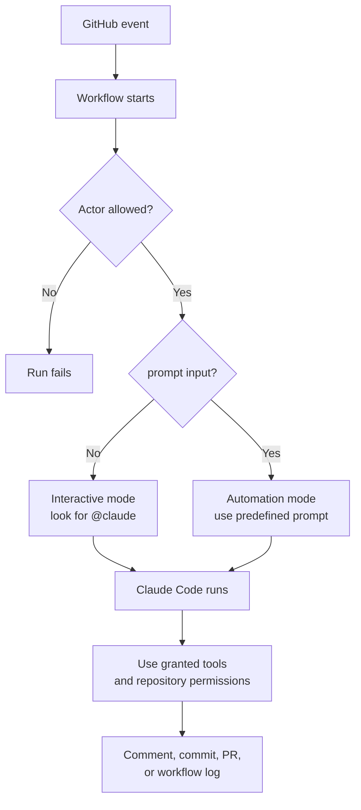
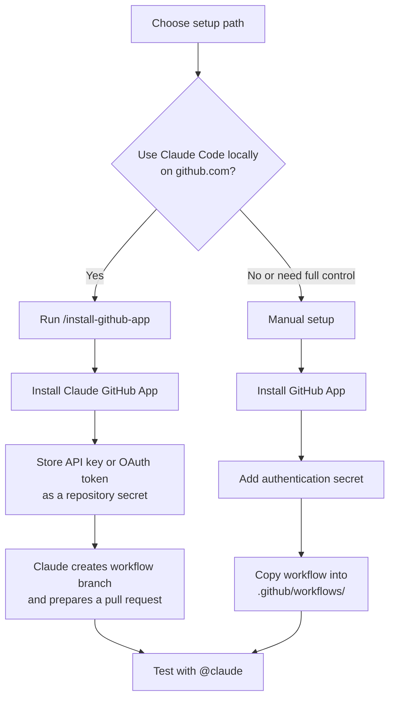
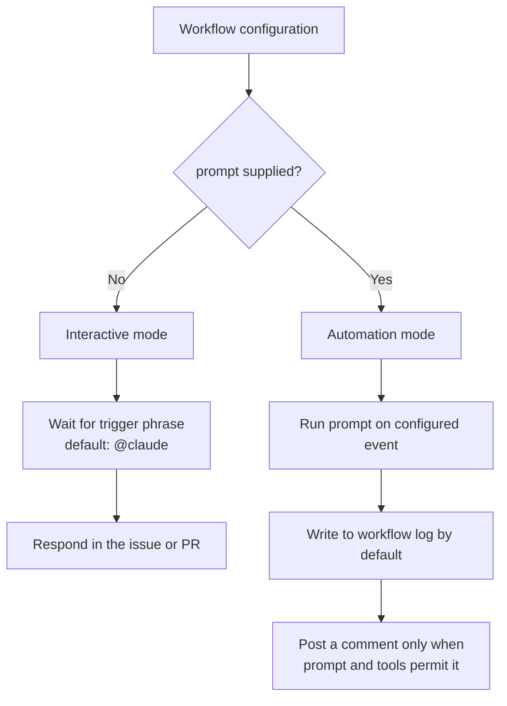
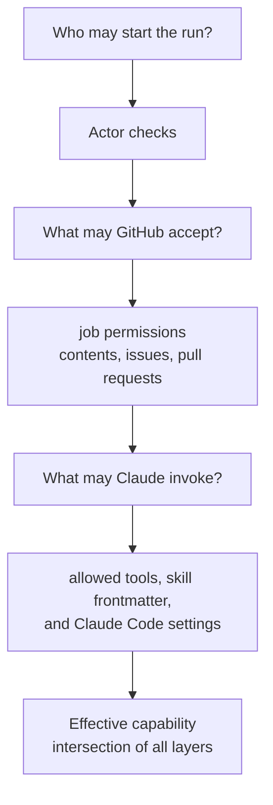
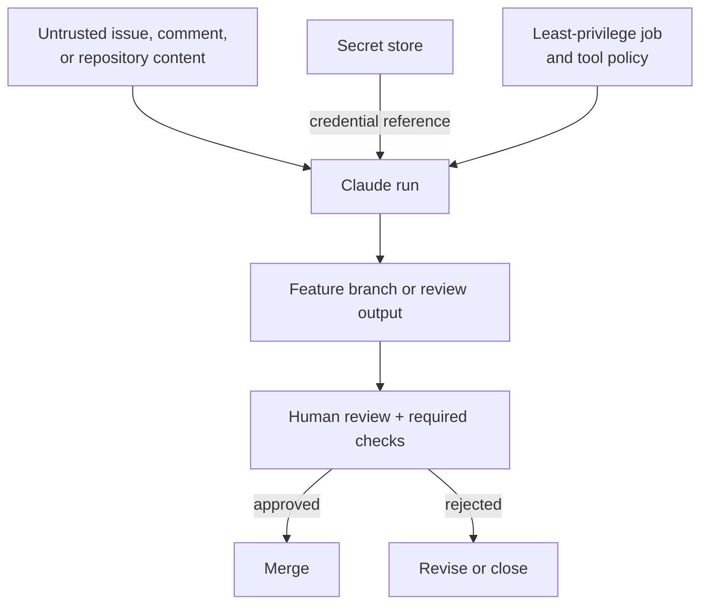

# Claude Code GitHub Actions

> Claude Code GitHub Actions is a constrained agent inside a GitHub Actions job: an event starts it, identity checks decide whether it may run, and GitHub plus Claude tool permissions limit what it may do.

This article answers four practical questions:

1. How does a GitHub event become a Claude result?
2. When does the Action use interactive or automation mode?
3. Which permission layers determine its effective capability?
4. Where should human review and operational limits remain?

## Big picture

The complete path is event → actor verification → mode selection → constrained execution → output:



The prompt controls the task, but it does not grant authority. The actor policy, workflow job permissions, credentials, Claude Code settings, and allowed tools remain separate controls.

## Source

- Official documentation: [Claude Code GitHub Actions](https://code.claude.com/docs/en/github-actions)
- Product: `anthropics/claude-code-action@v1`
- Reviewed: September 15, 2026
- Scope: setup, execution modes, permissions, authentication, common workflows, security, cost controls, and troubleshooting

This article is an original summary of the official documentation. The product is rolling software, so verify current inputs and examples before changing a production workflow.

## Where it fits

The Action is the workflow-file integration. It differs from automatic Claude Code Review, browser or mobile sessions, and custom automations built directly with the Claude Agent SDK.

Typical uses include turning an issue into a pull request, fixing a bug requested in a comment, answering implementation questions, reviewing code with a skill, and generating scheduled reports.

## Setup paths

Both setup paths require repository admin access.



### Quick setup

Install and authenticate the GitHub CLI, start Claude Code in the target repository, then run `/install-github-app`. The command works only for repositories hosted on `github.com`. It installs the app, stores either `ANTHROPIC_API_KEY` or `CLAUDE_CODE_OAUTH_TOKEN` as a repository secret, and creates a branch containing the selected workflow files. Review and merge the prepared pull request before using `@claude`.

### Manual setup

Install the Claude GitHub App, add one authentication secret, and copy the official `examples/claude.yml` into `.github/workflows/`. Match the secret to the Action input:

| Authentication | GitHub secret | Action input | Best fit |
| --- | --- | --- | --- |
| Claude API | `ANTHROPIC_API_KEY` | `anthropic_api_key` | API billing and shared organisational automation |
| Claude subscription | `CLAUDE_CODE_OAUTH_TOKEN` | `claude_code_oauth_token` | Pro, Max, Team, or Enterprise subscription owned by the token creator |
| Workload identity federation | No long-lived API credential | Federation IDs plus `id-token: write` | Organisation deployments that can configure a Claude Console service account |
| Cloud provider | Provider-specific OIDC configuration | `use_bedrock`, `use_vertex`, or `use_foundry` | Inference routed through Amazon Bedrock, Google Cloud Agent Platform, or Microsoft Foundry |

For a multi-repository rollout, install the app at organisation level, scope it to the intended repositories, and use an organisation secret or reusable workflow. An individual's OAuth token is a poor shared credential because it remains tied to that person's subscription; use an API key or workload identity federation instead.

## Two execution modes

The presence of `prompt` selects the mode automatically; the old explicit `mode` input is not used in v1.



Interactive requests can come from issue or pull-request comments, pull-request reviews, or the title or body of a newly opened issue. Automation mode supports events such as pull requests and schedules.

Before Claude starts, the Action checks the triggering actor:

1. For authored issue and pull-request events, the actor must have repository write access unless explicitly listed in `allowed_non_write_users` and a custom `github_token` is supplied.
2. Bots are rejected unless listed in `allowed_bots`, reducing the risk of automation loops. Scheduled events are also attributed to an actor, commonly the person who last edited the cron schedule.

## Permission and trust model

Three layers determine what a run can actually do:



- GitHub workflow `permissions` constrain the job token.
- `--allowedTools` in `claude_args`, `permissions.allow` in `settings`, or a skill's `allowed-tools` frontmatter governs Claude's tool access.
- A plain-text automation prompt has no shell or GitHub API tools until the workflow grants them.
- Repository skills require `actions/checkout` so `.claude/skills/` exists on the runner. Plugin skills must be installed through `plugin_marketplaces` and `plugins` before invocation.

The official Claude GitHub App serves several Claude features, so its installation permission set is broader than this Action alone needs. The Action relies on read/write access to Contents, Issues, and Pull requests. Organisations that cannot accept the official app's full permission set can create a custom GitHub App limited to those areas, but that custom app does not replace the official app for Claude Code Review or web auto-fix.

## A minimal interactive workflow

The essential shape is:

```yaml
name: Claude Code
on:
  issue_comment:
    types: [created]
  pull_request_review_comment:
    types: [created]

jobs:
  claude:
    if: contains(github.event.comment.body, '@claude')
    runs-on: ubuntu-latest
    permissions:
      contents: write
      pull-requests: write
      issues: write
      id-token: write
      actions: read
    steps:
      - uses: actions/checkout@v6
        with:
          fetch-depth: 1
      - uses: anthropics/claude-code-action@v1
        with:
          anthropic_api_key: ${{ secrets.ANTHROPIC_API_KEY }}
```

`id-token: write` supports the Action's default GitHub App authentication. `actions: read` lets Claude inspect CI results. The job-level `if` avoids starting a runner for irrelevant comments; the Action still performs its own trigger check.

## Operational guidance

### Security

- Keep credentials in GitHub Secrets and never commit them.
- Grant only the workflow permissions and Claude tools required by the task.
- Treat issue text, comments, and changed repository content as untrusted input.
- Require human review and branch protection before merging generated changes.
- Pin third-party actions according to the organisation's supply-chain policy.
- Remember that deleting a GitHub secret does not revoke the underlying credential; revoke the API key or token at its issuer as well.



### Cost and reliability

Each run consumes GitHub Actions minutes and either API tokens or Claude subscription usage. Use specific requests, issue templates, a concise `CLAUDE.md`, `--max-turns`, workflow timeouts, and GitHub concurrency controls to bound work and reduce waste.

### Common failures

| Symptom | Check |
| --- | --- |
| No response to `@claude` | App installation, enabled workflows, authentication secret, exact trigger phrase, and actor write access |
| CI does not run after Claude pushes | Do not force the default `GITHUB_TOKEN` if app authentication is intended; ensure CI listens to the resulting `push` or `pull_request` event |
| Authentication fails | Validate the API key or OAuth token locally; for cloud providers, verify the provider-specific OIDC setup |
| Scheduled run fails actor checks | Ensure the user attributed to the schedule is human, or explicitly allow the bot actor |
| Fork PR cannot access a secret | GitHub withholds secrets from public-repository fork workflows; run trusted review workflows only where credentials are available safely |

## Migration notes for beta users

To migrate from `anthropics/claude-code-action@beta` to `@v1`:

1. Change the Action reference to `@v1`.
2. Remove `mode`; v1 detects the mode from `prompt`.
3. Rename `direct_prompt` to `prompt`.
4. Move options such as model and maximum turns into `claude_args`; convert `custom_instructions` to `--append-system-prompt`.

## Safety comes from the whole control chain

Claude Code GitHub Actions is best understood as a constrained agent inside an ordinary CI job. Safe adoption depends less on the prompt alone than on the complete control chain: trusted trigger, minimal GitHub permissions, explicit Claude tools, protected credentials, bounded runtime, and human review before merge.

## Further reading

- [Official Claude Code GitHub Actions documentation](https://code.claude.com/docs/en/github-actions)
- [Claude Code Action repository](https://github.com/anthropics/claude-code-action)
- [GitHub Actions secrets](https://docs.github.com/en/actions/security-for-github-actions/security-guides/using-secrets-in-github-actions)
