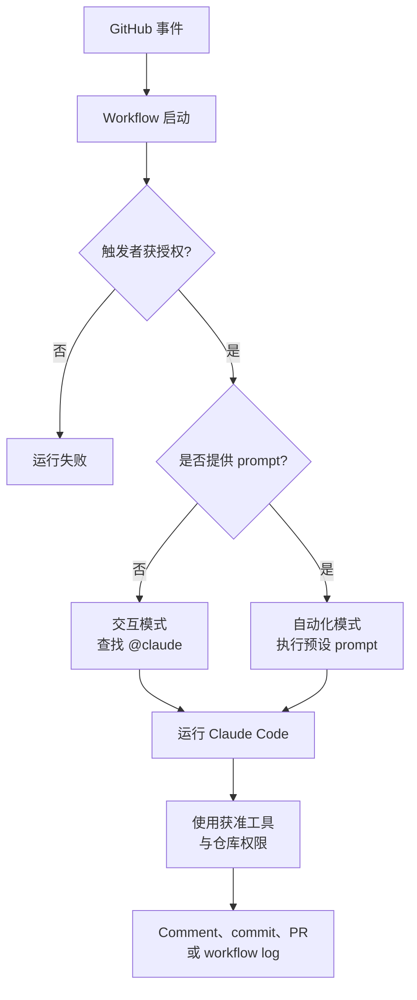
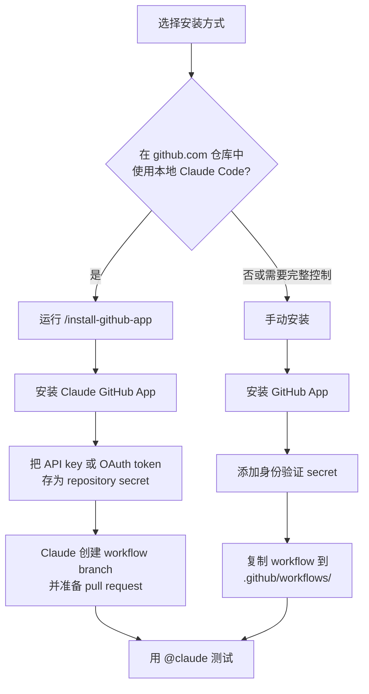
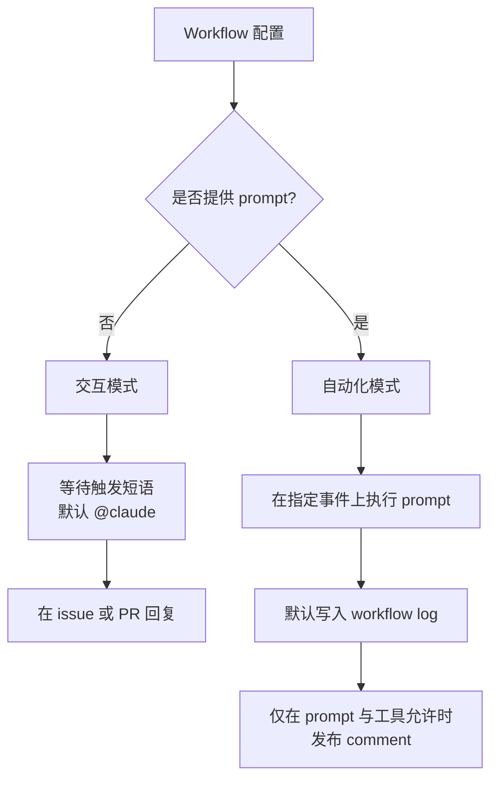
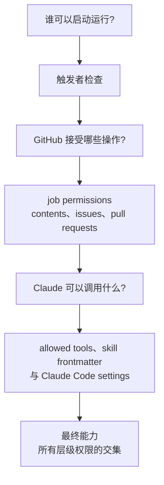
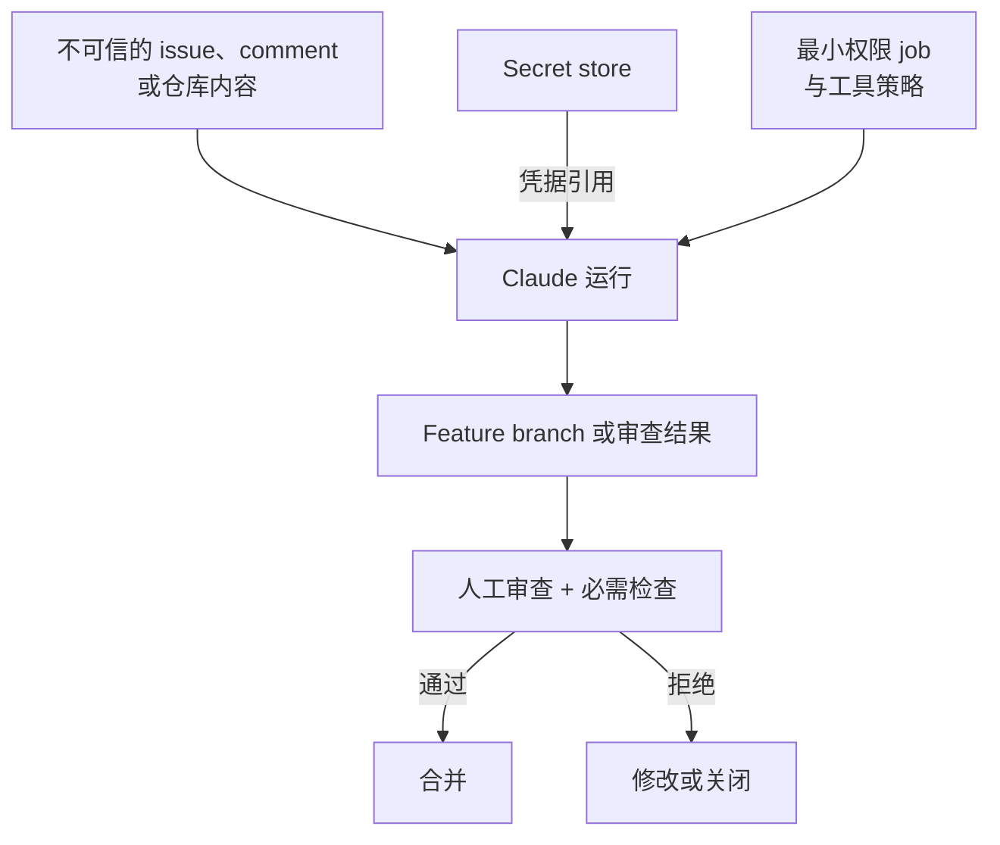

# Claude Code GitHub Actions

[English](README.md) | 简体中文

## 心智模型

> Claude Code GitHub Actions 是运行在 GitHub Actions job 内、受到多层约束的 agent：事件负责启动，身份检查决定能否运行，GitHub 与 Claude 工具权限共同限制它能做什么。

本文主要回答四个问题：

1. GitHub 事件如何一步步变成 Claude 的输出？
2. Action 何时进入交互模式或自动化模式？
3. 哪几层权限共同决定最终能力？
4. 哪些位置仍应保留人工审查与运行限制？

## 全景图

完整链路是：事件 → 触发者验证 → 模式选择 → 受约束执行 → 输出。



Prompt 决定任务内容，但不会自动授予权限。Actor policy、workflow job permissions、凭据、Claude Code settings 与 allowed tools 仍是彼此独立的控制层。

## 来源

- 官方文档：[Claude Code GitHub Actions](https://code.claude.com/docs/en/github-actions)
- 产品版本：`anthropics/claude-code-action@v1`
- 复查日期：2026-09-15
- 范围：安装、运行模式、权限、身份验证、常见工作流、安全、成本控制与故障排查

本文是对官方文档的原创整理。该产品持续更新，修改生产工作流前应再次核对当前参数和示例。

## 它在产品体系中的位置

这里介绍的是通过 workflow 文件配置的 Action 集成。它不同于无需维护 workflow 的自动 Claude Code Review、浏览器或手机上的 Claude Code session，以及直接用 Claude Agent SDK 构建的自定义自动化。

常见用途包括：把 issue 转为 pull request、按 comment 修复 bug、回答实现问题、通过 skill 审查代码，以及定时生成报告。

## 两种安装路径

两种方式都要求 repository admin 权限。



### 快速安装

先安装 GitHub CLI 并完成身份验证，在目标仓库中启动 Claude Code，然后运行 `/install-github-app`。此命令只支持托管在 `github.com` 的仓库。它会安装 app，把 `ANTHROPIC_API_KEY` 或 `CLAUDE_CODE_OAUTH_TOKEN` 存为 repository secret，并创建包含所选 workflow 的 branch。审查并合并准备好的 pull request 后，才能使用 `@claude`。

### 手动安装

安装 Claude GitHub App，添加一种身份验证 secret，再把官方 `examples/claude.yml` 复制到 `.github/workflows/`。Secret 与 Action input 必须对应：

| 身份验证 | GitHub secret | Action input | 适用场景 |
| --- | --- | --- | --- |
| Claude API | `ANTHROPIC_API_KEY` | `anthropic_api_key` | API 计费与组织共享自动化 |
| Claude subscription | `CLAUDE_CODE_OAUTH_TOKEN` | `claude_code_oauth_token` | Token 创建者拥有的 Pro、Max、Team 或 Enterprise subscription |
| Workload identity federation | 不保存长期 API 凭据 | Federation IDs 加 `id-token: write` | 能配置 Claude Console service account 的组织部署 |
| Cloud provider | Provider 专属 OIDC 配置 | `use_bedrock`、`use_vertex` 或 `use_foundry` | 通过 Amazon Bedrock、Google Cloud Agent Platform 或 Microsoft Foundry 推理 |

部署到多个仓库时，可在 organization 层安装 app 并限定目标仓库，再使用 organization secret 或 reusable workflow。个人 OAuth token 仍绑定创建者的 subscription，不适合作为共享凭据；应改用 API key 或 workload identity federation。

## 两种运行模式

是否存在 `prompt` 会自动决定运行模式；v1 不再使用旧的显式 `mode` input。



交互请求可来自 issue 或 pull-request comment、pull-request review，以及新 issue 的标题或正文。自动化模式支持 pull request、schedule 等事件。

Claude 启动前，Action 会检查触发者：

1. 对有人发起的 issue 与 pull-request 事件，触发者必须有仓库 write 权限；例外情况需要在 `allowed_non_write_users` 中明确列出，并提供自定义 `github_token`。
2. Bot 默认会被拒绝，避免自动化互相触发形成循环；`allowed_bots` 可显式放行。Schedule 也会归属于某个 actor，通常是最后修改 cron 配置的人。

## 权限与信任模型

一次运行最终能做什么，由三层控制共同决定：



- GitHub workflow 的 `permissions` 限制 job token。
- `claude_args` 中的 `--allowedTools`、`settings` 中的 `permissions.allow`，或 skill frontmatter 的 `allowed-tools` 控制 Claude 的工具访问。
- 普通文本 automation prompt 默认没有 shell 或 GitHub API 工具，必须由 workflow 主动授予。
- 仓库内 skill 需要先执行 `actions/checkout`，runner 才能读到 `.claude/skills/`。Plugin skill 则需先通过 `plugin_marketplaces` 与 `plugins` 安装。

官方 Claude GitHub App 同时服务多个 Claude 功能，所以安装时申请的权限多于这个 Action 单独所需的权限。Action 本身依赖 Contents、Issues 与 Pull requests 的读写权限。若组织无法接受官方 app 的完整权限集，可以创建只开放这三类权限的 custom GitHub App；但它不能替代 Claude Code Review 或 web auto-fix 所需的官方 app。

## 最小交互式 Workflow

核心结构如下：

```yaml
name: Claude Code
on:
  issue_comment:
    types: [created]
  pull_request_review_comment:
    types: [created]

jobs:
  claude:
    if: contains(github.event.comment.body, '@claude')
    runs-on: ubuntu-latest
    permissions:
      contents: write
      pull-requests: write
      issues: write
      id-token: write
      actions: read
    steps:
      - uses: actions/checkout@v6
        with:
          fetch-depth: 1
      - uses: anthropics/claude-code-action@v1
        with:
          anthropic_api_key: ${{ secrets.ANTHROPIC_API_KEY }}
```

`id-token: write` 支持 Action 默认的 GitHub App 身份验证；`actions: read` 让 Claude 能读取 CI 结果。Job 层的 `if` 避免无关 comment 启动 runner，Action 内部仍会自行检查触发短语。

## 运维建议

### 安全

- 凭据只放在 GitHub Secrets，绝不提交进仓库。
- 只授予任务必需的 workflow permissions 与 Claude tools。
- 把 issue 文本、comment 和变更后的仓库内容都当作不可信输入。
- 生成的改动合并前保留人工审查与 branch protection。
- 按组织的供应链策略固定第三方 Action 版本。
- 删除 GitHub secret 不等于吊销底层凭据；还要到签发方撤销 API key 或 token。



### 成本与可靠性

每次运行会消耗 GitHub Actions minutes，以及 API tokens 或 Claude subscription 用量。可通过具体的请求、issue template、精简的 `CLAUDE.md`、`--max-turns`、workflow timeout 与 GitHub concurrency controls 限制工作量和浪费。

### 常见故障

| 现象 | 检查项 |
| --- | --- |
| `@claude` 没有回应 | App 是否安装、workflow 是否启用、身份验证 secret、完整触发短语，以及触发者是否有 write 权限 |
| Claude push 后 CI 没运行 | 若期望使用 app 身份，不要强制传默认 `GITHUB_TOKEN`；确认 CI 监听相应 `push` 或 `pull_request` event |
| 身份验证失败 | 在本地验证 API key 或 OAuth token；使用 cloud provider 时检查专属 OIDC 配置 |
| 定时任务未通过 actor 检查 | 确认 schedule 归属用户是 human，或显式允许相应 bot actor |
| Fork PR 读不到 secret | GitHub 不向 public repository 的 fork workflow 提供 secret；只在能安全取得凭据的可信上下文运行审查 |

## Beta 版本迁移提示

从 `anthropics/claude-code-action@beta` 迁移到 `@v1`：

1. 把 Action reference 改为 `@v1`。
2. 删除 `mode`；v1 根据 `prompt` 自动判断模式。
3. 把 `direct_prompt` 改名为 `prompt`。
4. 把 model、最大轮数等选项移入 `claude_args`；将 `custom_instructions` 转为 `--append-system-prompt`。

## 核心结论

理解 Claude Code GitHub Actions 最准确的方式，是把它看成运行在普通 CI job 中、受到多层约束的 agent。安全采用的关键不只是 prompt，而是完整控制链：可信触发者、最小 GitHub 权限、明确的 Claude 工具、受保护的凭据、受限的运行时长，以及合并前的人工审查。

## 延伸阅读

- [Claude Code GitHub Actions 官方文档](https://code.claude.com/docs/en/github-actions)
- [Claude Code Action repository](https://github.com/anthropics/claude-code-action)
- [GitHub Actions secrets](https://docs.github.com/en/actions/security-for-github-actions/security-guides/using-secrets-in-github-actions)
