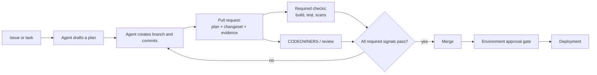

# GitHub Certified: Agentic AI Developer — Study Notes

Chinese version: [README_ZH.md](README_ZH.md)

This is a study guide for GitHub's **GitHub Certified: Agentic AI Developer** exam (exam code GH-600) and its companion Microsoft Learn course, *Developing in Agentic AI Systems* (course GH-600T00). It is an original summary for exam prep, not a transcript, and not a replacement for the official course or exam study guide.

## Mental model

> The exam tests one recurring idea in six disguises: an agent should be able to **propose** work — a plan, a branch, a pull request — but GitHub's own controls (required checks, CODEOWNERS, environments, rulesets) decide whether that work is **accepted**. Every domain is really asking "where does this control point sit, and who enforces it?"



The agent never gets to skip a step by being confident; every arrow into `M` is a GitHub-enforced gate, not an instruction the agent is trusted to follow on its own.

## Source coverage

| Source | What it covers | Coverage status |
| --- | --- | --- |
| [GitHub Certified: Agentic AI Developer](https://learn.github.com/certification/AGENTIC) | Certification landing page | Page is a JavaScript-rendered shell with no static content; details below come from the mirrored [Microsoft Learn credential page](https://learn.microsoft.com/en-us/credentials/certifications/agentic-ai-developer/), which GitHub co-publishes the exam through |
| [Course GH-600T00: Developing in Agentic AI Systems](https://learn.microsoft.com/en-us/training/courses/gh-600t00) | Course overview, audience, prerequisites, and the two learning paths that make up the syllabus | Overview and full module/unit list read |
| [Designing Agent Architecture and SDLC Integration](https://learn.microsoft.com/en-us/training/modules/design-agent-architecture-integration/1-introduction) | One module (module 2 of 6) | Read in full, all 9 units — the deep dive below follows it directly |

The other five modules are summarized from their published unit titles and the course/exam pages, without claiming unit-level completeness — treat the deep-dive section as the one part of this note backed by a full read.

## Exam at a glance

- **Exam:** GH-600, provided by Microsoft, maintained by GitHub; proctored, 120 minutes, English only, scheduled through Pearson VUE.
- **Level:** Intermediate. Aimed at people who operate, integrate, supervise, and govern AI agents inside production SDLC workflows, using GitHub as the system of record and control plane.
- **Prerequisites (recommended, not enforced):** a GitHub account; basic AI fundamentals; basic Git/GitHub (repositories, branches, pull requests); general CI/CD knowledge; hands-on experience with GitHub Copilot, MCP servers, and agent customization (custom instructions, custom agents, tools, Copilot setup steps).
- **Retakes:** 24 hours after a first failed attempt; the wait grows for later retakes.

### Exam domains

| Domain | Weight |
| --- | --- |
| 1. Prepare agent architecture and SDLC processes | 15–20% |
| 2. Implement tool use and environment interaction | 20–25% |
| 3. Manage memory, state, and execution | 10–15% |
| 4. Perform evaluation, error analysis, and tuning | 15–20% |
| 5. Orchestrate multi-agent coordination | 15–20% |
| 6. Implement guardrails and accountability | 10–15% |

## Course path

GH-600T00 is delivered as two Microsoft Learn learning paths, six modules total. Domains 1 and 6 each span more than one module — architecture and governance show up early and late in the course, not just once.

**Part 1 — architecture and tooling**

1. **Foundations of Agentic AI in GitHub** — agentic AI in the SDLC, the plan/act/evaluate lifecycle, GitHub as the system of record, responsibilities and anti-patterns, the contributor model applied to agent-generated work.
2. **Designing Agent Architecture and SDLC Integration** — covered in depth below.
3. **Tooling, MCP, and Agent Execution Environments** — GitHub APIs and workflows as agent tools, MCP servers/registries/allow-lists, execution context boundaries, execution limits and protections.

**Part 2 — coordination, memory, and governance**

4. **Multi-Agent Systems and Orchestration** — multi-agent responsibilities, orchestration via GitHub workflows, execution isolation/permissions/concurrency, conflict resolution and arbitration, observability, scale and failure recovery.
5. **Memory, State, and Evaluation** — agent memory strategies, state and context drift, memory/state continuity, evaluation signals and quality gates, diagnosing agent failures and improving behavior.
6. **Governance, Guardrails, and Operations** — risk-based autonomy, enforcing governance with GitHub controls, human-in-the-loop workflow design, controlling agent capabilities, making actions observable/traceable/auditable, sustaining governance operationally.

## Deep dive: Designing Agent Architecture and SDLC Integration

This module is the one this note read unit-by-unit. Its throughline: **an agent should be scoped to specific SDLC stages, given a task contract instead of an open-ended goal, and routed entirely through pull requests so that GitHub's own mechanisms — not the agent's judgment — decide what gets accepted.**

### Map responsibilities to SDLC stages

Scoping an agent to the whole SDLC makes its behavior hard to reason about. Most teams scope agents to implementation and validation, where pull requests and workflow runs are natural control points.

| SDLC stage | Typical agent responsibility | Primary GitHub artifact |
| --- | --- | --- |
| Planning | Draft scope, plan steps, define success criteria | Issues, PR descriptions/comments, Agents tab |
| Implementation | Create branch, make changes, open/update PR | Branch, commits, pull request |
| Validation | Run checks, attach artifacts, iterate on failures | Workflow runs, checks, artifacts |
| Deployment | Usually restricted; needs approval for sensitive actions | Environments and deployment approvals |

The design boundary the module keeps repeating: **agents propose, humans and policy accept.**

### Define inputs, outputs, and success criteria as a task contract

An under-specified task lets an agent produce a plausible-looking change that doesn't solve the real problem. Each task should define:

- **Inputs** — issue context, repository scope, explicit constraints (e.g. "no workflow changes without platform review").
- **Outputs** — a pull request containing a structured plan, a bounded changeset, and evidence links.
- **Success criteria** — required checks passing is necessary but not sufficient; criteria should reflect the actual intent ("vulnerability resolved," not just "tests passed"), and can be enforced as a required status check (e.g. a CodeQL job wired into branch protection).

### Separate planning, reasoning, and execution

Mixing planning and execution means reviewers only ever see a final diff, with no chance to validate intent before code exists. The module frames this as a choice between two GitHub-native workflows:

| | Plan-first PR | Plan + execution in one PR |
| --- | --- | --- |
| When the plan is visible | Before any code exists, in its own PR | Alongside initial commits, in the same PR |
| When human validation happens | Before code is written | Before merge (code already exists) |
| Best suited to | High-risk, hard-to-reverse changes (infra, auth, production) | Low/medium-risk, easily reversible changes where iteration speed matters |
| Enforcement mechanism | Same as the other option — required checks, CODEOWNERS, branch protection | Same as the other option |

Both are safe if GitHub protections are configured correctly; the only real variable is *when* code is allowed to exist relative to approval. Planning agents should also be capability-limited to read-only tools, with an explicit, deliberate handoff to an implementation agent once a plan is approved.

### Use pull requests as enforcement, not just collaboration

A pull request is the architectural control point. The module's safe-workflow shape:

```
Agent creates branch → Agent opens PR (with plan) → Required reviews validate approach
→ Required checks run → All checks pass + approvals complete → PR can merge
```

Three concrete mechanisms make this enforceable rather than aspirational:

1. **A PR template** (`.github/pull_request_template.md`) that requires a goal, scope, steps, verifiable success criteria, risks/mitigations, and a rollback plan.
2. **A required status check** (e.g. a "Plan Gate" workflow) that fails the PR if the plan artifact is missing, turning "please include a plan" into a build failure if ignored.
3. **CODEOWNERS**, so changes under `/security/`, `/.github/workflows/`, or `/infra/` automatically route to the right reviewers and can't merge without their sign-off.

### Size autonomy to risk, and build workflows defensively

Different paths warrant different autonomy:

| Task type | Example paths | Autonomy design |
| --- | --- | --- |
| Low | `docs/`, formatting | Auto-merge after required checks (and reviews, if configured) |
| Medium | `src/`, dependency bumps | PR required + checks + at least one review |
| High | `infra/`, `.github/workflows/` | CODEOWNERS + multiple reviews + stricter rulesets |
| Critical | Production deploys, settings, secrets | Environment approvals — the agent can prepare but not execute |

GitHub Actions environments with required reviewers are the mechanism for the "critical" row: a job targeting that environment simply pauses until a human approves it. Workflows should also gate defensively — e.g. `if: github.event_name == 'pull_request'` — so PR-only logic doesn't misfire on `push` or `workflow_dispatch` triggers, and should pass data between jobs as explicit step/job outputs rather than relying on logs.

### Operate agents safely: evidence, tools, secrets, hooks, reliability

- **Observability is a required artifact, not a nice-to-have.** A reviewable task should leave a plan, a PR + commit history, workflow run links, uploaded artifacts (logs/reports), and recorded review outcomes — each traceable to a specific commit and run.
- **Tool and MCP access is a capability boundary.** Prefer allowlists over wildcards; give planning/review agents read-only tools and reserve write/execution tools for implementation agents; treat adding or expanding MCP servers as a reviewable, high-risk-adjacent change, since it directly expands blast radius.
- **Secrets never live in instructions, committed config, or plain workflow YAML.** They're injected at runtime into only the components that need them, scoped by environment — an agent's runtime doesn't automatically inherit repository CI secrets.
- **Hooks enforce policy independent of the model's judgment.** A `.github/hooks/` entry can run pre-tool-use (block an unsafe command before it executes), post-action (audit logging), or on error (trigger escalation) — enforcement that doesn't depend on the agent choosing to comply.
- **Reliability assumes failure.** Bounded retries for transient check failures, escalation to a human after a check fails twice (with what failed, what was tried, and a suggested next step), rollback readiness for high-risk changes, and least-privilege workflow permissions (e.g. `contents: read`, `pull-requests: write` — nothing broader by default).

## My own analysis

The module's content maps onto the exam domains more unevenly than the two-learning-path split suggests: Domain 1 (architecture/SDLC) and Domain 6 (guardrails/accountability) both draw material from this one module's later units (autonomy sizing, hooks, secrets), not just from their "own" modules earlier or later in the course. When studying, I'd treat "PR as enforcement mechanism" and "propose vs. accept" as the two ideas to over-learn — they recur across at least four of the six domains in different clothing (tool gating, environment approval, CODEOWNERS routing, hook-based blocking).

## Study resources

- [GH-600 exam study guide](https://aka.ms/GH600-StudyGuide) — official topic breakdown and update log.
- [Exam sandbox](https://ghcertdemo.starttest.com/) — try the real question UI before test day.
- [Course GH-600T00 on Microsoft Learn](https://learn.microsoft.com/en-us/training/courses/gh-600t00)
- GitHub documentation referenced by the deep-dive module: [pull request templates](https://docs.github.com/en/communities/using-templates-to-encourage-useful-issues-and-pull-requests/creating-a-pull-request-template-for-your-repository), [rulesets](https://docs.github.com/repositories/configuring-branches-and-merges-in-your-repository/managing-rulesets/managing-rulesets-for-a-repository), [environments](https://docs.github.com/en/actions/reference/environments), [GITHUB_TOKEN authentication](https://docs.github.com/en/actions/configuring-and-managing-workflows/authenticating-with-the-github_token), [Actions security hardening](https://docs.github.com/en/actions/security-guides/security-hardening-for-github-actions), [uploading workflow artifacts](https://docs.github.com/en/actions/using-workflows/storing-workflow-data-as-artifacts), [SARIF upload](https://docs.github.com/en/code-security/how-tos/scan-code-for-vulnerabilities/integrate-with-existing-tools/uploading-a-sarif-file-to-github), [secret scanning push protection](https://docs.github.com/code-security/secret-scanning/protecting-pushes-with-secret-scanning), [hooks with Copilot agents](https://docs.github.com/en/copilot/how-tos/use-copilot-agents/cloud-agent/use-hooks), [tracking Copilot sessions](https://docs.github.com/en/copilot/how-tos/use-copilot-agents/cloud-agent/track-copilot-sessions).
