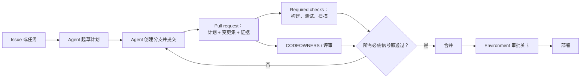

# GitHub Certified: Agentic AI Developer 认证学习笔记

English version: [README.md](README.md)

本篇是 GitHub 的 **GitHub Certified: Agentic AI Developer** 认证考试（考试代号 GH-600）及其配套 Microsoft Learn 课程《Developing in Agentic AI Systems》（课程代号 GH-600T00）的备考学习笔记。这是原创总结，用于备考参考，不是逐字转录，也不能替代官方课程或官方考试学习指南。

## 心智模型

> 这场考试其实反复考同一件事的六种变体：agent 可以**提出**变更——一份计划、一个分支、一个 pull request——但真正决定这份变更是否被**采纳**的，是 GitHub 自身的控制机制（required checks、CODEOWNERS、environments、rulesets）。每个知识域本质上都在问："这个控制点在哪里，由谁来强制执行？"



agent 不能凭"自信"跳过任何一步：流入 `M` 的每一条箭头都是 GitHub 强制执行的关卡，而不是靠 agent 自觉遵守的指令。

## 来源覆盖情况

| 来源 | 覆盖内容 | 阅读状态 |
| --- | --- | --- |
| [GitHub Certified: Agentic AI Developer](https://learn.github.com/certification/AGENTIC) | 认证落地页 | 该页面是纯 JavaScript 渲染的空壳，静态内容为空；以下细节来自 GitHub 与 Microsoft 共同发布考试所用的 [Microsoft Learn 认证页面](https://learn.microsoft.com/en-us/credentials/certifications/agentic-ai-developer/) |
| [课程 GH-600T00：Developing in Agentic AI Systems](https://learn.microsoft.com/en-us/training/courses/gh-600t00) | 课程概览、受众、前置条件，以及构成大纲的两条学习路径 | 已完整阅读概览及全部模块/单元列表 |
| [Designing Agent Architecture and SDLC Integration](https://learn.microsoft.com/en-us/training/modules/design-agent-architecture-integration/1-introduction) | 六个模块中的第 2 个模块 | 全部 9 个单元已完整阅读——下方的深度解析部分直接基于此模块展开 |

其余五个模块的内容基于其公开的单元标题以及课程/考试页面进行概括，不主张已达到单元级别的完整阅读——只有下方"深度解析"部分是基于完整阅读撰写的。

## 考试速览

- **考试：** GH-600，由 Microsoft 提供，GitHub 负责维护；监考制，120 分钟，仅提供英文，通过 Pearson VUE 预约。
- **难度级别：** 中级。面向在生产级 SDLC 工作流中运营、集成、监督和治理 AI agent 的人员，以 GitHub 作为系统记录与控制平面。
- **建议前置条件（非强制）：** 拥有 GitHub 账号；具备 AI 基础知识；熟悉 Git/GitHub 基本操作（仓库、分支、pull request）；了解 CI/CD 基本概念；具备 GitHub Copilot、MCP servers 及 agent 定制（自定义指令、自定义 agent、工具、Copilot 配置步骤）的实践经验。
- **重考规则：** 首次未通过后 24 小时可重考；后续重考的等待时间会变长。

### 考试知识域

| 知识域 | 权重 |
| --- | --- |
| 1. 准备 agent 架构与 SDLC 流程 | 15–20% |
| 2. 实现工具使用与环境交互 | 20–25% |
| 3. 管理内存、状态与执行 | 10–15% |
| 4. 执行评估、错误分析与调优 | 15–20% |
| 5. 编排多 agent 协作 | 15–20% |
| 6. 实施护栏与问责机制 | 10–15% |

## 课程路径

GH-600T00 通过两条 Microsoft Learn 学习路径交付，共六个模块。知识域 1 与知识域 6 各自跨越了不止一个模块——架构与治理在课程的前段和后段都会出现，而不是只讲一次。

**第一部分——架构与工具**

1. **Foundations of Agentic AI in GitHub（GitHub 中 agentic AI 基础）**——SDLC 中的 agentic AI、"计划 / 执行 / 评估"生命周期、GitHub 作为系统记录、职责与反模式、将贡献者模型应用于 agent 生成的工作。
2. **Designing Agent Architecture and SDLC Integration（设计 agent 架构与 SDLC 集成）**——下方有深度解析。
3. **Tooling, MCP, and Agent Execution Environments（工具、MCP 与 agent 执行环境）**——将 GitHub API 与工作流作为 agent 工具、MCP servers/注册表/许可清单、执行上下文边界、执行限制与保护机制。

**第二部分——协作、内存与治理**

4. **Multi-Agent Systems and Orchestration（多 agent 系统与编排）**——多 agent 职责划分、通过 GitHub 工作流编排、执行隔离/权限/并发、冲突解决与仲裁、可观测性、规模化与故障恢复。
5. **Memory, State, and Evaluation（内存、状态与评估）**——agent 内存策略、状态与上下文漂移、内存/状态连续性、评估信号与质量门禁、诊断 agent 失败并改进行为。
6. **Governance, Guardrails, and Operations（治理、护栏与运营）**——基于风险的自主性、用 GitHub 控制机制强化治理、人机协同工作流设计、控制 agent 能力、让操作可观测/可追溯/可审计、持续维持治理的运营化。

## 深度解析：Designing Agent Architecture and SDLC Integration

这是本笔记逐单元完整阅读的模块。其贯穿主线是：**agent 应被限定在特定的 SDLC 阶段内，拿到的是任务契约而非开放式目标，并且全程通过 pull request 路由——最终决定变更是否被采纳的是 GitHub 自身的机制，而不是 agent 的判断。**

### 将职责映射到 SDLC 各阶段

如果把 agent 的作用范围设定为整个 SDLC，其行为将很难被推理和审计。大多数团队会把 agent 限定在实现与验证阶段，因为 pull request 与工作流运行天然就是控制点。

| SDLC 阶段 | agent 的典型职责 | 主要 GitHub 产物 |
| --- | --- | --- |
| 规划 | 起草范围、规划步骤、定义成功标准 | Issues、PR 描述/评论、Agents 标签页 |
| 实现 | 创建分支、进行修改、打开/更新 PR | 分支、提交、pull request |
| 验证 | 运行检查、附加产物、根据失败迭代 | 工作流运行、检查、产物 |
| 部署 | 通常受限；敏感操作需要审批 | Environments 与部署审批 |

该模块反复强调的设计边界是：**agent 负责提出，人与策略负责采纳。**

### 将输入、输出与成功标准定义为任务契约

规格不明确的任务会让 agent 产出"看起来合理"却没解决真正问题的变更。每个任务都应定义：

- **输入**——issue 上下文、仓库范围、明确的约束（例如"未经平台评审不得修改工作流"）。
- **输出**——包含结构化计划、有边界的变更集以及证据链接的 pull request。
- **成功标准**——required checks 通过是必要条件，但不是充分条件；标准应反映真正的意图（例如"漏洞已修复"，而不只是"测试已通过"），并且可以作为 required status check 强制执行（例如把 CodeQL 任务接入分支保护）。

### 分离计划、推理与执行

如果把计划与执行混在一起，评审者看到的只有最终的 diff，没有机会在代码产生之前先验证意图。该模块把这个问题框定为两种 GitHub 原生工作流之间的选择：

| | 计划优先的 PR | 计划与执行合一的 PR |
| --- | --- | --- |
| 计划何时可见 | 代码产生之前，单独成一个 PR | 与初始提交一起出现在同一个 PR 中 |
| 人工验证发生的时机 | 在代码写出之前 | 在合并之前（代码已经存在） |
| 最适用场景 | 高风险、难以回滚的变更（基础设施、认证、生产环境） | 低/中风险、易于回滚、更看重迭代速度的变更 |
| 强制机制 | 与另一种方式相同——required checks、CODEOWNERS、分支保护 | 与另一种方式相同 |

只要 GitHub 的保护机制配置正确，两种方式都是安全的；真正的变量只是"代码相对于审批何时可以存在"。规划型 agent 也应当被限定为只读工具，并在计划获批后，通过明确、刻意的交接把工作移交给实现型 agent。

### 把 pull request 当作强制机制,而不只是协作工具

pull request 是架构层面的控制点。该模块给出的安全工作流形态是：

```
Agent 创建分支 → Agent 打开 PR（附带计划） → Required reviews 验证方案
→ Required checks 运行 → 所有检查通过 + 审批完成 → PR 可以合并
```

有三种具体机制能让这一点真正被强制执行,而不只是停留在口头约定：

1. **PR 模板**（`.github/pull_request_template.md`），要求填写目标、范围、步骤、可验证的成功标准、风险/缓解措施与回滚方案。
2. **required status check**（例如一个 "Plan Gate" 工作流），如果计划产物缺失就让 PR 检查失败，把"请附上计划"这句话变成一次真正的构建失败。
3. **CODEOWNERS**，让 `/security/`、`/.github/workflows/`、`/infra/` 下的变更自动路由给对应评审者，未经其批准无法合并。

### 让自主程度与风险匹配,并防御性地构建工作流

不同路径应对应不同的自主程度：

| 任务类型 | 示例路径 | 自主性设计 |
| --- | --- | --- |
| 低风险 | `docs/`、格式化 | required checks（及配置的评审，如有）通过后可自动合并 |
| 中风险 | `src/`、依赖升级 | 需要 PR + 检查 + 至少一次评审 |
| 高风险 | `infra/`、`.github/workflows/` | CODEOWNERS + 多人评审 + 更严格的 rulesets |
| 关键风险 | 生产部署、配置、密钥 | Environment 审批——agent 只能准备,不能执行 |

针对"关键风险"这一档，机制就是配置了 required reviewers 的 GitHub Actions environments：指向该 environment 的 job 会暂停，直到有人批准。工作流也应做防御性门控——例如 `if: github.event_name == 'pull_request'`——避免仅适用于 PR 的逻辑在 `push` 或 `workflow_dispatch` 触发时误运行；跨 job 传递数据也应使用显式的 step/job output,而不是依赖日志。

### 安全地运营 agent：证据、工具、密钥、hooks、可靠性

- **可观测性是必需产物,而不是锦上添花。** 一个可评审的任务应留下：计划、PR + 提交历史、工作流运行链接、上传的产物（日志/报告），以及记录下来的评审结果——每一项都能追溯到具体的提交与运行。
- **工具与 MCP 的访问权限是能力边界。** 优先使用许可清单而非通配符；规划/评审型 agent 只给只读工具，写入/执行类工具留给实现型 agent；新增或扩大 MCP server 的接入范围应被当作一次可审查、风险相当高的变更，因为它直接扩大了影响半径。
- **密钥绝不能出现在指令文件、已提交的配置文件或明文工作流 YAML 中。** 应在运行时注入,且只注入真正需要它的组件,并按 environment 限定作用范围——agent 的运行环境不会自动继承仓库的 CI 密钥。
- **hooks 独立于模型的判断来强制执行策略。** `.github/hooks/` 下的一条 hook 可以在工具调用前运行（在不安全命令执行前将其拦截）、在操作后运行（审计日志），或在出错时运行（触发升级）——这种强制执行不依赖 agent 是否"愿意"遵守。
- **可靠性建立在"失败一定会发生"这一假设之上。** 对瞬时性检查失败设置有限次数的重试；同一个检查连续失败两次后升级给人工处理（说明失败了什么、尝试过什么、建议的下一步是什么）；对高风险变更保持回滚就绪；工作流权限默认最小化（例如仅 `contents: read`、`pull-requests: write`，不默认给更宽的权限）。

## 我的分析

该模块的内容与考试知识域的对应关系,并不像"两条学习路径"这种划分方式看起来那么整齐：知识域 1（架构/SDLC）与知识域 6（护栏/问责）都从这一个模块的后半部分单元（自主性分级、hooks、密钥管理）中取材，而不只是来自课程前段或后段"专属"于它们的模块。备考时，我会把"PR 作为强制机制"和"提出 vs. 采纳"当作需要反复内化的两个核心思想——它们以不同的形式（工具门控、environment 审批、CODEOWNERS 路由、基于 hook 的拦截）至少在六个知识域中的四个里反复出现。

## 备考资源

- [GH-600 考试学习指南](https://aka.ms/GH600-StudyGuide)——官方知识点分解与更新记录。
- [考试沙盒](https://ghcertdemo.starttest.com/)——正式考试前体验真实题型界面。
- [Microsoft Learn 上的 GH-600T00 课程](https://learn.microsoft.com/en-us/training/courses/gh-600t00)
- 深度解析模块引用的 GitHub 文档：[pull request 模板](https://docs.github.com/en/communities/using-templates-to-encourage-useful-issues-and-pull-requests/creating-a-pull-request-template-for-your-repository)、[rulesets](https://docs.github.com/repositories/configuring-branches-and-merges-in-your-repository/managing-rulesets/managing-rulesets-for-a-repository)、[environments](https://docs.github.com/en/actions/reference/environments)、[GITHUB_TOKEN 认证](https://docs.github.com/en/actions/configuring-and-managing-workflows/authenticating-with-the-github_token)、[Actions 安全加固](https://docs.github.com/en/actions/security-guides/security-hardening-for-github-actions)、[上传工作流产物](https://docs.github.com/en/actions/using-workflows/storing-workflow-data-as-artifacts)、[上传 SARIF 文件](https://docs.github.com/en/code-security/how-tos/scan-code-for-vulnerabilities/integrate-with-existing-tools/uploading-a-sarif-file-to-github)、[密钥扫描推送保护](https://docs.github.com/code-security/secret-scanning/protecting-pushes-with-secret-scanning)、[Copilot agent 的 hooks 用法](https://docs.github.com/en/copilot/how-tos/use-copilot-agents/cloud-agent/use-hooks)、[追踪 Copilot 会话](https://docs.github.com/en/copilot/how-tos/use-copilot-agents/cloud-agent/track-copilot-sessions)。
