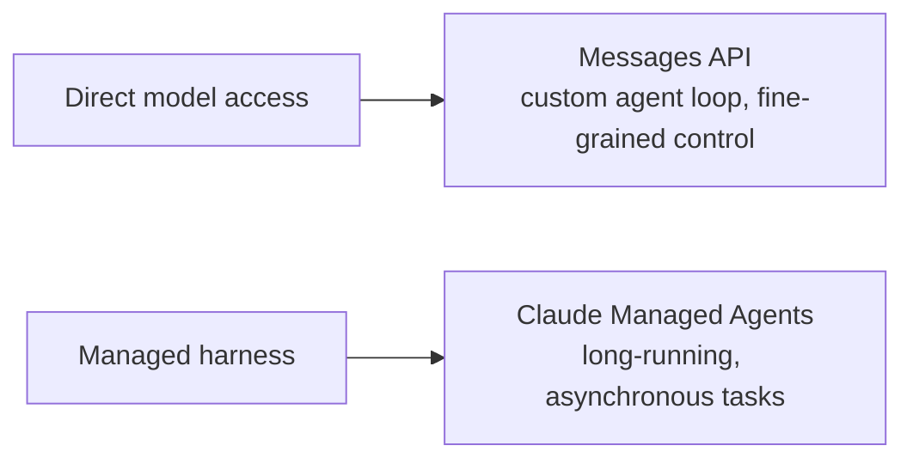
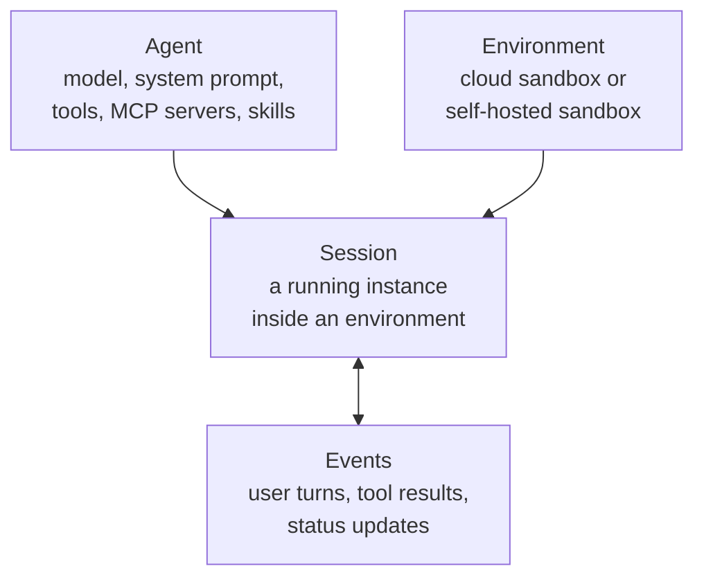
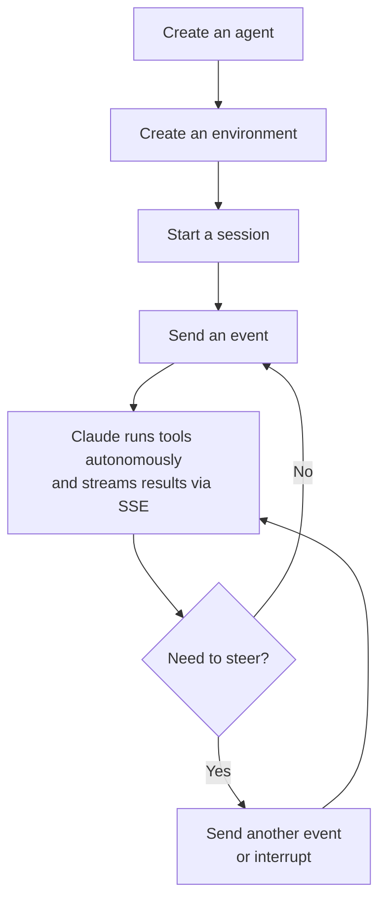

# Claude Managed Agents

> Claude Managed Agents is a hosted agent harness: Anthropic runs the loop, the sandbox, and tool
> execution, and you send it events instead of writing your own agent runtime.

This article answers three practical questions:

1. When should I reach for Managed Agents instead of calling the Messages API directly?
2. What are the four building blocks, and how does a session actually run?
3. What are the current beta limits on tools, access, and data retention?

## Big picture

Both are ways to build with Claude; they trade control for infrastructure. The Messages API means you own the loop, the sandbox, and tool execution. Managed Agents means Anthropic owns those, and you send events into a running session.

## Source

- Official documentation: [Claude Managed Agents overview](https://platform.claude.com/docs/en/managed-agents/overview)
- Status: Beta, requires the `managed-agents-2026-04-01` header on every request
- Reviewed: September 15, 2026

This article is an original summary of the official documentation. The product is in beta and rolling, so verify current inputs and limits before depending on it in production.

## The four building blocks

| Concept | Description |
| --- | --- |
| **Agent** | The model, system prompt, tools, MCP servers, and skills. Created once, referenced by ID across sessions. |
| **Environment** | Where sessions run: an Anthropic-managed cloud sandbox, or a self-hosted sandbox on your own infrastructure. |
| **Session** | A running agent instance within an environment, performing a specific task and generating outputs. |
| **Events** | Messages exchanged between your application and the agent: user turns, tool results, status updates. |

## How a session runs

Event history is persisted server-side and can be fetched in full, so a session survives pauses and resumes cleanly rather than starting over.

## Built-in tools

| Tool | What it does |
| --- | --- |
| Bash | Run shell commands in the sandbox |
| File operations | Read, write, edit, glob, and grep files in the sandbox |
| Web search and fetch | Search the web and retrieve URL content, optionally restricted to an allowlist or blocklist of domains |
| MCP servers | Connect to external tool providers |

## When it fits and when it does not

Reach for Managed Agents when a workload needs:

- **Long-running execution**: minutes or hours across many tool calls.
- **Managed cloud infrastructure**: sandboxes with pre-installed packages and network access, without building your own.
- **Self-hosted execution**: sandboxes on infrastructure you control, for compliance or data-residency needs.
- **Stateful sessions**: a persistent filesystem and conversation history across interactions.
- **Scheduled execution**: recurring runs on a cron schedule through scheduled deployments.

Stay on the Messages API when you need a custom agent loop or fine-grained control over every model call. Managed Agents gives up that control in exchange for the managed harness.

## Beta constraints to plan around

- Every request needs the `managed-agents-2026-04-01` beta header (the SDK sets it automatically).
- Access is enabled by default for API accounts; MCP tunnels and "dreaming" are a more limited research preview requiring separate access.
- Managed Agents is stateful by design (history, sandbox state, and outputs persist server-side), so it is **not currently eligible for Zero Data Retention or HIPAA BAA coverage**.
- You can delete sessions, and separately delete uploaded files, through the API at any time.
- Behavior may still be refined between beta releases.

## Further reading

- [Claude Managed Agents overview (official)](https://platform.claude.com/docs/en/managed-agents/overview)
- [Quickstart](https://platform.claude.com/docs/en/managed-agents/quickstart)
- [Sessions](https://platform.claude.com/docs/en/managed-agents/sessions)
- [Reference — event types, rate limits, CLI flags](https://platform.claude.com/docs/en/managed-agents/reference)
