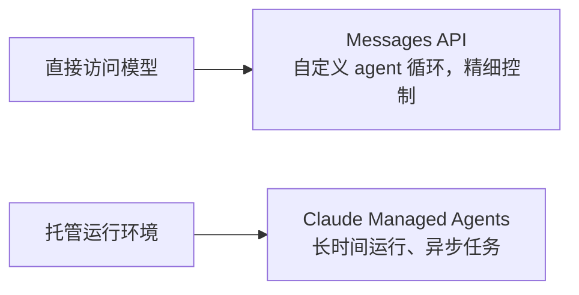
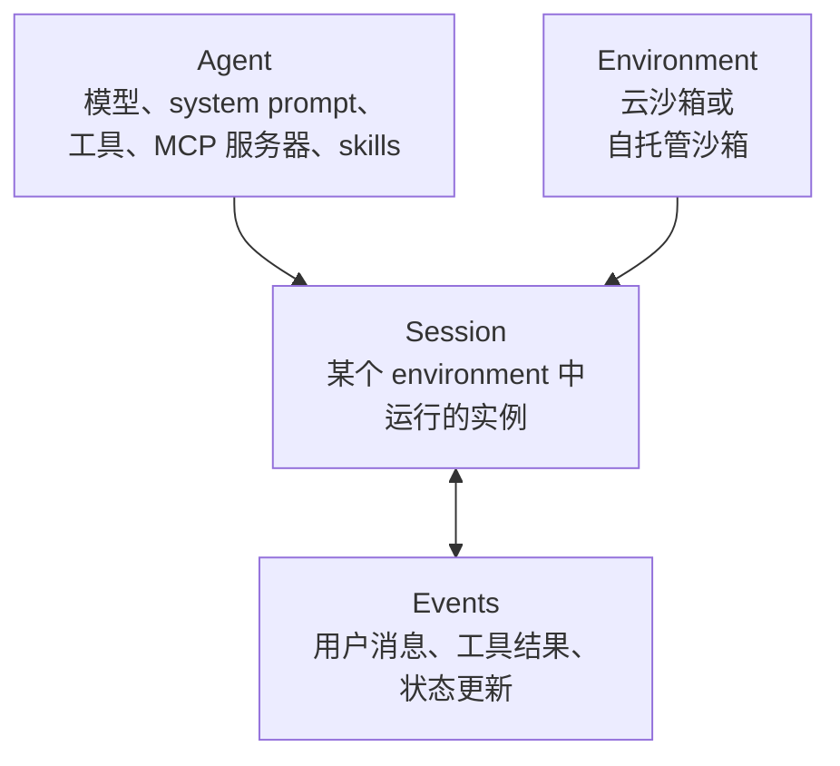
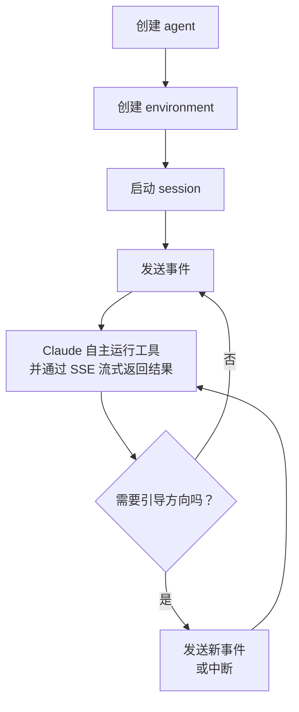

# Claude Managed Agents

[English](README.md) | 简体中文

## 心智模型

> Claude Managed Agents 是一个托管的 agent 运行环境：Anthropic 负责运行循环、沙箱和工具执行，
> 你只需要向其发送事件，而不用自己编写 agent 运行时。

本文回答三个实际问题：

1. 什么时候该用 Managed Agents，而不是直接调用 Messages API？
2. 四个核心构建块是什么？一个 session 具体是如何运行的？
3. 当前 beta 阶段在工具、访问权限和数据留存上有哪些限制？

## 全景图

两者都是构建 Claude 应用的方式，区别在于控制权与基础设施的取舍。Messages API 意味着你自己拥有循环、沙箱和工具执行；Managed Agents 意味着 Anthropic 拥有这些，你只需向正在运行的 session 发送事件。

## 来源

- 官方文档：[Claude Managed Agents overview](https://platform.claude.com/docs/en/managed-agents/overview)
- 状态：Beta —— 每个请求都需要携带 `managed-agents-2026-04-01` 头
- 核对时间：2026 年 9 月 15 日

本文是官方文档的原创总结。该产品处于 beta 阶段且仍在快速迭代，生产环境依赖前请核实最新的输入参数与限制。

## 四个核心构建块

| 概念 | 说明 |
| --- | --- |
| **Agent** | 模型、system prompt、工具、MCP 服务器和 skills 的集合，创建一次后可通过 ID 在多个 session 中复用。 |
| **Environment** | Session 运行的位置：Anthropic 托管的云沙箱，或你自己基础设施上的自托管沙箱。 |
| **Session** | 在某个 environment 中运行的一个 agent 实例，执行特定任务并产生输出。 |
| **Events** | 应用与 agent 之间交换的消息 —— 用户消息、工具结果、状态更新。 |

## Session 是如何运行的

事件历史保存在服务端，可以完整获取，因此 session 在暂停后能够干净地恢复，而不需要从头开始。

## 内置工具

| 工具 | 作用 |
| --- | --- |
| Bash | 在沙箱中运行 shell 命令 |
| 文件操作 | 在沙箱中读取、写入、编辑、glob 和 grep 文件 |
| 网络搜索与抓取 | 搜索网页并获取 URL 内容，可选限制为域名白名单或黑名单 |
| MCP 服务器 | 连接外部工具提供方 |

## 什么时候该用，什么时候不该用

以下场景适合使用 Managed Agents：

- **长时间运行的任务** —— 需要跨越多次工具调用、持续数分钟到数小时。
- **托管云基础设施** —— 需要预装依赖和网络访问的沙箱，且不想自建。
- **自托管执行** —— 出于合规或数据驻留要求，需要在自己控制的基础设施上运行沙箱。
- **有状态的 session** —— 需要跨多次交互保留持久文件系统和对话历史。
- **定时执行** —— 需要通过 scheduled deployments 按 cron 计划重复运行。

如果需要自定义 agent 循环，或者需要对每一次模型调用做精细控制，应继续使用 Messages API —— Managed Agents 用这部分控制权换取了托管运行环境。

## 需要规划的 beta 限制

- 每个请求都必须携带 `managed-agents-2026-04-01` 这个 beta 头（SDK 会自动设置）。
- API 账户默认已启用访问；MCP tunnels 和 "dreaming" 目前是范围更小的研究预览功能，需要单独申请访问权限。
- Managed Agents 在设计上是有状态的 —— 历史记录、沙箱状态和输出都保存在服务端 —— 因此**目前不适用于 Zero Data Retention 或 HIPAA BAA 覆盖范围**。
- 你可以随时通过 API 删除 session，也可以单独删除已上传的文件。
- 产品行为在后续 beta 版本中仍可能调整。

## 延伸阅读

- [Claude Managed Agents overview（官方文档）](https://platform.claude.com/docs/en/managed-agents/overview)
- [Quickstart](https://platform.claude.com/docs/en/managed-agents/quickstart)
- [Sessions](https://platform.claude.com/docs/en/managed-agents/sessions)
- [Reference —— 事件类型、速率限制、CLI 参数](https://platform.claude.com/docs/en/managed-agents/reference)
