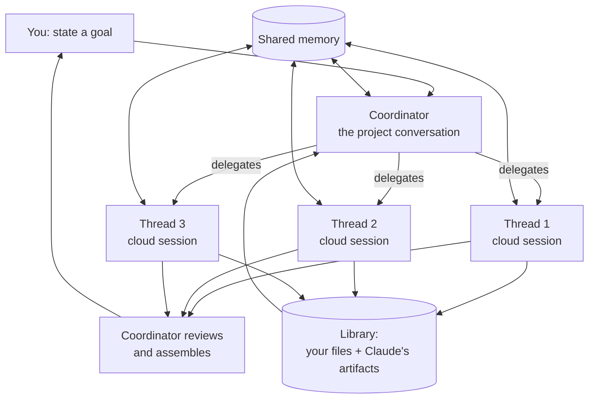

# Claude Projects, Redesigned

Chinese version: [README_ZH.md](README_ZH.md)

## Mental model

> A project used to be a folder: a place to park instructions and reference files that every new
> chat started from. In the redesign it becomes a single, long-running **conversation**. You state a
> goal; Claude splits it into threads, runs them as parallel cloud sessions, and reassembles the
> results.

The unit of work moves from "a chat that reads a folder" to "a coordinator that owns threads". Two
things follow, and they account for most of what is new: the project needs somewhere to keep what it
learns across threads (**memory**), and somewhere to keep what the threads produce (**library**).

This note answers three questions:

1. What actually changed, structurally, from the old Projects?
2. What are threads, the coordinator, memory, and the library?
3. Who can use it today, and what does it not cover yet?

## Source

- Primary source: [Projects redesigned: from folder to conversation](https://claude.com/blog/projects-redesigned) (Anthropic, September 17, 2026)
- Reviewed: September 18, 2026
- Status at time of review: **beta**, Claude Code only
- Sourcing caveat: `claude.com` was not reachable from the environment this note was written in. The
  factual claims below were reconstructed from search summaries of the announcement and from
  contemporaneous reporting ([SD Times](https://sdtimes.com/claude/a-new-experience-for-claude-projects-now-available-in-beta-in-claude-code/),
  [VentureBeat](https://venturebeat.com/orchestration/anthropic-launches-claude-code-projects-an-always-on-conversation-that-remembers-and-delegates-your-long-running-dev-work),
  [Unite.AI](https://www.unite.ai/anthropic-redesigns-claude-code-projects-to-coordinate-agent-threads/),
  [DevOps.com](https://devops.com/anthropic-brings-parallel-coding-workflows-to-claude-projects/)),
  plus Anthropic's own posts on [X](https://x.com/ClaudeDevs/status/2100633571543367691). Verify
  details against the original post before relying on them.

Sections marked *Analysis* are my own reading, not claims from the announcement.

## What changed

| | Old Projects | Redesigned Projects |
| --- | --- | --- |
| Shape | A folder of files and custom instructions | One ongoing conversation |
| Who splits the work | You do — separate chats, manual handoffs | Claude scopes and delegates |
| Where work runs | The chat you are in | Parallel cloud sessions, one per thread |
| Context between units | You re-paste it | Shared project memory |
| Outputs | Scattered across chats | Collected in the project library |
| After you close the laptop | Nothing runs | Threads keep running |

The old model is not deprecated: existing projects on Pro and Max keep working as they do now, and
Anthropic says it will upgrade them as the rollout reaches chat and Cowork.

## The four pieces

How do a goal, the threads, and what the project remembers fit together?

Read it top-down for the work, and note that memory and library are *shared edges*, not stages: every
thread both reads and writes them.

- **The conversation** is the project. There is one of them, and it persists.
- **The coordinator** is Claude in that conversation. It scopes the request, decides what becomes a
  thread, delegates, coordinates the parallel threads, reviews the outputs, and assembles the
  finished result.
- **Threads** do the work. Each runs as a separate cloud session, so they run in parallel and keep
  going after you close your laptop.
- **Memory** is shared across threads. Every thread adds to it and draws from it — the release slipped
  to Friday, why the export was dropped, who to check with before touching the billing service. It
  also holds your working and communication style: you can ask Claude to check in more or less often,
  start new threads more or less eagerly, or make each update more or less detailed.
- **The library** collects the files you add and the artifacts Claude produces, so later work builds
  on earlier work instead of starting cold.

## Availability

Beta access opened on **September 17, 2026**, and the initial gate is narrow:

| Requirement | Detail |
| --- | --- |
| Plan | Claude **Pro** or **Max** |
| Surface | Claude **Code** (desktop and web) |
| Must use | **Cloud sessions** — local-only workflows are not supported yet |
| Must not have | Existing projects on web or desktop |

Rollout order, as announced: more Claude Code users on Pro and Max over the following week, then the
rest of Claude, then Team and Enterprise. Pro and Max subscribers without access can join a waitlist.

Note the exclusion that catches people: if you *already* use Projects on the web or desktop, you stay
on the prior version until your account is upgraded.

## Analysis

**The cloud-session dependency is the design, not a rollout detail.** "Threads keep working after you
close your laptop" is only possible because each thread is an Anthropic-managed VM rather than a
process on your machine — see [Claude Code cloud sessions](../cloud-sessions/README.md) for what that
implies about GitHub access, network policy, and secrets. That is also why local-only workflows are
excluded: there is nothing to exclude them *from* until the coordinator has somewhere to put a thread.

**Memory is what makes delegation cheap.** Parallel agents are not new — subagents already fan work
out within one session. What was expensive was context: each unit started from whatever you pasted
into it. A memory that every thread reads and writes is the difference between "delegate and
re-explain" and "delegate". Anthropic frames it as reducing the need for prompt engineering, which is
the same claim read from the other side.

**The risk moves to review.** When you split the work yourself, you see every seam. When the
coordinator splits it, the assembled result is the first thing you see, and the seams are inside. The
library helps here — the artifacts are inspectable rather than implied — but the habit worth keeping
is reading the threads, not just the summary.

**Treat the working-style settings as real configuration.** Check-in frequency and update verbosity
sound cosmetic; on a system that runs unattended, they are the only throttle you have on how much
surprise accumulates before you look again.

## Related notes

- [Claude Code Cloud Sessions](../cloud-sessions/README.md) — the runtime each thread executes in
- [Introduction to Claude Code Subagents](../subagents/README.md) — delegation *within* a single session
- [Claude Managed Agents](../managed-agents/README.md) — the API-side equivalent for long-running asynchronous work
