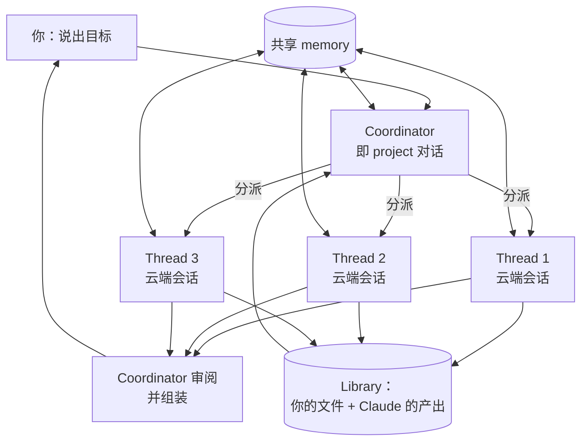

# Claude Projects 改版

English version: [README.md](README.md)

## 心智模型

> 过去的 project 是一个文件夹：存放自定义指令和参考资料，每次新开对话都从它出发。改版之后，project
> 变成一场持续进行的**对话**。你说出目标，Claude 自己把它拆成若干 thread，以并行的云端会话运行，
> 再把结果重新组装起来。

工作单元从「读取文件夹的一次对话」变成「拥有若干 thread 的协调者」。由此引出两件事，也解释了改版中
大部分新东西：project 需要一个地方保存它跨 thread 学到的内容（**memory**），也需要一个地方保存
thread 产出的内容（**library**）。

本文回答三个问题：

1. 相比旧版 Projects，结构上到底变了什么？
2. thread、coordinator、memory 和 library 分别是什么？
3. 今天谁能用上，它又还没覆盖什么？

## 来源

- 原始来源：[Projects redesigned: from folder to conversation](https://claude.com/blog/projects-redesigned)（Anthropic，2026 年 9 月 17 日）
- 查阅时间：2026 年 9 月 18 日
- 查阅时状态：**beta**，仅限 Claude Code
- 来源说明：撰写本文的环境无法访问 `claude.com`。下文的事实性内容是依据该公告的搜索摘要，以及同期报道
  （[SD Times](https://sdtimes.com/claude/a-new-experience-for-claude-projects-now-available-in-beta-in-claude-code/)、
  [VentureBeat](https://venturebeat.com/orchestration/anthropic-launches-claude-code-projects-an-always-on-conversation-that-remembers-and-delegates-your-long-running-dev-work)、
  [Unite.AI](https://www.unite.ai/anthropic-redesigns-claude-code-projects-to-coordinate-agent-threads/)、
  [DevOps.com](https://devops.com/anthropic-brings-parallel-coding-workflows-to-claude-projects/)）
  以及 Anthropic 自己的 [X](https://x.com/ClaudeDevs/status/2100633571543367691) 帖子重建的。以此为依据前，
  请对照原文核实细节。

标注 *分析* 的章节是我自己的解读，不是公告中的说法。

## 变了什么

| | 旧版 Projects | 改版后的 Projects |
| --- | --- | --- |
| 形态 | 文件与自定义指令的文件夹 | 一场持续进行的对话 |
| 谁来拆分工作 | 你自己——分别开对话、手动交接 | Claude 负责界定范围并分派 |
| 工作在哪运行 | 你所在的那次对话 | 并行的云端会话，每个 thread 一个 |
| 单元之间的上下文 | 你重新粘贴 | 共享的 project memory |
| 产出 | 散落在各次对话里 | 汇集到 project library |
| 合上电脑之后 | 什么都不再运行 | thread 继续运行 |

旧模式并未废弃：Pro 和 Max 上已有的 project 仍按现状工作，Anthropic 表示会在改版推广到 chat 和 Cowork
时对它们进行升级。

## 四个组成部分

一个目标、若干 thread，以及 project 记住的东西，是如何组合在一起的？

自上而下读是工作流；注意 memory 和 library 是*共享的连边*，不是流程中的某一步：每个 thread 都同时读和写。

- **对话**就是 project 本身。只有一个，并且持续存在。
- **Coordinator** 是这场对话中的 Claude。它界定请求范围、决定什么该成为一个 thread、分派任务、协调并行
  thread、审阅输出，并组装出最终结果。
- **Thread** 负责干活。每个 thread 作为一次独立的云端会话运行，因此可以并行，也能在你合上电脑之后继续跑。
- **Memory** 在各 thread 之间共享。每个 thread 都会写入并读取它——发布推迟到了周五、导出功能为什么被砍掉、
  动 billing 服务之前该找谁确认。它同时保存你的工作与沟通风格：你可以要求 Claude 更频繁或更少地来汇报、
  更积极或更克制地开新 thread、把每次更新写得更详细或更简略。
- **Library** 汇集你添加的文件和 Claude 产出的工件，让后续工作建立在既有成果之上，而不是从零开始。

## 可用范围

beta 于 **2026 年 9 月 17 日**开放，最初的门槛很窄：

| 条件 | 细节 |
| --- | --- |
| 套餐 | Claude **Pro** 或 **Max** |
| 入口 | Claude **Code**（桌面端与网页端） |
| 必须使用 | **云端会话**——尚不支持纯本地工作流 |
| 必须没有 | 网页端或桌面端上已存在的 project |

公告给出的推广顺序：随后一周内扩大到 Pro 和 Max 上更多的 Claude Code 用户，然后是 Claude 的其余部分，
再之后是 Team 和 Enterprise 套餐。尚未获得访问权限的 Pro 和 Max 订阅者可以加入等待列表。

注意那条最容易被忽略的排除项：如果你*已经*在网页端或桌面端使用 Projects，在账号被升级之前，你仍停留在
旧版本上。

## 分析

**依赖云端会话是设计本身，而不是推广细节。**「合上电脑后 thread 继续工作」之所以可能，是因为每个 thread
都是一台 Anthropic 托管的虚拟机，而不是你本机上的一个进程——它在 GitHub 访问、网络策略和密钥方面意味着
什么，见 [Claude Code 云端会话](../cloud-sessions/README_ZH.md)。这也是纯本地工作流被排除的原因：在
coordinator 有地方放置 thread 之前，根本无从谈起。

**Memory 才是让分派变便宜的东西。**并行 agent 并不新鲜——subagent 早就能在一次会话内把工作扇出。真正昂贵的
是上下文：每个单元都只能从你粘贴进去的内容开始。一个所有 thread 都读写的 memory，是「分派并重新解释一遍」
与「分派」之间的差别。Anthropic 把它表述为减少 prompt engineering 的需要，其实是同一件事的另一面。

**风险转移到了审阅环节。**当你自己拆分工作时，每一道接缝你都看得见。当 coordinator 来拆时，你首先看到的是
组装好的结果，接缝在里面。library 在这里有帮助——产出是可检视的，而不只是被暗示——但值得保持的习惯是去读
thread，而不只是读摘要。

**把工作风格设置当成真正的配置来对待。**汇报频率和更新详略听起来像是外观偏好；但在一个无人值守运行的系统里，
它们是你唯一能用来控制「下次查看前积累了多少意外」的阀门。

## 相关笔记

- [Claude Code 云端会话](../cloud-sessions/README_ZH.md) —— 每个 thread 实际运行的环境
- [Claude Code Subagents 入门](../subagents/README_ZH.md) —— 单次会话*内部*的任务分派
- [Claude Managed Agents](../managed-agents/README_ZH.md) —— 面向长时间异步工作的 API 侧对应物
