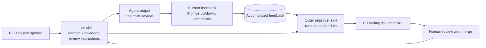

# How Warp Builds Self-Improving Agents on Claude

English | [简体中文](README_ZH.md)

## Mental model

> A skill is just a file. So an agent can edit it. Warp runs a second, scheduled agent whose only
> job is to read human feedback on the first agent's work and open a pull request that improves the
> skill file the first agent reads.

Nothing about the model changes. No fine-tuning, no embeddings store, no memory service. The thing
that improves is a plain text file in a repository, and it improves through the same review workflow
as any other change.

This article answers three questions:

1. Why do agents keep repeating mistakes people already corrected?
2. What is the inner/outer skill pattern, and how does a full cycle run?
3. What does it take to adopt, and where does it break down?

## Source

- Primary source: [How Warp builds self-improving agents on Claude](https://claude.com/blog/how-warp-builds-self-improving-agents-on-claude) (Anthropic), from a webinar with Warp founder Zach Lloyd and Anthropic's Applied AI team
- Related: [Warp — How to build a self-improvement loop for your Skills](https://www.warp.dev/blog/self-improvement-loop-for-skills), [Warp docs — Build a self-improving agent](https://docs.warp.dev/guides/agent-workflows/build-a-self-improving-agent)
- Reviewed: September 16, 2026

Sourcing note: the primary pages above were not reachable from the network this summary was written
on, so it is assembled from search-result excerpts of those pages plus secondary coverage. Treat
specific wording and figures as second-hand and verify against the primary source before relying on
them. Sections marked *Analysis* are my own reading, not claims from Warp or Anthropic.

## The problem: feedback dies with the session

Warp's agents serve roughly 800,000 monthly developers. Their code review agent shipped with an
ordinary failure mode: it produced suggestions engineers disagreed with — the reviewer explained why
in a comment, the agent never saw that explanation again, and the next pull request got the same
suggestion.

The correction existed. It just had nowhere to live. A session ends, its context is discarded, and
the instructions the agent reads next time are exactly the ones it read last time.

## The pattern: inner skill, outer skill

Two loops at different frequencies:

| | Inner loop | Outer loop |
| --- | --- | --- |
| **Runs** | Per task (every PR) | On a schedule, over many past runs |
| **Reads** | The skill file, the diff, repo context | Accumulated human feedback + the skill file |
| **Produces** | The code review | A small, focused diff to the skill file |
| **Applied by** | Immediately, in the session | A pull request a human merges |

The inner skill is the functional one: what to look for in a diff, what the codebase's conventions
are, what to stay quiet about. The outer skill is an *observer* — it never does the task, it only
compares what the agent suggested against how humans responded, and proposes an edit.

## Why the improvement is a pull request, not a write

The outer loop proposes; it does not apply silently. Every change to a skill file goes through the
repository's normal code review before merging.

That single design choice carries most of the safety of the pattern:

- The team decides what counts as an improvement; the agent only drafts it.
- Every behaviour change is a reviewable diff with an author, a date, and a revert path.
- A bad lesson — feedback from one dissenting reviewer, or a misread of a one-off exception — gets
  caught in review rather than quietly reshaping the agent's behaviour.

*Analysis:* this is also why the pattern needs no new infrastructure. Version control already
provides the audit log, the approval gate, and the rollback that a bespoke "agent memory" system
would have to build from scratch.

## Feedback quality beats feedback volume

The webinar's most transferable claim is about the input, not the architecture: a small amount of
detailed, domain-specific feedback from a senior engineer is worth more than a large volume of
cursory feedback.

A thumbs-down says the output was wrong. It does not say why, so nothing generalisable can be
extracted from it. Compare:

| Feedback | What the improver can extract |
| --- | --- |
| 👎 | Nothing actionable — wrong output, unknown reason |
| "Bad suggestion" | The case was wrong; not the rule behind it |
| "You suggested renaming this variable, but our convention is that this type of global variable uses this naming pattern" | A stated convention, which becomes a line in the skill file |

The consequence is practical: you can get good signal from a relatively small sample if the feedback
is detailed. So collect free-text reasons, not just ratings, and weight the reviewers who write
them.

## Adopting it

1. **Put the agent's instructions in a file in the repo.** If the behaviour lives in a prompt in an
   application, there is nothing to review and nothing to improve.
2. **Capture feedback as text, attached to the run it responds to.** The improver needs the pairing
   of output and reaction, not a rating in isolation.
3. **Write the improver as its own skill.** Its instructions: read the feedback since the last run,
   compare it against the current skill file, propose one small focused edit, open a PR.
4. **Schedule it.** Per-task improvement has too little evidence per run and creates churn; a
   periodic pass sees patterns.
5. **Review the PRs like any other change.** Reject the lessons that are one reviewer's preference
   rather than a team convention.

## Where it breaks down

*Analysis*, not claims from the source:

- **Skill file drift.** Every accepted lesson adds lines. Without periodic consolidation, the file
  grows into a long, partly contradictory list that costs context on every run and gets harder to
  review. Budget for pruning.
- **Overfitting to loud reviewers.** The people who write detailed feedback are a biased sample. The
  PR review gate is the only thing preventing their preferences from becoming team policy.
- **Feedback that is really a product complaint.** "This review was noisy" may mean the skill needs
  a rule, or it may mean the agent should not be reviewing that file type at all. The improver will
  tend to produce the former.
- **No rollback signal.** The loop measures nothing after merge. If a change makes reviews worse,
  only the next round of human feedback will show it — slowly.

## The takeaway

The pattern is deliberately unremarkable: text files, a scheduled job, and pull requests. It is worth
copying not because it is clever but because it turns corrections that used to evaporate at the end
of a session into a reviewable, versioned, compounding asset — using tooling every engineering team
already runs.
