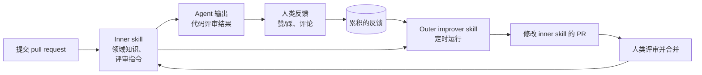

# Warp 如何在 Claude 上构建自我改进的 agent

[English](README.md) | 简体中文

## 心智模型

> skill 只是一个文件，所以 agent 可以修改它。Warp 运行第二个定时执行的 agent，它唯一的任务是：
> 读取人类对第一个 agent 工作成果的反馈，然后提交一个 pull request，改进第一个 agent 所读取的
> skill 文件。

模型本身没有任何变化：没有微调，没有向量库，没有记忆服务。被改进的只是仓库里的一个纯文本文件，
而且它通过与其他任何改动完全相同的评审流程来改进。

本文回答三个问题：

1. 为什么 agent 会不断重复人类已经纠正过的错误？
2. inner/outer skill 模式是什么，一个完整循环如何运行？
3. 采用它需要什么，它在哪里会失效？

## 来源

- 主要来源：[How Warp builds self-improving agents on Claude](https://claude.com/blog/how-warp-builds-self-improving-agents-on-claude)（Anthropic），出自 Warp 创始人 Zach Lloyd 与 Anthropic Applied AI 团队的线上分享
- 相关：[Warp — How to build a self-improvement loop for your Skills](https://www.warp.dev/blog/self-improvement-loop-for-skills)、[Warp 文档 — Build a self-improving agent](https://docs.warp.dev/guides/agent-workflows/build-a-self-improving-agent)
- 查阅时间：2026 年 9 月 16 日

来源说明：撰写本文的网络环境无法访问上述主要页面，因此本文依据这些页面的搜索结果摘录以及二手报道
整理而成。具体措辞与数字属于二手信息，依赖之前请对照主要来源核实。标注为 *分析* 的部分是我自己的
解读，不是 Warp 或 Anthropic 的主张。

## 问题：反馈随会话一起消失

Warp 的 agent 服务约 80 万月活开发者。他们的代码评审 agent 存在一个常见的失效模式：它给出工程师
不认同的建议，评审者在评论里解释了原因，而 agent 再也看不到这条解释，于是下一个 pull request 又
收到同样的建议。

纠正是存在的，只是无处安放。会话结束，上下文被丢弃，agent 下次读到的指令与上次一模一样。

## 模式：inner skill 与 outer skill

两个频率不同的循环：

| | 内循环 | 外循环 |
| --- | --- | --- |
| **运行时机** | 每个任务（每个 PR） | 按计划定时运行，覆盖多次历史运行 |
| **读取** | skill 文件、diff、仓库上下文 | 累积的人类反馈 + skill 文件 |
| **产出** | 代码评审结果 | 对 skill 文件的一处小而聚焦的改动 |
| **生效方式** | 会话内立即生效 | 由人类合并的 pull request |

inner skill 承担实际功能：在 diff 中该关注什么、代码库的约定是什么、哪些问题不必提。outer skill 是
一个*观察者* —— 它从不执行任务，只对比 agent 的建议与人类的反应，并提出修改建议。

## 为什么改进是 pull request，而不是直接写入

外循环只提议，不静默应用。对 skill 文件的每一处改动都要走仓库正常的代码评审流程才能合并。

这一个设计选择承载了该模式的大部分安全性：

- 由团队决定什么算改进，agent 只负责起草。
- 每次行为变更都是可评审的 diff，带有作者、时间和回滚路径。
- 错误的“教训”（某位持不同意见的评审者的反馈，或对一次性例外的误读）会在评审中被拦下，而不是悄悄
  改变 agent 的行为。

*分析：* 这也是该模式不需要新基础设施的原因。版本控制已经提供了审计日志、审批关卡和回滚能力，而
自研的“agent 记忆”系统需要从零构建这些。

## 反馈质量胜过反馈数量

分享中最具可迁移性的观点是关于输入而非架构的：来自资深工程师的少量详细、贴合领域的反馈，价值高于
大量草率的反馈。

一个“踩”只说明输出是错的，却没说明原因，因此无法从中提炼出可泛化的规则。对比：

| 反馈 | improver 能提炼出什么 |
| --- | --- |
| 👎 | 无可操作内容 —— 输出有误，原因未知 |
| “建议不好” | 这个案例是错的，但没有背后的规则 |
| “你建议重命名这个变量，但我们的约定是这类全局变量使用这种命名方式” | 一条明确的约定，可以写成 skill 文件里的一行 |

由此得到的实践结论：只要反馈足够详细，较小的样本量也能提供良好信号。所以要收集自由文本形式的理由，
而不仅仅是评分，并对愿意写理由的评审者给予更高权重。

## 如何采用

1. **把 agent 的指令放进仓库里的文件。** 如果行为写死在应用的 prompt 里，就既无从评审也无从改进。
2. **以文本形式采集反馈，并与它所针对的那次运行绑定。** improver 需要的是“输出—反应”的配对，而不是
   孤立的评分。
3. **把 improver 写成独立的 skill。** 它的指令是：读取上次运行以来的反馈，与当前 skill 文件对比，
   提出一处小而聚焦的改动，提交 PR。
4. **给它排定时任务。** 逐任务改进单次证据太少且带来频繁抖动；周期性运行才能看出规律。
5. **像评审其他改动一样评审这些 PR。** 拒绝那些只是个别评审者偏好、而非团队约定的“教训”。

## 它在哪里会失效

以下是*分析*，不是来源中的主张：

- **skill 文件膨胀。** 每条被接受的教训都会增加行数。若不定期整合，文件会变成冗长且部分自相矛盾的
  清单，每次运行都消耗上下文，也越来越难评审。要预留裁剪的成本。
- **过度拟合于“声音大”的评审者。** 愿意写详细反馈的人是有偏样本。PR 评审关卡是阻止其个人偏好变成
  团队规则的唯一屏障。
- **实为产品问题的反馈。** “这次评审太吵”可能意味着 skill 需要新规则，也可能意味着 agent 根本不该
  评审这类文件。improver 倾向于给出前一种答案。
- **缺少回滚信号。** 该循环在合并后不做任何度量。如果某次改动让评审变差，只能靠下一轮人类反馈慢慢
  显现。

## 结论

这个模式刻意保持平淡：文本文件、定时任务、pull request。它值得借鉴，不是因为巧妙，而是因为它把过去
随会话蒸发的纠正，变成了可评审、可版本化、可复利累积的资产 —— 而且只用每个工程团队已经在运行的工具。
