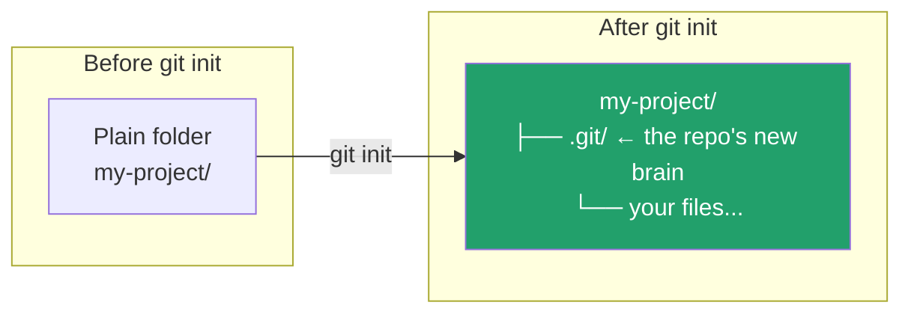

← [Back to index](../basics/README.md)

Chinese version: [README_ZH.md](README_ZH.md)

# `git init` — Create Your First Repository

## What this does

`git init` turns the current folder into a Git repository: it creates a hidden `.git/` directory inside it, where Git will store all future history, branch information, and configuration. **Before this, Git has no idea the folder exists.**



## Common commands

```bash
# Option 1: initialize in the current directory
mkdir my-project && cd my-project
git init

# Option 2: initialize into a named directory (created automatically)
git init my-project

# Set the initial branch name at init time (recommended, avoids master/main confusion)
git init -b main
```

## Flags

| Flag | Effect |
|---|---|
| `-b <name>` / `--initial-branch=<name>` | Sets the initial branch name (e.g. `main`); otherwise Git falls back to its global default |
| `--bare` | Creates a "bare" repository with no working tree, storing history only — typically used as a server-side remote |
| `-q` / `--quiet` | Suppresses output |

## Verify it worked

```bash
ls -la          # should show a .git directory
git status      # should show "On branch main / No commits yet"
```

## Common pitfalls

- ⚠️ Don't manually delete `.git` and re-run `init` in a directory that's already a repository — this destroys all history. Check `git status` first if you're unsure whether the working tree is clean.
- ⚠️ Running `git init` in your home directory (`~`) or a system root is a common mistake — Git will start tracking the entire directory as a repo. Always `cd` into your intended project folder first.

## What's next

`git init` is the "start from scratch" entry point. But the more common real-world scenario is: the project already exists on GitHub, and you just want to download it locally — for that you don't use `init`, you use the next command: **`git clone`**.

👉 Next: [Git/clone — copy an existing remote repository](../clone/README.md)

---
References: [Pro Git 1.1 — About Version Control](https://git-scm.com/book/en/v2/Getting-Started-About-Version-Control) | [git-init manual](https://git-scm.com/docs/git-init)
