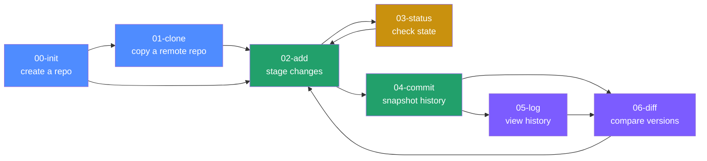
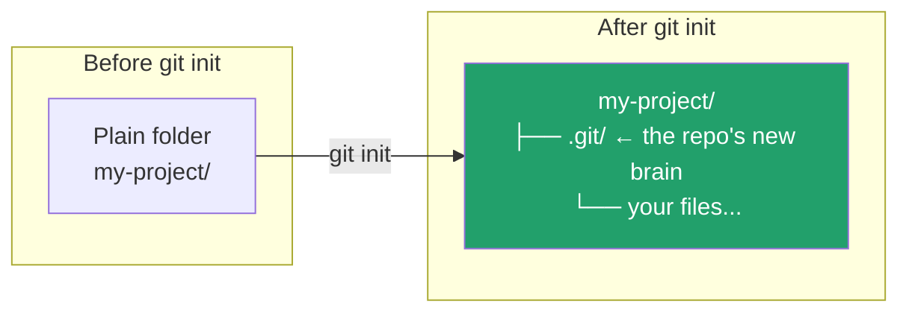

# Git Command-Line Basics, Step 00 — `git init`

Chinese version: [README_ZH.md](README_ZH.md)

> This is the first of 7 chapters covering the most essential Git command-line commands, numbered in the order you'd actually use them day to day: `00-init` → `01-clone` → `02-add` → `03-status` → `04-commit` → `05-log` → `06-diff`. Each chapter is a sibling directory under `Git/` — just follow the numbers in order, or jump to whichever command you need.
>
> Written for absolute beginners. If you're already comfortable with basic Git and need a production/ops-oriented reference instead, see [Git/README.md](../README.md) one level up.

## Learning roadmap



## Contents

| Step | Command | One-line takeaway |
|---|---|---|
| 00 | `git init` | Turn a plain folder into a Git repository *(you are here)* |
| 01 | `git clone` | Copy a remote repository to your machine — [../01-clone](../01-clone/README.md) |
| 02 | `git add` | Stage changes for the next commit — [../02-add](../02-add/README.md) |
| 03 | `git status` | Inspect the current state of your working tree/index — [../03-status](../03-status/README.md) |
| 04 | `git commit` | Turn the staged content into a permanent snapshot — [../04-commit](../04-commit/README.md) |
| 05 | `git log` | Browse commit history — [../05-log](../05-log/README.md) |
| 06 | `git diff` | Compare the exact differences between two versions — [../06-diff](../06-diff/README.md) |

## The core mental model (learn this first, everything else follows)

Git manages your code across "three areas". Once this clicks, every one of the 7 commands makes sense:

```mermaid
flowchart LR
    accTitle: Git's three areas and how commands move content between them
    accDescr: The working directory moves into the staging area via add, the staging area moves into the local repository via commit, and the local repository moves into the remote via push. Clone or pull bring the remote back into the working directory. Diff compares the staging area against the repository, or the working directory against the staging area; log inspects repository history.
    subgraph WD[Working Directory]
        F1[Files you're currently editing]
    end
    subgraph SA[Staging Area / Index]
        F2[Snapshot after git add]
    end
    subgraph REPO[Local Repository .git]
        F3[History after git commit]
    end
    subgraph REMOTE[Remote Repository GitHub]
        F4[Shared history after git push]
    end

    WD -- "git add" --> SA
    SA -- "git commit" --> REPO
    REPO -- "git push" --> REMOTE
    REMOTE -- "git clone / git pull" --> WD
    REPO -. "git diff — compares" .-> SA
    SA -. "git diff, staged — compares" .-> REPO
    REPO -. "git log — inspects history" .-> REPO
```



- **`git status`** is a "health check": it always tells you where the three areas currently differ.
- **`git diff`** is a "magnifying glass": it shows the exact line-by-line content of a difference.
- **`git log`** is the "table of contents for a time machine": it shows what happened in the repository's history.

---

## `git init` — create your first repository

### What this does

`git init` turns the current folder into a Git repository: it creates a hidden `.git/` directory inside it, where Git will store all future history, branch information, and configuration. **Before this, Git has no idea the folder exists.**



### Common commands

```bash
# Option 1: initialize in the current directory
mkdir my-project && cd my-project
git init

# Option 2: initialize into a named directory (created automatically)
git init my-project

# Set the initial branch name at init time (recommended, avoids master/main confusion)
git init -b main
```

### Flags

| Flag | Effect |
|---|---|
| `-b <name>` / `--initial-branch=<name>` | Sets the initial branch name (e.g. `main`); otherwise Git falls back to its global default |
| `--bare` | Creates a "bare" repository with no working tree, storing history only — typically used as a server-side remote |
| `-q` / `--quiet` | Suppresses output |

### Verify it worked

```bash
ls -la          # should show a .git directory
git status      # should show "On branch main / No commits yet"
```

### Common pitfalls

- ⚠️ Don't manually delete `.git` and re-run `init` in a directory that's already a repository — this destroys all history. Check `git status` first if you're unsure whether the working tree is clean.
- ⚠️ Running `git init` in your home directory (`~`) or a system root is a common mistake — Git will start tracking the entire directory as a repo. Always `cd` into your intended project folder first.

### What's next

`git init` is the "start from scratch" entry point. But the more common real-world scenario is: the project already exists on GitHub, and you just want to download it locally — for that you don't use `init`, you use the next command: **`git clone`**.

👉 Next: [01-clone — copy an existing remote repository](../01-clone/README.md)

---
References: [Pro Git Book (free official ebook)](https://git-scm.com/book/en/v2) | [Official Git command reference](https://git-scm.com/docs) | [Learn Git Branching (interactive exercises)](https://learngitbranching.js.org/) | [Pro Git 1.1 — About Version Control](https://git-scm.com/book/en/v2/Getting-Started-About-Version-Control) | [git-init manual](https://git-scm.com/docs/git-init)

Once you've finished this series, move on to the production/team-collaboration reference at [Git/README.md](../README.md).
